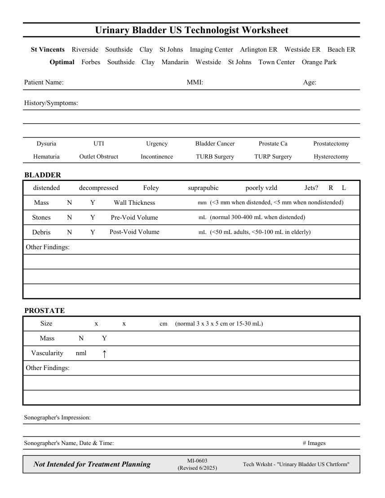

# Ecografie — Fișă de lucru: Bladder (MCB)

## Documentul original MCB — Fișă de lucru: Bladder

**Fișă de lucru · 1 pagini · consultat la 2026-09-27.**

[Descarcă PDF-ul integral](../../assets/mcb-modalities/eco-fisa-de-lucru-bladder-mcb/document.pdf) · [Sursa MCB](https://ref.mcbradiology.com/Protocols,%20Policies,%20Worksheets%20&%20Forms/US/Tech%20Worksheets/Bladder.pdf) · [Catalogul MCB pentru această modalitate](../mcb/index.md)

Instrucțiunile, valorile și ilustrațiile din documentul original sunt păstrate în **engleză**. Titlul și navigarea sunt în română.

### Pagina 1

{ loading=lazy }

## Textul documentului original

??? abstract "Pagina 1 — text în engleză"

    
Urinary Bladder US Technologist Worksheet
      St Vincents    Riverside    Southside    Clay    St Johns    Imaging Center    Arlington ER    Westside ER    Beach ER
      Optimal    Forbes    Southside    Clay    Mandarin    Westside    St Johns    Town Center    Orange Park
    Patient Name:
    MMI:
    Age:
    History/Symptoms:
    Dysuria
    UTI
    Urgency
    Bladder Cancer
    Prostate Ca
    Prostatectomy
    Hematuria
    Outlet Obstruct
    Hysterectomy
    Incontinence
    TURB Surgery
    TURP Surgery
    BLADDER
    distended
    decompressed
    poorly vzld
    Foley
    Jets?      R     L
    suprapubic
    mm 
    (&lt;3 mm when distended, &lt;5 mm when nondistended)
     Wall Thickness
     Mass
    N
    Y
    mL 
    (normal 300-400 mL when distended)
     Pre-Void Volume
     Stones
    N
    Y
    mL 
     Post-Void Volume
     Debris
    (&lt;50 mL adults, &lt;50-100 mL in elderly)
    N
    Y
     Other Findings:
    PROSTATE
     cm
    Size
    x              x
    (normal 3 x 3 x 5 cm or 15-30 mL)
     Mass
    Y
    N
     Vascularity
    nml
    ↑
     Other Findings:
    Sonographer&#x27;s Impression:
    Sonographer&#x27;s Name, Date &amp; Time:
    # Images
    Not Intended for Treatment Planning
    MI-0603                                                      
    (Revised 6/2025)
    Tech Wrksht - &quot;Urinary Bladder US Chrtform&quot;
    

