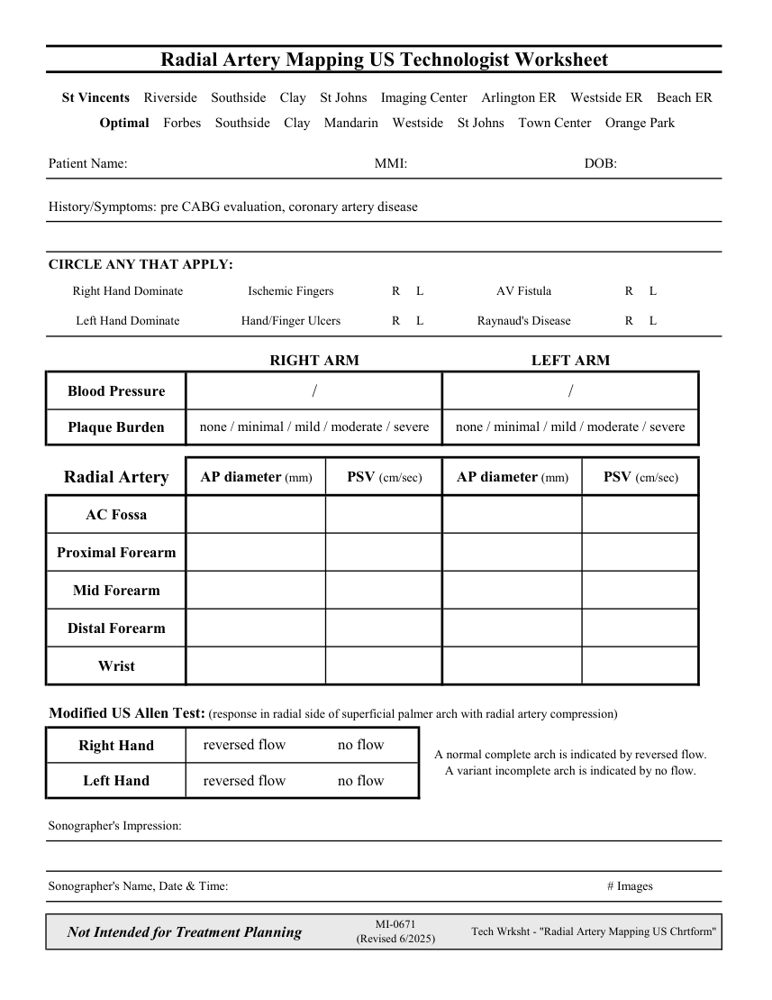

# Ecografie — Fișă de lucru: Cartografiere arteră radială (MCB)

## Documentul original MCB — Fișă de lucru: Cartografiere arteră radială

**Fișă de lucru · 1 pagini · consultat la 2026-09-27.**

[Descarcă PDF-ul integral](../../assets/mcb-modalities/eco-fisa-de-lucru-cartografiere-artera-radiala-mcb/document.pdf) · [Sursa MCB](https://ref.mcbradiology.com/Protocols,%20Policies,%20Worksheets%20&%20Forms/US/Tech%20Worksheets/Radial%20Artery%20Map.pdf) · [Catalogul MCB pentru această modalitate](../mcb/index.md)

Instrucțiunile, valorile și ilustrațiile din documentul original sunt păstrate în **engleză**. Titlul și navigarea sunt în română.

### Pagina 1

{ loading=lazy }

## Textul documentului original

??? abstract "Pagina 1 — text în engleză"

    
Radial Artery Mapping US Technologist Worksheet
      St Vincents    Riverside    Southside    Clay    St Johns    Imaging Center    Arlington ER    Westside ER    Beach ER
      Optimal    Forbes    Southside    Clay    Mandarin    Westside    St Johns    Town Center    Orange Park
    Patient Name:
    MMI:
    DOB:
    History/Symptoms: pre CABG evaluation, coronary artery disease
    CIRCLE ANY THAT APPLY:
    Right Hand Dominate
    Ischemic Fingers
    R     L
    AV Fistula
    R     L
    Left Hand Dominate
    Hand/Finger Ulcers
    R     L
    Raynaud&#x27;s Disease
    R     L
    RIGHT ARM
    LEFT ARM
    Blood Pressure
    /
    /
    Plaque Burden
    none / minimal / mild / moderate / severe
    none / minimal / mild / moderate / severe
    AP diameter (mm)
    PSV (cm/sec)
    AP diameter (mm)
    PSV (cm/sec)
    Radial Artery
    AC Fossa
    Proximal Forearm
    Mid Forearm
    Distal Forearm
    Wrist
    Modified US Allen Test: (response in radial side of superficial palmer arch with radial artery compression)
    reversed flow
    no flow
    Right Hand
    A normal complete arch is indicated by reversed flow.                     
    A variant incomplete arch is indicated by no flow.
    reversed flow
    no flow
    Left Hand
    Sonographer&#x27;s Impression:
    Sonographer&#x27;s Name, Date &amp; Time:
    # Images
    Not Intended for Treatment Planning
    MI-0671                                                                    
    (Revised 6/2025)
    Tech Wrksht - &quot;Radial Artery Mapping US Chrtform&quot;
    

