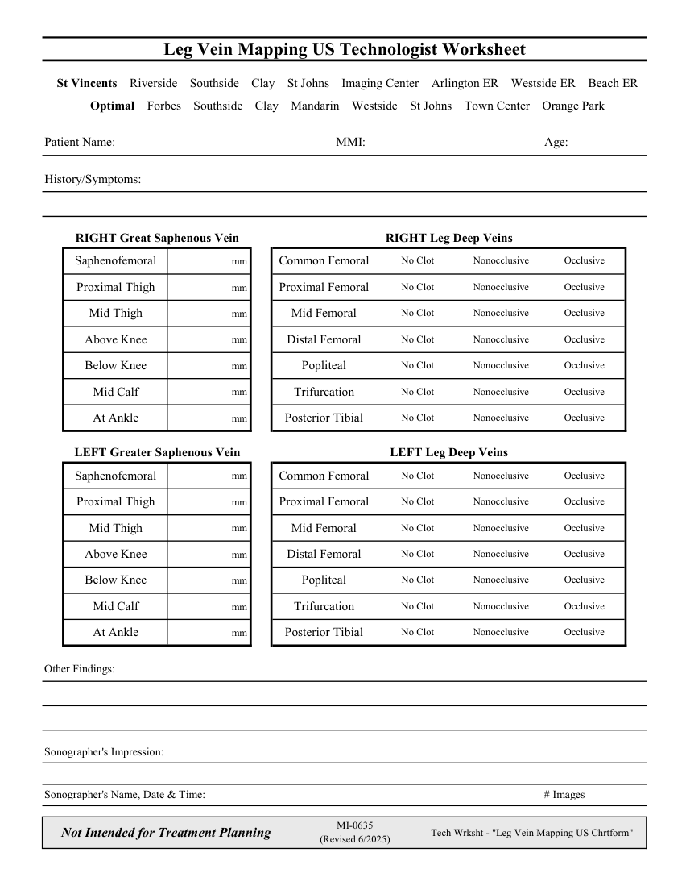

# Ecografie — Fișă de lucru: Cartografiere venoasă: membru inferior (MCB)

## Documentul original MCB — Fișă de lucru: Cartografiere venoasă: membru inferior

**Fișă de lucru · 1 pagini · consultat la 2026-09-27.**

[Descarcă PDF-ul integral](../../assets/mcb-modalities/eco-fisa-de-lucru-cartografiere-venoasa-membru-inferior-mcb/document.pdf) · [Sursa MCB](https://ref.mcbradiology.com/Protocols,%20Policies,%20Worksheets%20&%20Forms/US/Tech%20Worksheets/Leg%20Vein%20Mapping.pdf) · [Catalogul MCB pentru această modalitate](../mcb/index.md)

Instrucțiunile, valorile și ilustrațiile din documentul original sunt păstrate în **engleză**. Titlul și navigarea sunt în română.

### Pagina 1

{ loading=lazy }

## Textul documentului original

??? abstract "Pagina 1 — text în engleză"

    
Leg Vein Mapping US Technologist Worksheet
      St Vincents    Riverside    Southside    Clay    St Johns    Imaging Center    Arlington ER    Westside ER    Beach ER
      Optimal    Forbes    Southside    Clay    Mandarin    Westside    St Johns    Town Center    Orange Park
    Patient Name:
    MMI:
    Age:
    History/Symptoms:
    RIGHT Great Saphenous Vein
    RIGHT Leg Deep Veins
    Occlusive
    Nonocclusive
    No Clot
    mm 
    Saphenofemoral
    Common Femoral
    No Clot
    Nonocclusive
    Occlusive
    mm 
    Proximal Thigh
    Proximal Femoral
    No Clot
    Nonocclusive
    Occlusive
    mm 
    Mid Thigh
    Mid Femoral
    No Clot
    Nonocclusive
    Occlusive
    mm 
    Above Knee
    Distal Femoral
    No Clot
    Nonocclusive
    Occlusive
    mm 
    Below Knee
    Popliteal
    No Clot
    Nonocclusive
    Occlusive
    mm 
    Mid Calf
    Trifurcation
    mm 
    At Ankle
    Posterior Tibial
    No Clot
    Nonocclusive
    Occlusive
    LEFT Greater Saphenous Vein
    LEFT Leg Deep Veins
    mm 
    Saphenofemoral
    Common Femoral
    No Clot
    Nonocclusive
    Occlusive
    No Clot
    Nonocclusive
    Occlusive
    mm 
    Proximal Thigh
    Proximal Femoral
    No Clot
    Nonocclusive
    Occlusive
    mm 
    Mid Thigh
    Mid Femoral
    No Clot
    Nonocclusive
    Occlusive
    mm 
    Above Knee
    Distal Femoral
    mm 
    Below Knee
    Popliteal
    No Clot
    Nonocclusive
    Occlusive
    No Clot
    Nonocclusive
    Occlusive
    mm 
    Mid Calf
    Trifurcation
    No Clot
    Nonocclusive
    Occlusive
    mm 
    At Ankle
    Posterior Tibial
    Other Findings:
    Sonographer&#x27;s Impression:
    Sonographer&#x27;s Name, Date &amp; Time:
    # Images
    Not Intended for Treatment Planning
    MI-0635                                                              
    (Revised 6/2025)
    Tech Wrksht - &quot;Leg Vein Mapping US Chrtform&quot;
    

