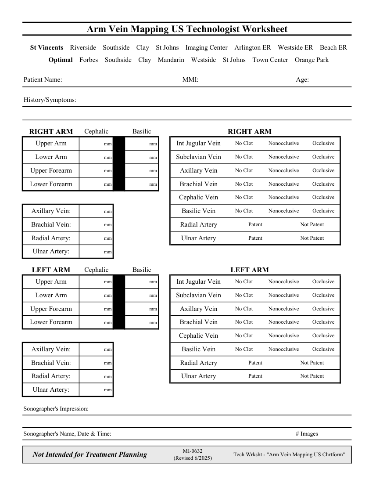

# Ecografie — Fișă de lucru: Cartografiere venoasă: membru superior (MCB)

## Documentul original MCB — Fișă de lucru: Cartografiere venoasă: membru superior

**Fișă de lucru · 1 pagini · consultat la 2026-09-27.**

[Descarcă PDF-ul integral](../../assets/mcb-modalities/eco-fisa-de-lucru-cartografiere-venoasa-membru-superior-mcb/document.pdf) · [Sursa MCB](https://ref.mcbradiology.com/Protocols,%20Policies,%20Worksheets%20&%20Forms/US/Tech%20Worksheets/Arm%20Vein%20Mapping.pdf) · [Catalogul MCB pentru această modalitate](../mcb/index.md)

Instrucțiunile, valorile și ilustrațiile din documentul original sunt păstrate în **engleză**. Titlul și navigarea sunt în română.

### Pagina 1

{ loading=lazy }

## Textul documentului original

??? abstract "Pagina 1 — text în engleză"

    
Arm Vein Mapping US Technologist Worksheet
      St Vincents    Riverside    Southside    Clay    St Johns    Imaging Center    Arlington ER    Westside ER    Beach ER
      Optimal    Forbes    Southside    Clay    Mandarin    Westside    St Johns    Town Center    Orange Park
    Patient Name:
    MMI:
    Age:
    History/Symptoms:
    Cephalic
    Basilic
    RIGHT ARM
    RIGHT ARM
    Nonocclusive
    Occlusive
    mm
    mm
    Upper Arm
    No Clot
    Int Jugular Vein
    No Clot
    Occlusive
    Nonocclusive
    mm
    mm
    Lower Arm
    Subclavian Vein
    No Clot
    Nonocclusive
    mm
    mm
    Occlusive
    Upper Forearm
    Axillary Vein
    No Clot
    Occlusive
    Nonocclusive
    mm
    mm
    Lower Forearm
    Brachial Vein
    Nonocclusive
    No Clot
    Occlusive
    Cephalic Vein
    No Clot
    Nonocclusive
    Occlusive
    mm
    Axillary Vein:
    Basilic Vein
    Patent
    Not Patent
    mm
    Brachial Vein:
    Radial Artery
    Patent
    Not Patent
    mm
    Radial Artery:
    Ulnar Artery
    mm
    Ulnar Artery:
    Cephalic
    Basilic
    LEFT ARM
    LEFT ARM
    Nonocclusive
    Occlusive
    mm
    mm
    Upper Arm
    Int Jugular Vein
    No Clot
    No Clot
    Nonocclusive
    Occlusive
    mm
    mm
    Lower Arm
    Subclavian Vein
    No Clot
    Nonocclusive
    Occlusive
    mm
    mm
    Upper Forearm
    Axillary Vein
    No Clot
    Nonocclusive
    Occlusive
    mm
    mm
    Lower Forearm
    Brachial Vein
    Cephalic Vein
    No Clot
    Nonocclusive
    Occlusive
    mm
    Axillary Vein:
    Basilic Vein
    No Clot
    Nonocclusive
    Occlusive
    Patent
    Not Patent
    mm
    Radial Artery
    Brachial Vein:
    mm
    Radial Artery:
    Ulnar Artery
    Patent
    Not Patent
    mm
    Ulnar Artery:
    Sonographer&#x27;s Impression:
    Sonographer&#x27;s Name, Date &amp; Time:
    # Images
    Not Intended for Treatment Planning
    MI-0632                                                                  
    (Revised 6/2025)
    Tech Wrksht - &quot;Arm Vein Mapping US Chrtform&quot;
    

