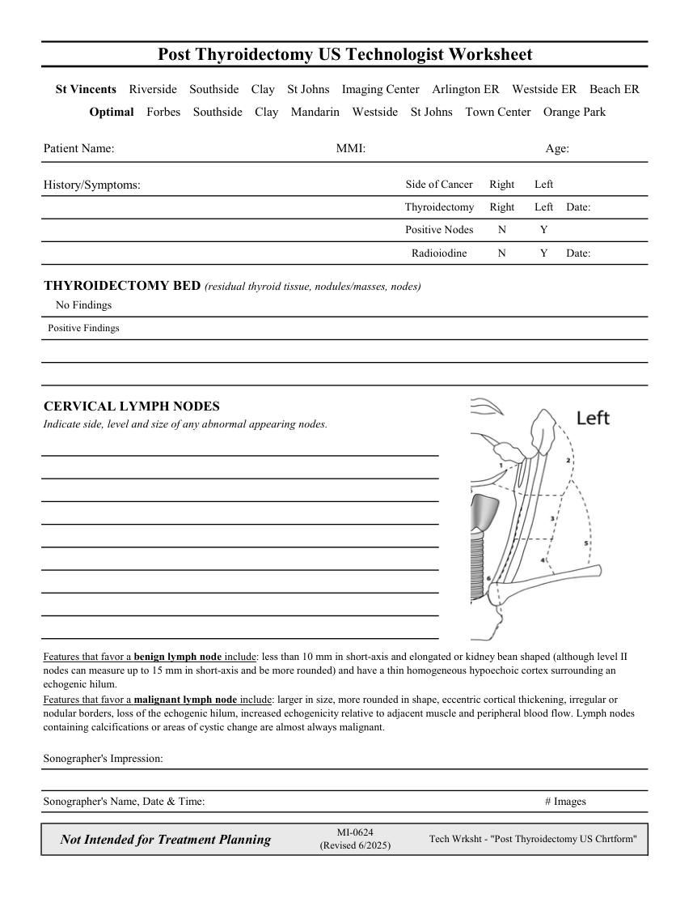

# Ecografie — Fișă de lucru: După tiroidectomie (MCB)

## Documentul original MCB — Fișă de lucru: După tiroidectomie

**Fișă de lucru · 1 pagini · consultat la 2026-09-27.**

[Descarcă PDF-ul integral](../../assets/mcb-modalities/eco-fisa-de-lucru-dupa-tiroidectomie-mcb/document.pdf) · [Sursa MCB](https://ref.mcbradiology.com/Protocols,%20Policies,%20Worksheets%20&%20Forms/US/Tech%20Worksheets/Post%20Thyroidectomy.pdf) · [Catalogul MCB pentru această modalitate](../mcb/index.md)

Instrucțiunile, valorile și ilustrațiile din documentul original sunt păstrate în **engleză**. Titlul și navigarea sunt în română.

### Pagina 1

{ loading=lazy }

## Textul documentului original

??? abstract "Pagina 1 — text în engleză"

    
Post Thyroidectomy US Technologist Worksheet
      St Vincents    Riverside    Southside    Clay    St Johns    Imaging Center    Arlington ER    Westside ER    Beach ER
      Optimal    Forbes    Southside    Clay    Mandarin    Westside    St Johns    Town Center    Orange Park
    Patient Name:
    MMI:
    Age:
    Left
    Side of Cancer
    Right
    History/Symptoms:
    Thyroidectomy
    Right
    Left
    Date:
    Positive Nodes
    N
    Y
    Radioiodine
    N
    Y
    Date:
    THYROIDECTOMY BED (residual thyroid tissue, nodules/masses, nodes)
    No Findings
    Positive Findings
    CERVICAL LYMPH NODES 
    Indicate side, level and size of any abnormal appearing nodes.
    Features that favor a benign lymph node include: less than 10 mm in short-axis and elongated or kidney bean shaped (although level II 
    nodes can measure up to 15 mm in short-axis and be more rounded) and have a thin homogeneous hypoechoic cortex surrounding an 
    echogenic hilum. 
    Features that favor a malignant lymph node include: larger in size, more rounded in shape, eccentric cortical thickening, irregular or 
    nodular borders, loss of the echogenic hilum, increased echogenicity relative to adjacent muscle and peripheral blood flow. Lymph nodes 
    containing calcifications or areas of cystic change are almost always malignant.
    Sonographer&#x27;s Impression:
    Sonographer&#x27;s Name, Date &amp; Time:
    # Images
    Not Intended for Treatment Planning
    MI-0624                                                      
    (Revised 6/2025)
    Tech Wrksht - &quot;Post Thyroidectomy US Chrtform&quot;
    

