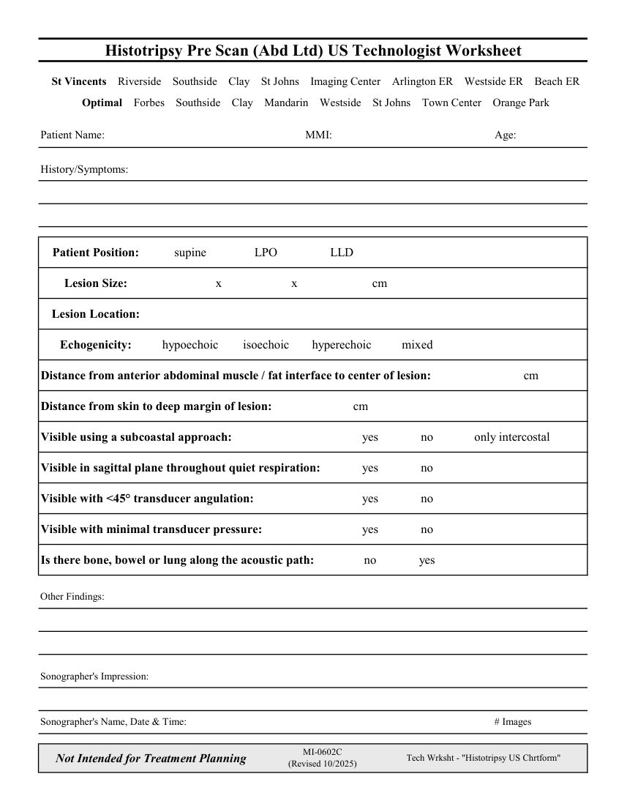

# Ecografie — Fișă de lucru: Evaluare înainte de histotripsie (MCB)

## Documentul original MCB — Fișă de lucru: Evaluare înainte de histotripsie

**Fișă de lucru · 1 pagini · consultat la 2026-09-27.**

[Descarcă PDF-ul integral](../../assets/mcb-modalities/eco-fisa-de-lucru-evaluare-inainte-de-histotripsie-mcb/document.pdf) · [Sursa MCB](https://ref.mcbradiology.com/Protocols,%20Policies,%20Worksheets%20&%20Forms/US/Tech%20Worksheets/Histotripsy%20Pre%20Scan.pdf) · [Catalogul MCB pentru această modalitate](../mcb/index.md)

Instrucțiunile, valorile și ilustrațiile din documentul original sunt păstrate în **engleză**. Titlul și navigarea sunt în română.

### Pagina 1

{ loading=lazy }

## Textul documentului original

??? abstract "Pagina 1 — text în engleză"

    
Histotripsy Pre Scan (Abd Ltd) US Technologist Worksheet
      St Vincents    Riverside    Southside    Clay    St Johns    Imaging Center    Arlington ER    Westside ER    Beach ER
      Optimal    Forbes    Southside    Clay    Mandarin    Westside    St Johns    Town Center    Orange Park
    Patient Name:
    MMI:
    Age:
    History/Symptoms:
    LLD
    Patient Position:
    supine
    LPO
    Lesion Size:
    cm
    x
    x
    Lesion Location:
    hypoechoic
    isoechoic
    hyperechoic
    mixed
    Echogenicity:
    cm
    Distance from anterior abdominal muscle / fat interface to center of lesion:
    cm
    Distance from skin to deep margin of lesion:
    yes
    no
    only intercostal
    Visible using a subcoastal approach:
    yes
    no
    Visible in sagittal plane throughout quiet respiration:
    yes
    no
    Visible with &lt;45° transducer angulation:
    yes
    no
    Visible with minimal transducer pressure:
    no
    yes
    Is there bone, bowel or lung along the acoustic path:
    Other Findings:
    Sonographer&#x27;s Impression:
    Sonographer&#x27;s Name, Date &amp; Time:
    # Images
    Not Intended for Treatment Planning
    MI-0602C                                               
    (Revised 10/2025)
    Tech Wrksht - &quot;Histotripsy US Chrtform&quot;
    

