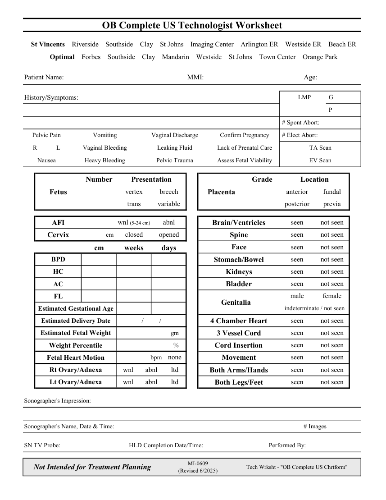

# Ecografie — Fișă de lucru: Examinare obstetricală completă (MCB)

## Documentul original MCB — Fișă de lucru: Examinare obstetricală completă

**Fișă de lucru · 1 pagini · consultat la 2026-09-27.**

[Descarcă PDF-ul integral](../../assets/mcb-modalities/eco-fisa-de-lucru-examinare-obstetricala-completa-mcb/document.pdf) · [Sursa MCB](https://ref.mcbradiology.com/Protocols,%20Policies,%20Worksheets%20&%20Forms/US/Tech%20Worksheets/OB%20Complete.pdf) · [Catalogul MCB pentru această modalitate](../mcb/index.md)

Instrucțiunile, valorile și ilustrațiile din documentul original sunt păstrate în **engleză**. Titlul și navigarea sunt în română.

### Pagina 1

{ loading=lazy }

## Textul documentului original

??? abstract "Pagina 1 — text în engleză"

    
OB Complete US Technologist Worksheet
      St Vincents    Riverside    Southside    Clay    St Johns    Imaging Center    Arlington ER    Westside ER    Beach ER
      Optimal    Forbes    Southside    Clay    Mandarin    Westside    St Johns    Town Center    Orange Park
    Patient Name:
    MMI:
    Age:
     G
      LMP
    History/Symptoms:
     P
     # Spont Abort:
    Pelvic Pain
    Vomiting
    Vaginal Discharge
    Confirm Pregnancy
     # Elect Abort:
    R
    L
    Vaginal Bleeding
    Leaking Fluid
    Lack of Prenatal Care
    TA Scan
    Nausea
    Pelvic Trauma
    Assess Fetal Viability
    Heavy Bleeding
    EV Scan
    Number
    Presentation
    Location
    Grade
    vertex
    breech
    anterior
    fundal
    Fetus
    Placenta
    trans
    variable
    posterior
    previa
    wnl (5-24 cm)
    abnl
    seen
    not seen
    AFI
    Brain/Ventricles
    cm 
    closed
    opened
    seen
    not seen
    Cervix
    Spine
    seen
    not seen
    Face
    cm
    weeks
    days
    seen
    not seen
    BPD
    Stomach/Bowel
    seen
    not seen
    HC
    Kidneys
    seen
    not seen
    AC
    Bladder
    male
    female
    FL
    Genitalia   
    indeterminate / not seen
    Estimated Gestational Age
    Estimated Delivery Date
    /         /
    seen
    not seen
    4 Chamber Heart
    gm    
    seen
    not seen
    Estimated Fetal Weight
    3 Vessel Cord
    %    
    seen
    not seen
    Weight Percentile
    Cord Insertion
    bpm
    seen
    none
    not seen
    Fetal Heart Motion
    Movement
    wnl
    abnl
    ltd
    seen
    not seen
    Rt Ovary/Adnexa
    Both Arms/Hands
    seen
    not seen
    Lt Ovary/Adnexa
    wnl
    abnl
    ltd
    Both Legs/Feet
    Sonographer&#x27;s Impression:
    Sonographer&#x27;s Name, Date &amp; Time:
    # Images
    SN TV Probe:
    HLD Completion Date/Time:
    Performed By:
    Not Intended for Treatment Planning
    MI-0609                                                            
    (Revised 6/2025)
    Tech Wrksht - &quot;OB Complete US Chrtform&quot;
    

