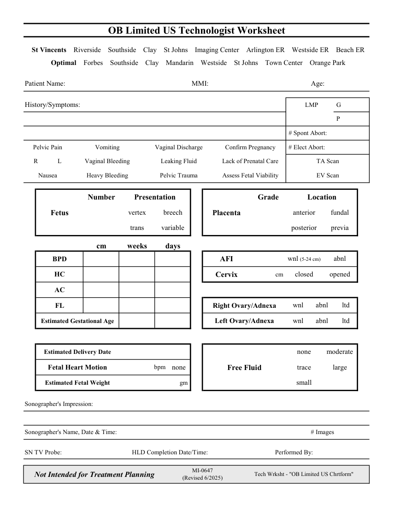

# Ecografie — Fișă de lucru: Examinare obstetricală limitată (MCB)

## Documentul original MCB — Fișă de lucru: Examinare obstetricală limitată

**Fișă de lucru · 1 pagini · consultat la 2026-09-27.**

[Descarcă PDF-ul integral](../../assets/mcb-modalities/eco-fisa-de-lucru-examinare-obstetricala-limitata-mcb/document.pdf) · [Sursa MCB](https://ref.mcbradiology.com/Protocols,%20Policies,%20Worksheets%20&%20Forms/US/Tech%20Worksheets/OB%20Limited.pdf) · [Catalogul MCB pentru această modalitate](../mcb/index.md)

Instrucțiunile, valorile și ilustrațiile din documentul original sunt păstrate în **engleză**. Titlul și navigarea sunt în română.

### Pagina 1

{ loading=lazy }

## Textul documentului original

??? abstract "Pagina 1 — text în engleză"

    
OB Limited US Technologist Worksheet
      St Vincents    Riverside    Southside    Clay    St Johns    Imaging Center    Arlington ER    Westside ER    Beach ER
      Optimal    Forbes    Southside    Clay    Mandarin    Westside    St Johns    Town Center    Orange Park
    Patient Name:
    MMI:
    Age:
    History/Symptoms:
      LMP
     G
     P
     # Spont Abort:
    Pelvic Pain
    Vomiting
    Vaginal Discharge
    Confirm Pregnancy
     # Elect Abort:
    R
    L
    Vaginal Bleeding
    Leaking Fluid
    Lack of Prenatal Care
    TA Scan
    Nausea
    Heavy Bleeding
    Pelvic Trauma
    Assess Fetal Viability
    EV Scan
    Grade
    Number
    Presentation
    Location
    vertex
    breech
    anterior
    fundal
    Fetus
    Placenta
    trans
    variable
    posterior
    previa
    cm
    weeks
    days
    wnl (5-24 cm)
    abnl
    BPD
    AFI
    cm 
    opened
    closed
    HC
    Cervix
    AC
    wnl
    abnl
    ltd
    FL
    Right Ovary/Adnexa
    Estimated Gestational Age
    wnl
    abnl
    ltd
    Left Ovary/Adnexa
    Estimated Delivery Date
    none
    moderate
    bpm
    none
    trace
    large
    Fetal Heart Motion
    Free Fluid
    gm 
    Estimated Fetal Weight
    small
    Sonographer&#x27;s Impression:
    Sonographer&#x27;s Name, Date &amp; Time:
    # Images
    SN TV Probe:
    HLD Completion Date/Time:
    Performed By:
    Not Intended for Treatment Planning
    MI-0647                                                        
    (Revised 6/2025)
    Tech Wrksht - &quot;OB Limited US Chrtform&quot;
    

