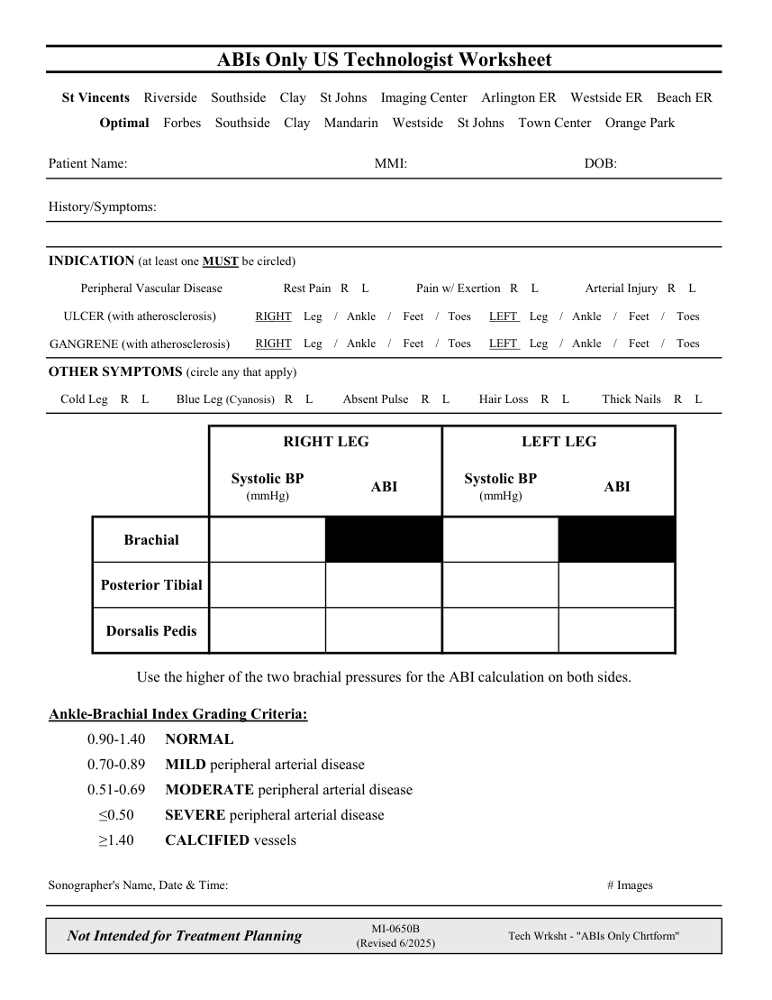

# Ecografie — Fișă de lucru: Leg ABIs Only (MCB)

## Documentul original MCB — Fișă de lucru: Leg ABIs Only

**Fișă de lucru · 1 pagini · consultat la 2026-09-27.**

[Descarcă PDF-ul integral](../../assets/mcb-modalities/eco-fisa-de-lucru-leg-abis-only-mcb/document.pdf) · [Sursa MCB](https://ref.mcbradiology.com/Protocols,%20Policies,%20Worksheets%20&%20Forms/US/Tech%20Worksheets/Leg%20ABIs%20Only.pdf) · [Catalogul MCB pentru această modalitate](../mcb/index.md)

Instrucțiunile, valorile și ilustrațiile din documentul original sunt păstrate în **engleză**. Titlul și navigarea sunt în română.

### Pagina 1

{ loading=lazy }

## Textul documentului original

??? abstract "Pagina 1 — text în engleză"

    
ABIs Only US Technologist Worksheet
      St Vincents    Riverside    Southside    Clay    St Johns    Imaging Center    Arlington ER    Westside ER    Beach ER
      Optimal    Forbes    Southside    Clay    Mandarin    Westside    St Johns    Town Center    Orange Park
    Patient Name:
    MMI:
    DOB:
    History/Symptoms:
    INDICATION (at least one MUST be circled)
    Peripheral Vascular Disease
    Rest Pain   R    L
    Pain w/ Exertion   R    L
    Arterial Injury   R    L
    ULCER (with atherosclerosis)
    RIGHT    Leg    /   Ankle    /    Feet    /   Toes      LEFT    Leg    /   Ankle    /    Feet    /    Toes
    GANGRENE (with atherosclerosis)
    RIGHT    Leg    /   Ankle    /    Feet    /   Toes      LEFT    Leg    /   Ankle    /    Feet    /    Toes
    OTHER SYMPTOMS (circle any that apply)
    Cold Leg    R    L
    Blue Leg (Cyanosis)   R    L
    Absent Pulse    R    L
    Hair Loss    R    L
    Thick Nails    R    L
    RIGHT LEG
    LEFT LEG
    Systolic BP                                              
    (mmHg)
    ABI
    Systolic BP                                              
    (mmHg)
    ABI
    Brachial
    Posterior Tibial
    Dorsalis Pedis
    Use the higher of the two brachial pressures for the ABI calculation on both sides.
    Ankle-Brachial Index Grading Criteria:
    0.90-1.40
    NORMAL
    0.70-0.89
    MILD peripheral arterial disease
    0.51-0.69
    MODERATE peripheral arterial disease
    ≤0.50
    SEVERE peripheral arterial disease
    ≥1.40
    CALCIFIED vessels
    Sonographer&#x27;s Name, Date &amp; Time:
    # Images
    Not Intended for Treatment Planning
    MI-0650B                                                                                           
    (Revised 6/2025)
    Tech Wrksht - &quot;ABIs Only Chrtform&quot;
    

