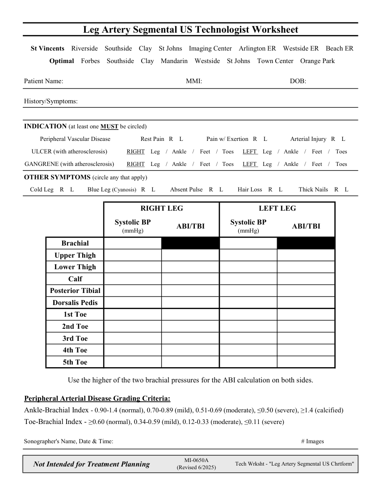

# Ecografie — Fișă de lucru: Leg Segmentals (MCB)

## Documentul original MCB — Fișă de lucru: Leg Segmentals

**Fișă de lucru · 1 pagini · consultat la 2026-09-27.**

[Descarcă PDF-ul integral](../../assets/mcb-modalities/eco-fisa-de-lucru-leg-segmentals-mcb/document.pdf) · [Sursa MCB](https://ref.mcbradiology.com/Protocols,%20Policies,%20Worksheets%20&%20Forms/US/Tech%20Worksheets/Leg%20Segmentals.pdf) · [Catalogul MCB pentru această modalitate](../mcb/index.md)

Instrucțiunile, valorile și ilustrațiile din documentul original sunt păstrate în **engleză**. Titlul și navigarea sunt în română.

### Pagina 1

{ loading=lazy }

## Textul documentului original

??? abstract "Pagina 1 — text în engleză"

    
Leg Artery Segmental US Technologist Worksheet
      St Vincents    Riverside    Southside    Clay    St Johns    Imaging Center    Arlington ER    Westside ER    Beach ER
      Optimal    Forbes    Southside    Clay    Mandarin    Westside    St Johns    Town Center    Orange Park
    Patient Name:
    MMI:
    DOB:
    History/Symptoms:
    INDICATION (at least one MUST be circled)
    Peripheral Vascular Disease
    Rest Pain   R    L
    Pain w/ Exertion   R    L
    Arterial Injury   R    L
    ULCER (with atherosclerosis)
    RIGHT    Leg    /   Ankle    /    Feet    /   Toes      LEFT    Leg    /   Ankle    /    Feet    /    Toes
    GANGRENE (with atherosclerosis)
    RIGHT    Leg    /   Ankle    /    Feet    /   Toes      LEFT    Leg    /   Ankle    /    Feet    /    Toes
    OTHER SYMPTOMS (circle any that apply)
    Cold Leg    R    L
    Blue Leg (Cyanosis)   R    L
    Absent Pulse    R    L
    Hair Loss    R    L
    Thick Nails    R    L
    RIGHT LEG
    LEFT LEG
    Systolic BP                                              
    (mmHg)
    ABI/TBI
    Systolic BP                                              
    (mmHg)
    ABI/TBI
    Brachial
    Upper Thigh
    Lower Thigh
    Calf
    Posterior Tibial
    Dorsalis Pedis
    1st Toe
    2nd Toe
    3rd Toe
    4th Toe
    5th Toe
    Use the higher of the two brachial pressures for the ABI calculation on both sides.
    Peripheral Arterial Disease Grading Criteria:
    Ankle-Brachial Index - 0.90-1.4 (normal), 0.70-0.89 (mild), 0.51-0.69 (moderate), ≤0.50 (severe), ≥1.4 (calcified)
    Toe-Brachial Index - ≥0.60 (normal), 0.34-0.59 (mild), 0.12-0.33 (moderate), ≤0.11 (severe)
    Sonographer&#x27;s Name, Date &amp; Time:
    # Images
    Not Intended for Treatment Planning
    MI-0650A                                                                    
    (Revised 6/2025)
    Tech Wrksht - &quot;Leg Artery Segmental US Chrtform&quot;
    

