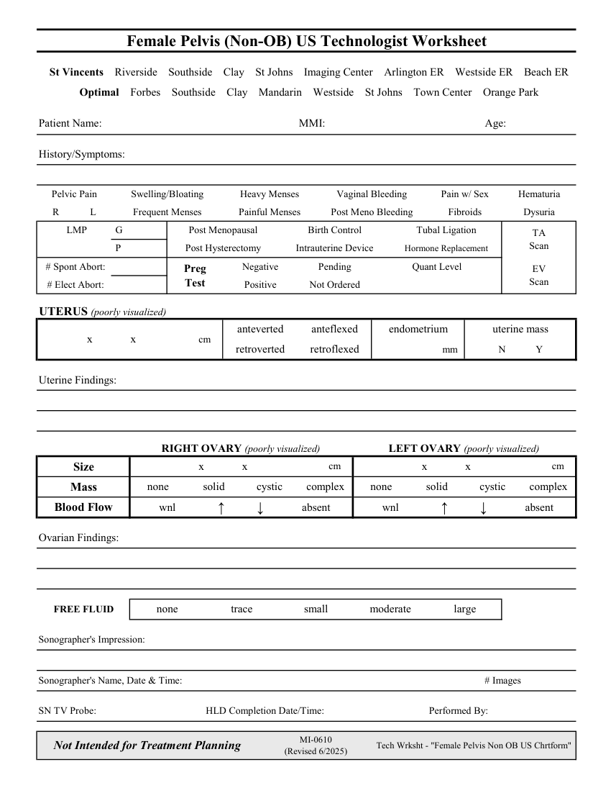

# Ecografie — Fișă de lucru: Pelvis feminin neobstetrical (MCB)

## Documentul original MCB — Fișă de lucru: Pelvis feminin neobstetrical

**Fișă de lucru · 1 pagini · consultat la 2026-09-27.**

[Descarcă PDF-ul integral](../../assets/mcb-modalities/eco-fisa-de-lucru-pelvis-feminin-neobstetrical-mcb/document.pdf) · [Sursa MCB](https://ref.mcbradiology.com/Protocols,%20Policies,%20Worksheets%20&%20Forms/US/Tech%20Worksheets/Female%20Pelvis%20%28Non%20OB%29.pdf) · [Catalogul MCB pentru această modalitate](../mcb/index.md)

Instrucțiunile, valorile și ilustrațiile din documentul original sunt păstrate în **engleză**. Titlul și navigarea sunt în română.

### Pagina 1

{ loading=lazy }

## Textul documentului original

??? abstract "Pagina 1 — text în engleză"

    
Female Pelvis (Non-OB) US Technologist Worksheet
      St Vincents    Riverside    Southside    Clay    St Johns    Imaging Center    Arlington ER    Westside ER    Beach ER
      Optimal    Forbes    Southside    Clay    Mandarin    Westside    St Johns    Town Center    Orange Park
    Patient Name:
    MMI:
    Age:
    History/Symptoms:
    Pelvic Pain
    Pain w/ Sex
    Swelling/Bloating
    Vaginal Bleeding
    Heavy Menses
    Hematuria
    R
    L
    Frequent Menses
    Post Meno Bleeding
    Painful Menses
    Fibroids
    Dysuria
    Tubal Ligation
      LMP
     G
    Post Menopausal
    Birth Control
    TA                            
    Scan
    Hormone Replacement
     P
    Post Hysterectomy
    Intrauterine Device
     # Spont Abort:
    Negative
    Pending
    Quant Level
    EV                            
    Preg                            
    Scan
    Test
     # Elect Abort:
    Positive
    Not Ordered
    UTERUS (poorly visualized)
    anteverted
    anteflexed
    endometrium
    uterine mass
    cm
    x               x
    Y
    N
    retroverted
    retroflexed
    mm  
    Uterine Findings:
    RIGHT OVARY (poorly visualized)
    LEFT OVARY (poorly visualized)
    cm
    x               x
    x               x
    cm
    Size
    none
    solid
    cystic
    complex
    none
    solid
    cystic
    complex
    Mass
    wnl
    Blood Flow
    ↑ 
    ↓
    absent
    ↑ 
    wnl
    ↓
    absent
    Ovarian Findings:
    FREE FLUID
    none
    trace
    moderate
    small
    large
    Sonographer&#x27;s Impression:
    Sonographer&#x27;s Name, Date &amp; Time:
    # Images
    SN TV Probe:
    HLD Completion Date/Time:
    Performed By:
    Not Intended for Treatment Planning
    MI-0610                                                             
    (Revised 6/2025)
    Tech Wrksht - &quot;Female Pelvis Non OB US Chrtform&quot;
    

