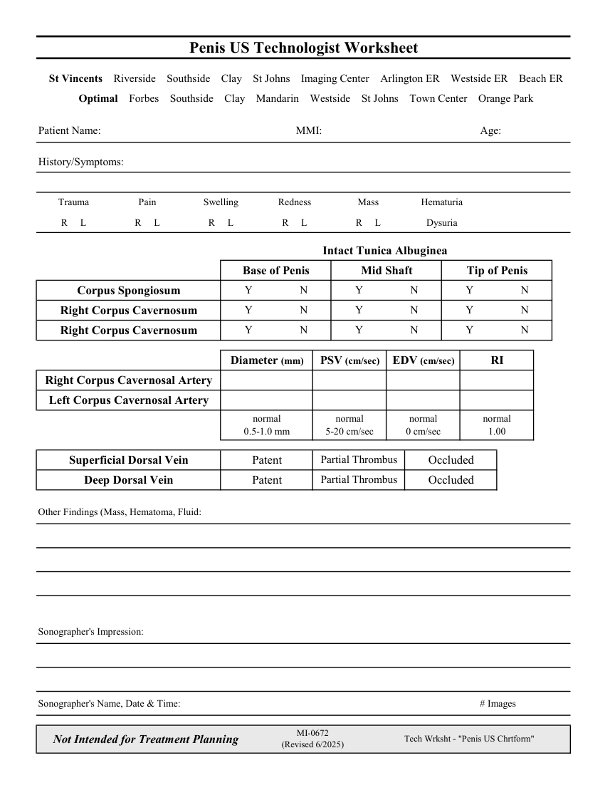

# Ecografie — Fișă de lucru: Penis (MCB)

## Documentul original MCB — Fișă de lucru: Penis

**Fișă de lucru · 1 pagini · consultat la 2026-09-27.**

[Descarcă PDF-ul integral](../../assets/mcb-modalities/eco-fisa-de-lucru-penis-mcb/document.pdf) · [Sursa MCB](https://ref.mcbradiology.com/Protocols,%20Policies,%20Worksheets%20&%20Forms/US/Tech%20Worksheets/Penis.pdf) · [Catalogul MCB pentru această modalitate](../mcb/index.md)

Instrucțiunile, valorile și ilustrațiile din documentul original sunt păstrate în **engleză**. Titlul și navigarea sunt în română.

### Pagina 1

{ loading=lazy }

## Textul documentului original

??? abstract "Pagina 1 — text în engleză"

    
Penis US Technologist Worksheet
      St Vincents    Riverside    Southside    Clay    St Johns    Imaging Center    Arlington ER    Westside ER    Beach ER
      Optimal    Forbes    Southside    Clay    Mandarin    Westside    St Johns    Town Center    Orange Park
    Patient Name:
    MMI:
    Age:
    History/Symptoms:
    Pain
    Swelling
    Redness
    Mass
    Trauma
    Hematuria
    R     L
    R     L
    R     L
    R     L
    R     L
    Dysuria
    Intact Tunica Albuginea 
    Base of Penis
    Mid Shaft
    Tip of Penis
    Y
    Y
    N
    N
    Y
    N
    Corpus Spongiosum
    Y
    N
    Y
    N
    Y
    N
    Right Corpus Cavernosum
    Y
    N
    Y
    Y
    N
    N
    Right Corpus Cavernosum
    Diameter (mm)
    PSV (cm/sec)
    EDV (cm/sec)
    RI
    Right Corpus Cavernosal Artery
    Left Corpus Cavernosal Artery
    normal                                                              
    normal                                                  
    normal                                                  
    normal                                        
    0.5-1.0 mm
    5-20 cm/sec
    0 cm/sec
    1.00
    Partial Thrombus
    Occluded
    Superficial Dorsal Vein
    Patent
    Partial Thrombus
    Occluded
    Deep Dorsal Vein
    Patent
    Other Findings (Mass, Hematoma, Fluid:
    Sonographer&#x27;s Impression:
    Sonographer&#x27;s Name, Date &amp; Time:
    # Images
    Not Intended for Treatment Planning
    MI-0672                                                                 
    (Revised 6/2025)
    Tech Wrksht - &quot;Penis US Chrtform&quot;
    

