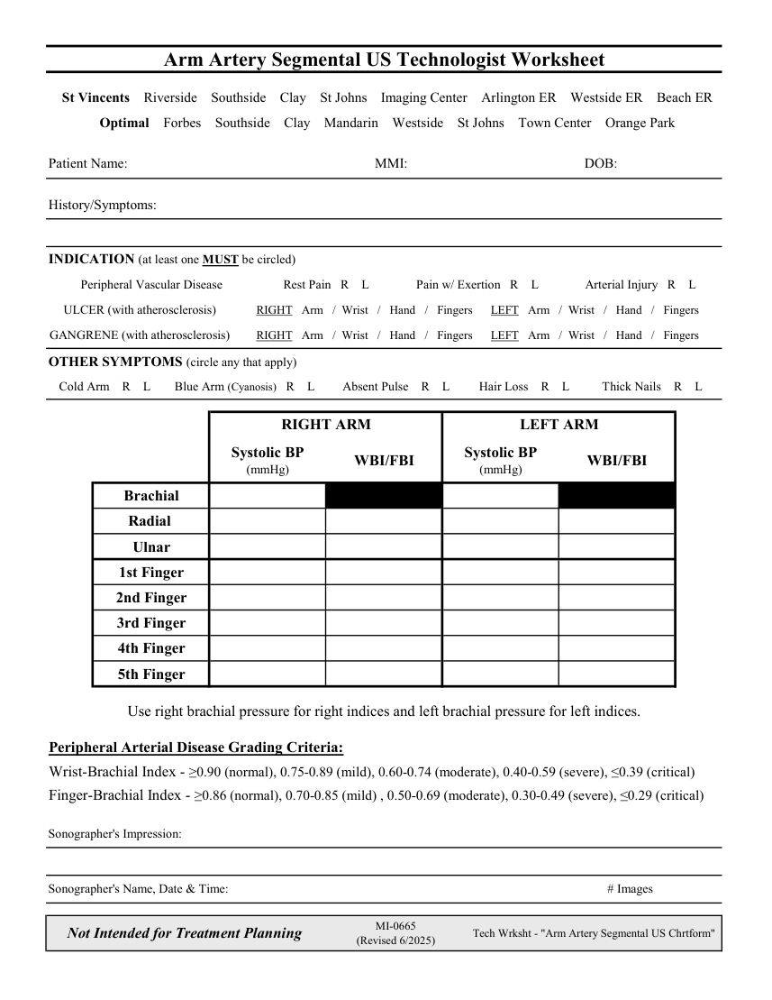

# Ecografie — Fișă de lucru: Presiuni segmentare: membru superior (MCB)

## Documentul original MCB — Fișă de lucru: Presiuni segmentare: membru superior

**Fișă de lucru · 1 pagini · consultat la 2026-09-27.**

[Descarcă PDF-ul integral](../../assets/mcb-modalities/eco-fisa-de-lucru-presiuni-segmentare-membru-superior-mcb/document.pdf) · [Sursa MCB](https://ref.mcbradiology.com/Protocols,%20Policies,%20Worksheets%20&%20Forms/US/Tech%20Worksheets/Arm%20Segmentals.pdf) · [Catalogul MCB pentru această modalitate](../mcb/index.md)

Instrucțiunile, valorile și ilustrațiile din documentul original sunt păstrate în **engleză**. Titlul și navigarea sunt în română.

### Pagina 1

{ loading=lazy }

## Textul documentului original

??? abstract "Pagina 1 — text în engleză"

    
Arm Artery Segmental US Technologist Worksheet
      St Vincents    Riverside    Southside    Clay    St Johns    Imaging Center    Arlington ER    Westside ER    Beach ER
      Optimal    Forbes    Southside    Clay    Mandarin    Westside    St Johns    Town Center    Orange Park
    Patient Name:
    MMI:
    DOB:
    History/Symptoms:
    INDICATION (at least one MUST be circled)
    Peripheral Vascular Disease
    Rest Pain   R    L
    Pain w/ Exertion   R    L
    Arterial Injury   R    L
    ULCER (with atherosclerosis)
    RIGHT   Arm   /  Wrist   /   Hand   /   Fingers      LEFT   Arm   /  Wrist   /   Hand   /   Fingers
    GANGRENE (with atherosclerosis)
    RIGHT   Arm   /  Wrist   /   Hand   /   Fingers      LEFT   Arm   /  Wrist   /   Hand   /   Fingers
    OTHER SYMPTOMS (circle any that apply)
    Cold Arm    R    L
    Blue Arm (Cyanosis)   R    L
    Absent Pulse    R    L
    Hair Loss    R    L
    Thick Nails    R    L
    RIGHT ARM
    LEFT ARM
    Systolic BP                                              
    Systolic BP                                              
    (mmHg)
    WBI/FBI
    WBI/FBI
    (mmHg)
    Brachial
    Radial 
    Ulnar
    1st Finger
    2nd Finger
    3rd Finger
    4th Finger
    5th Finger
    Use right brachial pressure for right indices and left brachial pressure for left indices.
    Peripheral Arterial Disease Grading Criteria:
    Wrist-Brachial Index - ≥0.90 (normal), 0.75-0.89 (mild), 0.60-0.74 (moderate), 0.40-0.59 (severe), ≤0.39 (critical)
    Finger-Brachial Index - ≥0.86 (normal), 0.70-0.85 (mild) , 0.50-0.69 (moderate), 0.30-0.49 (severe), ≤0.29 (critical)
    Sonographer&#x27;s Impression:
    Sonographer&#x27;s Name, Date &amp; Time:
    # Images
    Not Intended for Treatment Planning
    MI-0665                                                          
    (Revised 6/2025)
    Tech Wrksht - &quot;Arm Artery Segmental US Chrtform&quot;
    

