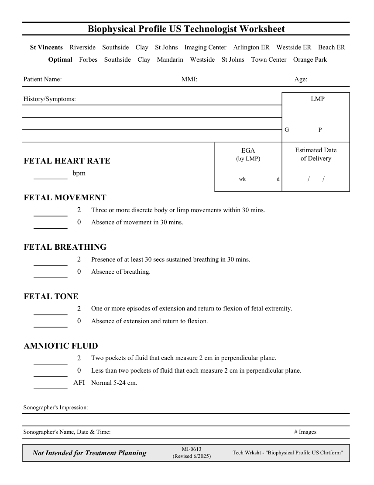

# Ecografie — Fișă de lucru: Profil biofizic fetal (MCB)

## Documentul original MCB — Fișă de lucru: Profil biofizic fetal

**Fișă de lucru · 1 pagini · consultat la 2026-09-27.**

[Descarcă PDF-ul integral](../../assets/mcb-modalities/eco-fisa-de-lucru-profil-biofizic-fetal-mcb/document.pdf) · [Sursa MCB](https://ref.mcbradiology.com/Protocols,%20Policies,%20Worksheets%20&%20Forms/US/Tech%20Worksheets/Biophysical%20Profile.pdf) · [Catalogul MCB pentru această modalitate](../mcb/index.md)

Instrucțiunile, valorile și ilustrațiile din documentul original sunt păstrate în **engleză**. Titlul și navigarea sunt în română.

### Pagina 1

{ loading=lazy }

## Textul documentului original

??? abstract "Pagina 1 — text în engleză"

    
Biophysical Profile US Technologist Worksheet
      St Vincents    Riverside    Southside    Clay    St Johns    Imaging Center    Arlington ER    Westside ER    Beach ER
      Optimal    Forbes    Southside    Clay    Mandarin    Westside    St Johns    Town Center    Orange Park
    Patient Name:
    MMI:
    Age:
    History/Symptoms:
      LMP
     G
     P
    Estimated Date                       
    EGA                                          
    (by LMP)
    of Delivery                          
    FETAL HEART RATE
    bpm
    d 
    wk 
    /       /
    FETAL MOVEMENT
    Three or more discrete body or limp movements within 30 mins.
    2
    Absence of movement in 30 mins.
    0
    FETAL BREATHING
    Presence of at least 30 secs sustained breathing in 30 mins.
    2
    Absence of breathing.
    0
    FETAL TONE
    One or more episodes of extension and return to flexion of fetal extremity.
    2
    Absence of extension and return to flexion.
    0
    AMNIOTIC FLUID
    Two pockets of fluid that each measure 2 cm in perpendicular plane.
    2
    Less than two pockets of fluid that each measure 2 cm in perpendicular plane.
    0
    AFI
    Normal 5-24 cm.
    Sonographer&#x27;s Impression:
    Sonographer&#x27;s Name, Date &amp; Time:
    # Images
    Not Intended for Treatment Planning
    MI-0613                                                                  
    (Revised 6/2025)
    Tech Wrksht - &quot;Biophysical Profile US Chrtform&quot;
    

