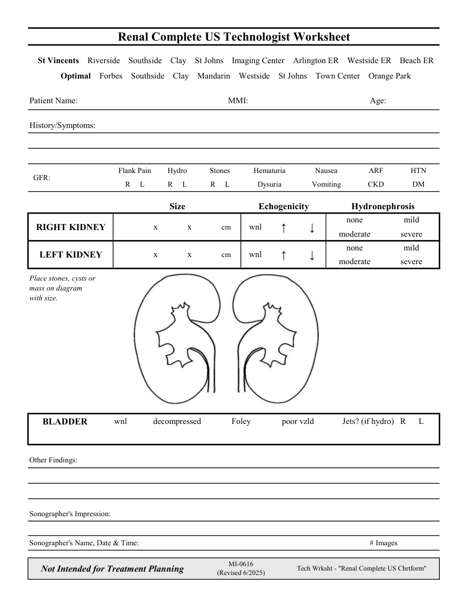

# Ecografie — Fișă de lucru: Rinichi: examinare completă (MCB)

## Documentul original MCB — Fișă de lucru: Rinichi: examinare completă

**Fișă de lucru · 1 pagini · consultat la 2026-09-27.**

[Descarcă PDF-ul integral](../../assets/mcb-modalities/eco-fisa-de-lucru-rinichi-examinare-completa-mcb/document.pdf) · [Sursa MCB](https://ref.mcbradiology.com/Protocols,%20Policies,%20Worksheets%20&%20Forms/US/Tech%20Worksheets/Renal%20Complete.pdf) · [Catalogul MCB pentru această modalitate](../mcb/index.md)

Instrucțiunile, valorile și ilustrațiile din documentul original sunt păstrate în **engleză**. Titlul și navigarea sunt în română.

### Pagina 1

{ loading=lazy }

## Textul documentului original

??? abstract "Pagina 1 — text în engleză"

    
Renal Complete US Technologist Worksheet
      St Vincents    Riverside    Southside    Clay    St Johns    Imaging Center    Arlington ER    Westside ER    Beach ER
      Optimal    Forbes    Southside    Clay    Mandarin    Westside    St Johns    Town Center    Orange Park
    Patient Name:
    MMI:
    Age:
    History/Symptoms:
    Flank Pain
    Hydro
    Stones
    Hematuria
    Nausea
    ARF
    HTN
      GFR:
    R     L
    R     L
    DM
    R     L
    Dysuria
    Vomiting
    CKD
    Size
    Echogenicity
    Hydronephrosis
    none
    mild
                  x              x              cm
    wnl
    RIGHT KIDNEY
    ↑
    ↓
    moderate
    severe
    none
    mild
    wnl
    ↓
    LEFT KIDNEY
                  x              x              cm
    ↑
    moderate
    severe
    Place stones, cysts or 
    mass on diagram 
    with size.
    wnl
    decompressed
    poor vzld
    Foley
    Jets? (if hydro)   R      L
     BLADDER
    Other Findings:
    Sonographer&#x27;s Impression:
    Sonographer&#x27;s Name, Date &amp; Time:
    # Images
    Not Intended for Treatment Planning
    MI-0616                                                                 
    (Revised 6/2025)
    Tech Wrksht - &quot;Renal Complete US Chrtform&quot;
    

