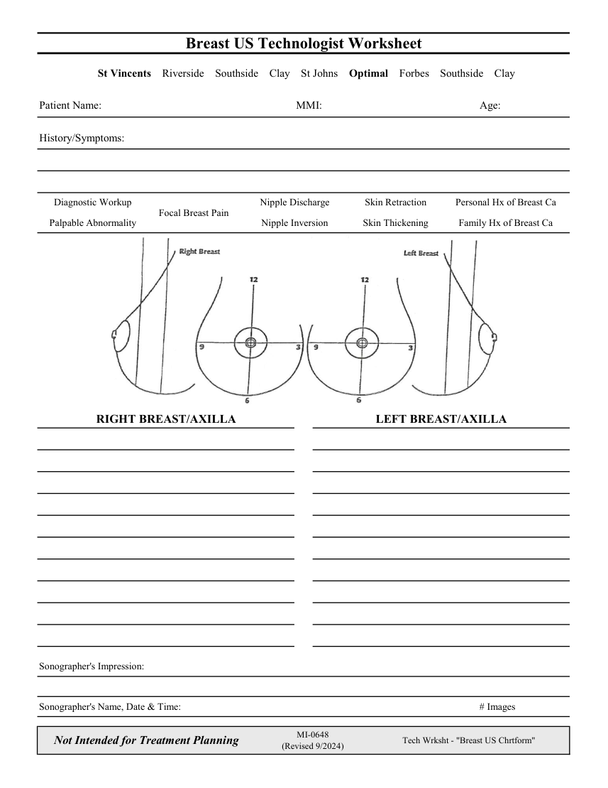

# Ecografie — Fișă de lucru: Sân și axilă (MCB)

## Documentul original MCB — Fișă de lucru: Sân și axilă

**Fișă de lucru · 1 pagini · consultat la 2026-09-27.**

[Descarcă PDF-ul integral](../../assets/mcb-modalities/eco-fisa-de-lucru-san-si-axila-mcb/document.pdf) · [Sursa MCB](https://ref.mcbradiology.com/Protocols,%20Policies,%20Worksheets%20&%20Forms/US/Tech%20Worksheets/Breast%20&%20Axilla.pdf) · [Catalogul MCB pentru această modalitate](../mcb/index.md)

Instrucțiunile, valorile și ilustrațiile din documentul original sunt păstrate în **engleză**. Titlul și navigarea sunt în română.

### Pagina 1

{ loading=lazy }

## Textul documentului original

??? abstract "Pagina 1 — text în engleză"

    
Breast US Technologist Worksheet
      St Vincents    Riverside    Southside    Clay    St Johns    Optimal    Forbes    Southside    Clay
    Patient Name:
    MMI:
    Age:
    History/Symptoms:
    Diagnostic Workup
    Nipple Discharge
    Skin Retraction
    Personal Hx of Breast Ca
    Focal Breast Pain
    Skin Thickening
    Palpable Abnormality
    Nipple Inversion
    Family Hx of Breast Ca
    RIGHT BREAST/AXILLA
    LEFT BREAST/AXILLA
    Sonographer&#x27;s Impression:
    Sonographer&#x27;s Name, Date &amp; Time:
    # Images
    Not Intended for Treatment Planning
    MI-0648                                                                     
    (Revised 9/2024)
    Tech Wrksht - &quot;Breast US Chrtform&quot;
    

