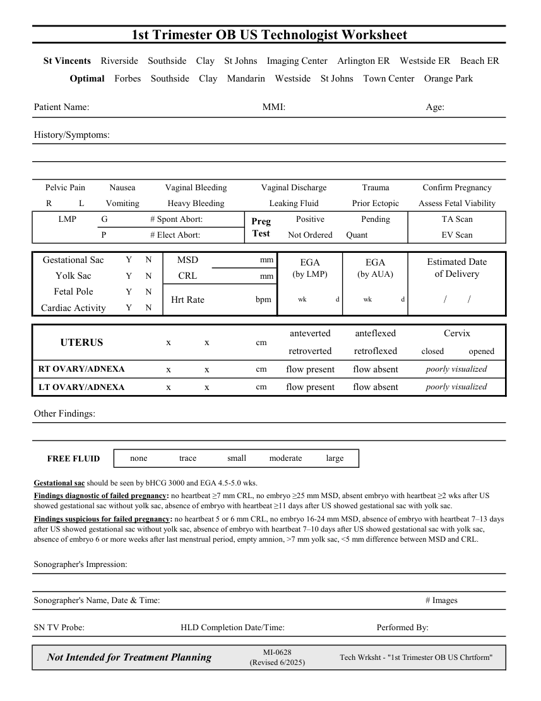

# Ecografie — Fișă de lucru: Sarcină în trimestrul I (MCB)

## Documentul original MCB — Fișă de lucru: Sarcină în trimestrul I

**Fișă de lucru · 1 pagini · consultat la 2026-09-27.**

[Descarcă PDF-ul integral](../../assets/mcb-modalities/eco-fisa-de-lucru-sarcina-in-trimestrul-i-mcb/document.pdf) · [Sursa MCB](https://ref.mcbradiology.com/Protocols,%20Policies,%20Worksheets%20&%20Forms/US/Tech%20Worksheets/1st%20Trimester%20OB.pdf) · [Catalogul MCB pentru această modalitate](../mcb/index.md)

Instrucțiunile, valorile și ilustrațiile din documentul original sunt păstrate în **engleză**. Titlul și navigarea sunt în română.

### Pagina 1

{ loading=lazy }

## Textul documentului original

??? abstract "Pagina 1 — text în engleză"

    
1st Trimester OB US Technologist Worksheet
      St Vincents    Riverside    Southside    Clay    St Johns    Imaging Center    Arlington ER    Westside ER    Beach ER
      Optimal    Forbes    Southside    Clay    Mandarin    Westside    St Johns    Town Center    Orange Park
    Patient Name:
    MMI:
    Age:
    History/Symptoms:
    Pelvic Pain
    Nausea
    Vaginal Bleeding
    Vaginal Discharge
    Trauma
    Confirm Pregnancy
    R
    L
    Vomiting
    Heavy Bleeding
    Leaking Fluid
    Prior Ectopic
    Assess Fetal Viability
      LMP
     G
     # Spont Abort:
    Positive
    Pending
    TA Scan
    Preg                            
    Test
     P
     # Elect Abort:
    Not Ordered
     Quant
    EV Scan
    Estimated Date                       
    Gestational Sac
    Y      N
    MSD
    mm 
    EGA                                          
    EGA                                          
    (by LMP)
    (by AUA)
    of Delivery
    Yolk Sac
    Y      N
    CRL
    mm 
    Y      N
    wk 
    d 
    bpm  
    Fetal Pole
    Hrt Rate
    wk 
    d 
    /        /
    Cardiac Activity
    Y      N
    anteverted
    anteflexed
    Cervix
    cm
    UTERUS
    x               x
    retroverted
    closed
    opened
    retroflexed
    cm
    poorly visualized
    RT OVARY/ADNEXA
    x               x
    flow present
    flow absent
    cm
    LT OVARY/ADNEXA
    x               x
    poorly visualized
    flow present
    flow absent
    Other Findings:
    none
    trace
    small
    moderate
    large
    FREE FLUID
    Gestational sac should be seen by bHCG 3000 and EGA 4.5-5.0 wks.
    Findings diagnostic of failed pregnancy: no heartbeat ≥7 mm CRL, no embryo ≥25 mm MSD, absent embryo with heartbeat ≥2 wks after US 
    showed gestational sac without yolk sac, absence of embryo with heartbeat ≥11 days after US showed gestational sac with yolk sac.
    Findings suspicious for failed pregnancy: no heartbeat 5 or 6 mm CRL, no embryo 16-24 mm MSD, absence of embryo with heartbeat 7–13 days 
    after US showed gestational sac without yolk sac, absence of embryo with heartbeat 7–10 days after US showed gestational sac with yolk sac, 
    absence of embryo 6 or more weeks after last menstrual period, empty amnion, &gt;7 mm yolk sac, &lt;5 mm difference between MSD and CRL. 
    Sonographer&#x27;s Impression:
    Sonographer&#x27;s Name, Date &amp; Time:
    # Images
    SN TV Probe:
    HLD Completion Date/Time:
    Performed By:
    Not Intended for Treatment Planning
    MI-0628                                                  
    (Revised 6/2025)
    Tech Wrksht - &quot;1st Trimester OB US Chrtform&quot;
    

