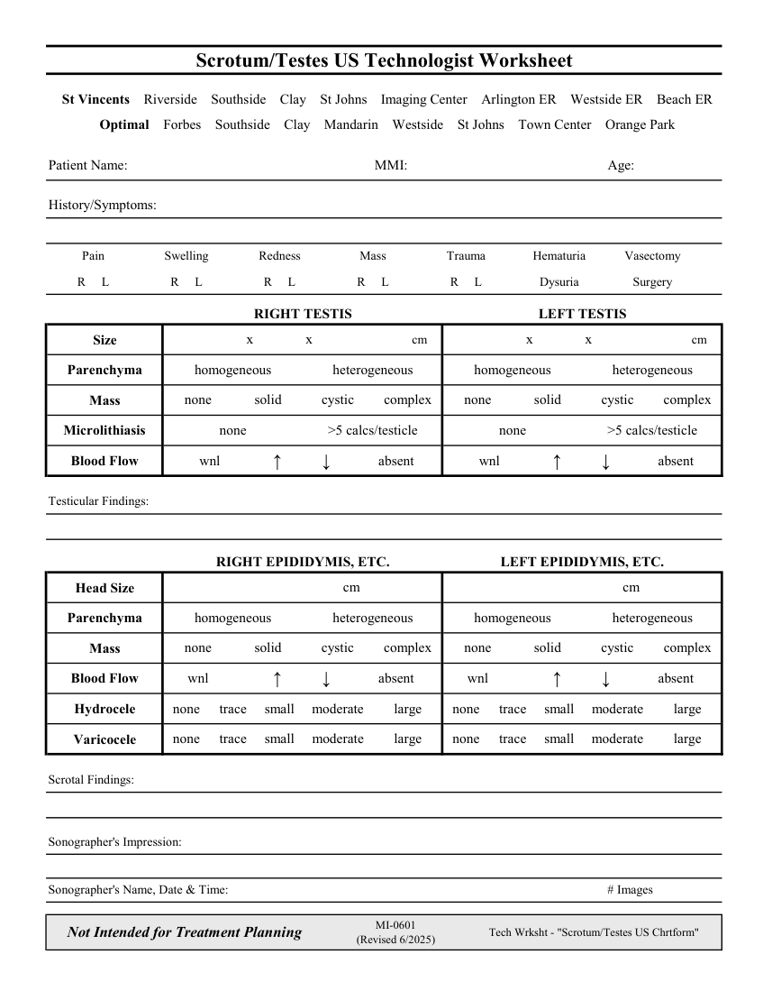

# Ecografie — Fișă de lucru: Scrot și testicule (MCB)

## Documentul original MCB — Fișă de lucru: Scrot și testicule

**Fișă de lucru · 1 pagini · consultat la 2026-09-27.**

[Descarcă PDF-ul integral](../../assets/mcb-modalities/eco-fisa-de-lucru-scrot-si-testicule-mcb/document.pdf) · [Sursa MCB](https://ref.mcbradiology.com/Protocols,%20Policies,%20Worksheets%20&%20Forms/US/Tech%20Worksheets/Scrotum%20Testes.pdf) · [Catalogul MCB pentru această modalitate](../mcb/index.md)

Instrucțiunile, valorile și ilustrațiile din documentul original sunt păstrate în **engleză**. Titlul și navigarea sunt în română.

### Pagina 1

{ loading=lazy }

## Textul documentului original

??? abstract "Pagina 1 — text în engleză"

    
Scrotum/Testes US Technologist Worksheet
      St Vincents    Riverside    Southside    Clay    St Johns    Imaging Center    Arlington ER    Westside ER    Beach ER
      Optimal    Forbes    Southside    Clay    Mandarin    Westside    St Johns    Town Center    Orange Park
    Patient Name:
    MMI:
    Age:
    History/Symptoms:
    Swelling
    Pain
    Redness
    Mass
    Trauma
    Hematuria
    Vasectomy
    R     L
    R     L
    R     L
    R     L
    R     L
    Dysuria
    Surgery
    RIGHT TESTIS
    LEFT TESTIS
    cm
    cm
                   x               x               
                   x               x               
    Size
    heterogeneous
    homogeneous
    homogeneous
    heterogeneous
    Parenchyma
    solid
    cystic
    complex
    none
    solid
    cystic
    complex
    Mass
    none
    none
    &gt;5 calcs/testicle
    none
    &gt;5 calcs/testicle
    Microlithiasis     
    wnl
    Blood Flow
    wnl
    ↓
    absent
    ↑ 
    ↓
    absent
    ↑ 
    Testicular Findings:
    RIGHT EPIDIDYMIS, ETC.
    LEFT EPIDIDYMIS, ETC.
                                cm
                                cm
    Head Size
    homogeneous
    heterogeneous
    homogeneous
    heterogeneous
    Parenchyma
    none
    solid
    cystic
    complex
    none
    solid
    cystic
    complex
    Mass
    wnl
    absent
    Blood Flow
    ↑ 
    ↓
    wnl
    ↑ 
    ↓
    absent
    none
    trace
    small
    moderate
    large
    none
    trace
    small
    moderate
    large
    Hydrocele
    none
    trace
    small
    moderate
    large
    none
    small
    moderate
    large
    trace
    Varicocele
    Scrotal Findings:
    Sonographer&#x27;s Impression:
    Sonographer&#x27;s Name, Date &amp; Time:
    # Images
    Not Intended for Treatment Planning
    MI-0601                                                                         
    (Revised 6/2025)
    Tech Wrksht - &quot;Scrotum/Testes US Chrtform&quot;
    

