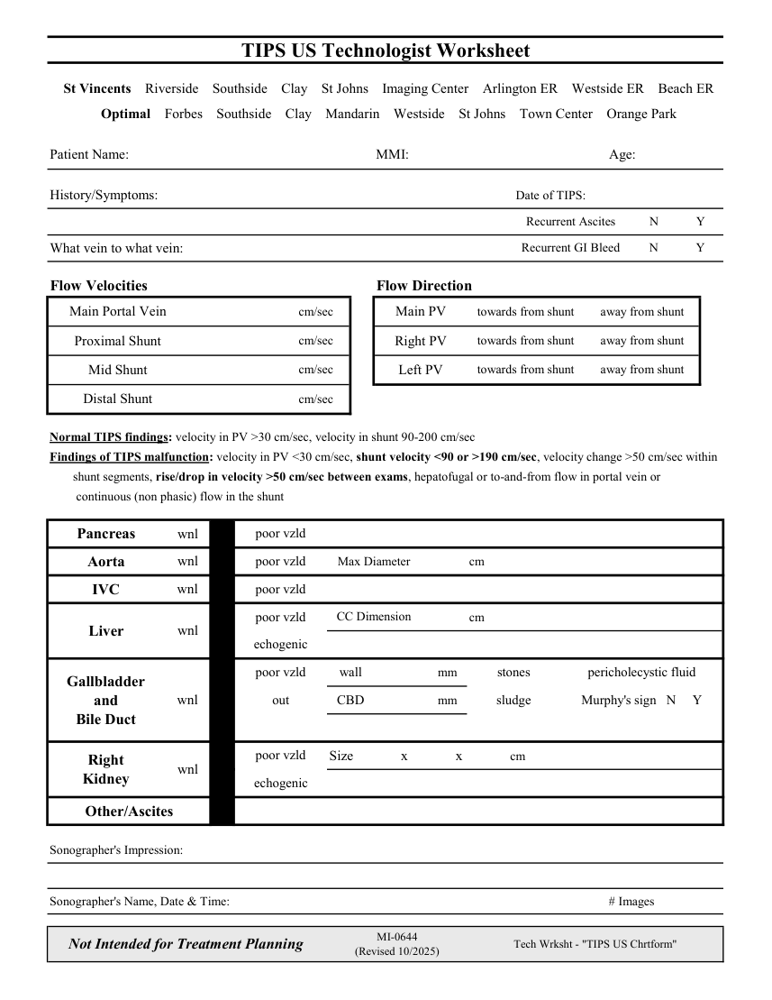

# Ecografie — Fișă de lucru: Șunt TIPS (MCB)

## Documentul original MCB — Fișă de lucru: Șunt TIPS

**Fișă de lucru · 1 pagini · consultat la 2026-09-27.**

[Descarcă PDF-ul integral](../../assets/mcb-modalities/eco-fisa-de-lucru-sunt-tips-mcb/document.pdf) · [Sursa MCB](https://ref.mcbradiology.com/Protocols,%20Policies,%20Worksheets%20&%20Forms/US/Tech%20Worksheets/TIPS.pdf) · [Catalogul MCB pentru această modalitate](../mcb/index.md)

Instrucțiunile, valorile și ilustrațiile din documentul original sunt păstrate în **engleză**. Titlul și navigarea sunt în română.

### Pagina 1

{ loading=lazy }

## Textul documentului original

??? abstract "Pagina 1 — text în engleză"

    
TIPS US Technologist Worksheet
      St Vincents    Riverside    Southside    Clay    St Johns    Imaging Center    Arlington ER    Westside ER    Beach ER
      Optimal    Forbes    Southside    Clay    Mandarin    Westside    St Johns    Town Center    Orange Park
    Patient Name:
    MMI:
    Age:
    Date of TIPS:
    History/Symptoms:
    N
    Y
    Recurrent Ascites 
    What vein to what vein:
    Recurrent GI Bleed 
    N
    Y
    Flow Velocities
    Flow Direction
    cm/sec
    towards from shunt
    away from shunt
    Main Portal Vein
    Main PV
    towards from shunt
    away from shunt
    Proximal Shunt
    cm/sec
    Right PV
    towards from shunt
    away from shunt
    Mid Shunt
    cm/sec
    Left PV
    Distal Shunt
    cm/sec
    Normal TIPS findings: velocity in PV &gt;30 cm/sec, velocity in shunt 90-200 cm/sec
    Findings of TIPS malfunction: velocity in PV &lt;30 cm/sec, shunt velocity &lt;90 or &gt;190 cm/sec, velocity change &gt;50 cm/sec within
    shunt segments, rise/drop in velocity &gt;50 cm/sec between exams, hepatofugal or to-and-from flow in portal vein or
     continuous (non phasic) flow in the shunt
    wnl
    poor vzld
    Pancreas
    cm
    Aorta
    wnl
    poor vzld
    Max Diameter
    IVC
    wnl
    poor vzld
    CC Dimension
    poor vzld
    cm
    Liver
    wnl
    echogenic
    poor vzld
    wall
                     mm
    stones
    pericholecystic fluid
    Gallbladder                             
    out
    CBD
                     mm
    sludge
    Murphy&#x27;s sign   N     Y
    wnl
    and                                  
    Bile Duct
    poor vzld
    Size               x               x               cm    
    Right                                      
    Kidney
    wnl
    echogenic
    Other/Ascites
    Sonographer&#x27;s Impression:
    Sonographer&#x27;s Name, Date &amp; Time:
    # Images
    Not Intended for Treatment Planning
    MI-0644                                                            
    (Revised 10/2025)
    Tech Wrksht - &quot;TIPS US Chrtform&quot;
    

