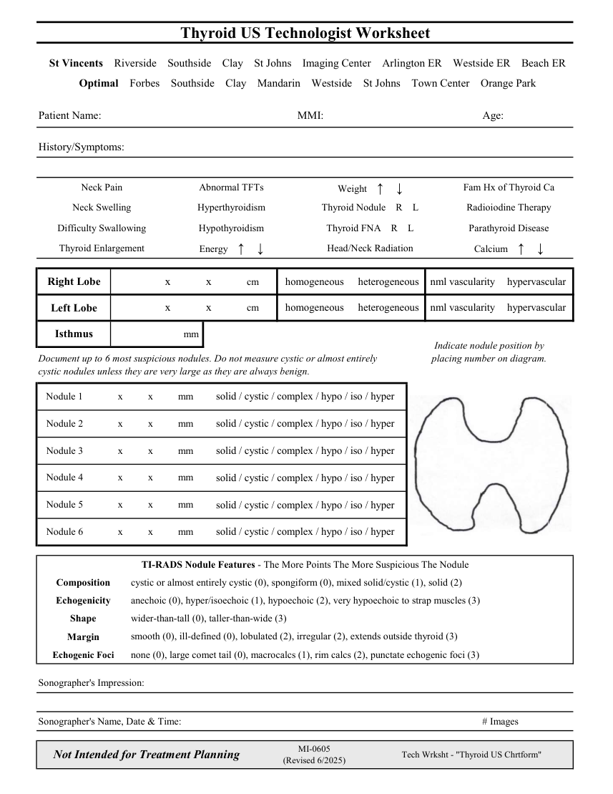

# Ecografie — Fișă de lucru: Tiroidă (MCB)

## Documentul original MCB — Fișă de lucru: Tiroidă

**Fișă de lucru · 1 pagini · consultat la 2026-09-27.**

[Descarcă PDF-ul integral](../../assets/mcb-modalities/eco-fisa-de-lucru-tiroida-mcb/document.pdf) · [Sursa MCB](https://ref.mcbradiology.com/Protocols,%20Policies,%20Worksheets%20&%20Forms/US/Tech%20Worksheets/Thyroid.pdf) · [Catalogul MCB pentru această modalitate](../mcb/index.md)

Instrucțiunile, valorile și ilustrațiile din documentul original sunt păstrate în **engleză**. Titlul și navigarea sunt în română.

### Pagina 1

{ loading=lazy }

## Textul documentului original

??? abstract "Pagina 1 — text în engleză"

    
Thyroid US Technologist Worksheet
      St Vincents    Riverside    Southside    Clay    St Johns    Imaging Center    Arlington ER    Westside ER    Beach ER
      Optimal    Forbes    Southside    Clay    Mandarin    Westside    St Johns    Town Center    Orange Park
    Patient Name:
    MMI:
    Age:
    History/Symptoms:
    Neck Pain
    Abnormal TFTs
    Fam Hx of Thyroid Ca
    Weight    ↑    ↓
    Neck Swelling
    Hyperthyroidism
    Thyroid Nodule    R    L
    Radioiodine Therapy
    Difficulty Swallowing
    Hypothyroidism
    Thyroid FNA    R    L
    Parathyroid Disease
    Thyroid Enlargement
    Head/Neck Radiation
    Energy    ↑    ↓
    Calcium    ↑    ↓
    homogeneous
    heterogeneous
    nml vascularity
    hypervascular
                  x              x              cm
    Right Lobe
    homogeneous
    heterogeneous
    nml vascularity
    hypervascular
                  x              x              cm
    Left Lobe
     mm 
    Isthmus
    Indicate nodule position by                            
    placing number on diagram.
    Document up to 6 most suspicious nodules. Do not measure cystic or almost entirely 
    cystic nodules unless they are very large as they are always benign.
    Nodule 1
          x          x          mm
    solid / cystic / complex / hypo / iso / hyper
    Nodule 2
          x          x          mm
    solid / cystic / complex / hypo / iso / hyper
    Nodule 3
          x          x          mm
    solid / cystic / complex / hypo / iso / hyper
    Nodule 4
          x          x          mm
    solid / cystic / complex / hypo / iso / hyper
    Nodule 5
          x          x          mm
    solid / cystic / complex / hypo / iso / hyper
    Nodule 6
          x          x          mm
    solid / cystic / complex / hypo / iso / hyper
    TI-RADS Nodule Features - The More Points The More Suspicious The Nodule
    Composition
    cystic or almost entirely cystic (0), spongiform (0), mixed solid/cystic (1), solid (2)
    anechoic (0), hyper/isoechoic (1), hypoechoic (2), very hypoechoic to strap muscles (3)
    Echogenicity
    wider-than-tall (0), taller-than-wide (3)
    Shape
    smooth (0), ill-defined (0), lobulated (2), irregular (2), extends outside thyroid (3)
    Margin
    Echogenic Foci
    none (0), large comet tail (0), macrocalcs (1), rim calcs (2), punctate echogenic foci (3)
    Sonographer&#x27;s Impression:
    Sonographer&#x27;s Name, Date &amp; Time:
    # Images
    Not Intended for Treatment Planning
    MI-0605                                                   
    (Revised 6/2025)
    Tech Wrksht - &quot;Thyroid US Chrtform&quot;
    

