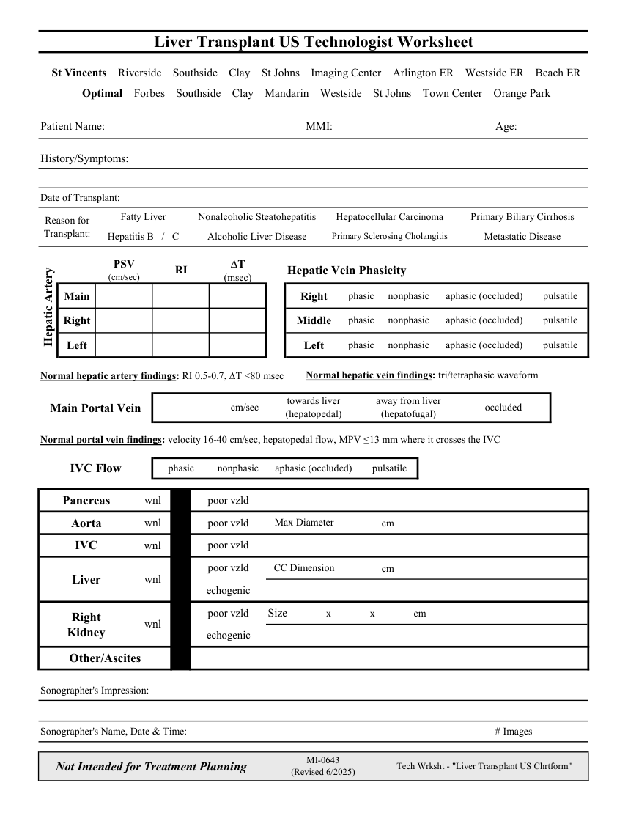

# Ecografie — Fișă de lucru: Transplant hepatic (MCB)

## Documentul original MCB — Fișă de lucru: Transplant hepatic

**Fișă de lucru · 1 pagini · consultat la 2026-09-27.**

[Descarcă PDF-ul integral](../../assets/mcb-modalities/eco-fisa-de-lucru-transplant-hepatic-mcb/document.pdf) · [Sursa MCB](https://ref.mcbradiology.com/Protocols,%20Policies,%20Worksheets%20&%20Forms/US/Tech%20Worksheets/Liver%20Transplant.pdf) · [Catalogul MCB pentru această modalitate](../mcb/index.md)

Instrucțiunile, valorile și ilustrațiile din documentul original sunt păstrate în **engleză**. Titlul și navigarea sunt în română.

### Pagina 1

{ loading=lazy }

## Textul documentului original

??? abstract "Pagina 1 — text în engleză"

    
Liver Transplant US Technologist Worksheet
      St Vincents    Riverside    Southside    Clay    St Johns    Imaging Center    Arlington ER    Westside ER    Beach ER
      Optimal    Forbes    Southside    Clay    Mandarin    Westside    St Johns    Town Center    Orange Park
    Patient Name:
    MMI:
    Age:
    History/Symptoms:
    Date of Transplant:
    Fatty Liver
    Nonalcoholic Steatohepatitis
    Hepatocellular Carcinoma
    Primary Biliary Cirrhosis
    Reason for           
    Transplant:
    Primary Sclerosing Cholangitis
    Hepatitis B   /   C
    Alcoholic Liver Disease
    Metastatic Disease
    PSV                        
    RI
    DT                          
    Hepatic Vein Phasicity
    (cm/sec)
    (msec)
    phasic
    pulsatile
    nonphasic
    aphasic (occluded)
    Main
    Right
    phasic
    nonphasic
    pulsatile
    aphasic (occluded)
    Right
    Middle
    Hepatic Artery
    phasic
    pulsatile
    nonphasic
    aphasic (occluded)
    Left
    Left
    Normal hepatic artery findings: RI 0.5-0.7, DT &lt;80 msec
    Normal hepatic vein findings: tri/tetraphasic waveform
    towards liver                                             
    away from liver                                                                         
                                 cm/sec  
    occluded
    Main Portal Vein
    (hepatopedal)
    (hepatofugal)
    Normal portal vein findings: velocity 16-40 cm/sec, hepatopedal flow, MPV ≤13 mm where it crosses the IVC
    phasic
    nonphasic
    pulsatile
    IVC Flow
    aphasic (occluded)
    Pancreas
    wnl
    poor vzld
    cm
    Aorta
    wnl
    poor vzld
    Max Diameter
    IVC
    wnl
    poor vzld
    poor vzld
    CC Dimension
    cm
    Liver
    wnl
    echogenic
    poor vzld
    Size               x               x               cm    
    Right                                      
    Kidney
    wnl
    echogenic
    Other/Ascites
    Sonographer&#x27;s Impression:
    Sonographer&#x27;s Name, Date &amp; Time:
    # Images
    Not Intended for Treatment Planning
    MI-0643                                                                           
    (Revised 6/2025)
    Tech Wrksht - &quot;Liver Transplant US Chrtform&quot;
    

