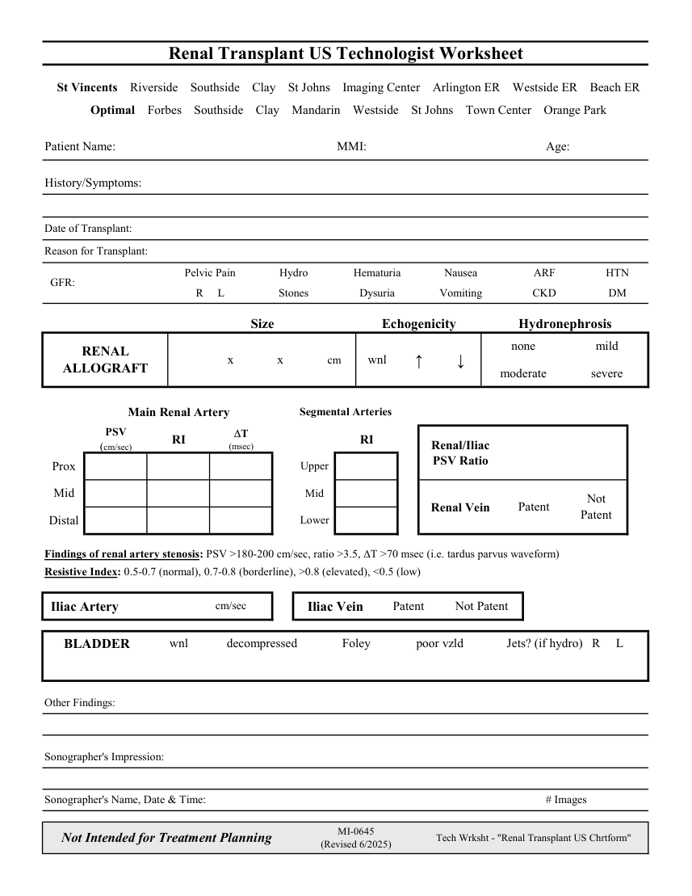

# Ecografie — Fișă de lucru: Transplant renal (MCB)

## Documentul original MCB — Fișă de lucru: Transplant renal

**Fișă de lucru · 1 pagini · consultat la 2026-09-27.**

[Descarcă PDF-ul integral](../../assets/mcb-modalities/eco-fisa-de-lucru-transplant-renal-mcb/document.pdf) · [Sursa MCB](https://ref.mcbradiology.com/Protocols,%20Policies,%20Worksheets%20&%20Forms/US/Tech%20Worksheets/Renal%20Transplant.pdf) · [Catalogul MCB pentru această modalitate](../mcb/index.md)

Instrucțiunile, valorile și ilustrațiile din documentul original sunt păstrate în **engleză**. Titlul și navigarea sunt în română.

### Pagina 1

{ loading=lazy }

## Textul documentului original

??? abstract "Pagina 1 — text în engleză"

    
Renal Transplant US Technologist Worksheet
      St Vincents    Riverside    Southside    Clay    St Johns    Imaging Center    Arlington ER    Westside ER    Beach ER
      Optimal    Forbes    Southside    Clay    Mandarin    Westside    St Johns    Town Center    Orange Park
    Patient Name:
    MMI:
    Age:
    History/Symptoms:
    Date of Transplant:
    Reason for Transplant:
    Pelvic Pain
    Hydro
    Hematuria
    Nausea
    ARF
    HTN
      GFR:
    R     L
    Stones
    Vomiting
    Dysuria
    CKD
    DM
    Size
    Echogenicity
    Hydronephrosis
    none
    mild
    RENAL                                
    ↑
    ↓
    ALLOGRAFT
                  x              x              cm
    wnl
    moderate
    severe
    Main Renal Artery
    Segmental Arteries
    PSV                               
    (msec)
    RI
    Renal/Iliac 
    (cm/sec)
    RI
    DT                          
    PSV Ratio
    Upper
    Prox
    Mid
    Mid
    Not                            
    Renal Vein
    Patent
    Patent
    Distal
    Lower
    Findings of renal artery stenosis: PSV &gt;180-200 cm/sec, ratio &gt;3.5, DT &gt;70 msec (i.e. tardus parvus waveform)
    Resistive Index: 0.5-0.7 (normal), 0.7-0.8 (borderline), &gt;0.8 (elevated), &lt;0.5 (low)
    Iliac Vein
    Patent
    Not Patent
    cm/sec
    Iliac Artery
    Foley
    poor vzld
    Jets? (if hydro)   R     L
     BLADDER
    wnl
    decompressed
    Other Findings:
    Sonographer&#x27;s Impression:
    Sonographer&#x27;s Name, Date &amp; Time:
    # Images
    Not Intended for Treatment Planning
    MI-0645                                              
    (Revised 6/2025)
    Tech Wrksht - &quot;Renal Transplant US Chrtform&quot;
    

