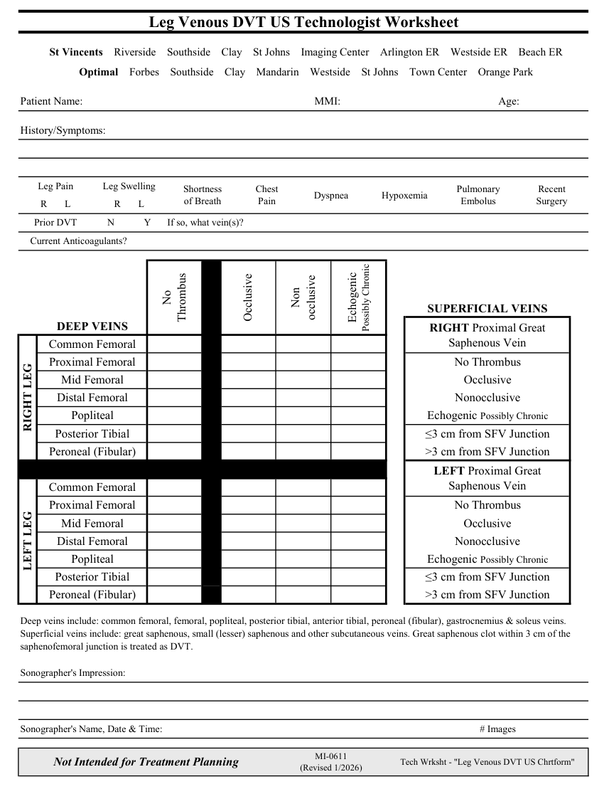

# Ecografie — Fișă de lucru: Tromboză venoasă profundă: membru inferior (MCB)

## Documentul original MCB — Fișă de lucru: Tromboză venoasă profundă: membru inferior

**Fișă de lucru · 1 pagini · consultat la 2026-09-27.**

[Descarcă PDF-ul integral](../../assets/mcb-modalities/eco-fisa-de-lucru-tromboza-venoasa-profunda-membru-inferior-mcb/document.pdf) · [Sursa MCB](https://ref.mcbradiology.com/Protocols,%20Policies,%20Worksheets%20&%20Forms/US/Tech%20Worksheets/Leg%20DVT.pdf) · [Catalogul MCB pentru această modalitate](../mcb/index.md)

Instrucțiunile, valorile și ilustrațiile din documentul original sunt păstrate în **engleză**. Titlul și navigarea sunt în română.

### Pagina 1

{ loading=lazy }

## Textul documentului original

??? abstract "Pagina 1 — text în engleză"

    
Leg Venous DVT US Technologist Worksheet
      St Vincents    Riverside    Southside    Clay    St Johns    Imaging Center    Arlington ER    Westside ER    Beach ER
      Optimal    Forbes    Southside    Clay    Mandarin    Westside    St Johns    Town Center    Orange Park
    Patient Name:
    MMI:
    Age:
    History/Symptoms:
    Leg Pain
    Leg Swelling
    Chest                      
    Recent                  
    Dyspnea
    Shortness                                   
    of Breath
    Pain
    Hypoxemia
    Pulmonary 
    Embolus
    Surgery
    R       L
    R       L
    Prior DVT
    N
    Y
    If so, what vein(s)?
        Current Anticoagulants?
    No                                        
    Non                         
    SUPERFICIAL VEINS
    occlusive
    Occlusive
    Thrombus
    Echogenic                                               
    Possibly Chronic
    DEEP VEINS
    RIGHT Proximal Great                      
    Saphenous Vein
    Common Femoral
    Proximal Femoral
    No Thrombus
    Mid Femoral
    Occlusive
    Distal Femoral
    Nonocclusive
    Echogenic Possibly Chronic
    Popliteal
    RIGHT LEG
    Posterior Tibial
    ≤3 cm from SFV Junction
    Peroneal (Fibular)
    &gt;3 cm from SFV Junction
    LEFT Proximal Great                       
    Saphenous Vein
    Common Femoral
    Proximal Femoral
    No Thrombus
    Mid Femoral
    Occlusive
    Distal Femoral
    Nonocclusive
    Popliteal
    Echogenic Possibly Chronic
    LEFT LEG
    Posterior Tibial
    ≤3 cm from SFV Junction
    Peroneal (Fibular)
    &gt;3 cm from SFV Junction
    Deep veins include: common femoral, femoral, popliteal, posterior tibial, anterior tibial, peroneal (fibular), gastrocnemius &amp; soleus veins. 
    Superficial veins include: great saphenous, small (lesser) saphenous and other subcutaneous veins. Great saphenous clot within 3 cm of the 
    saphenofemoral junction is treated as DVT.
    Sonographer&#x27;s Impression:
    Sonographer&#x27;s Name, Date &amp; Time:
    # Images
    MI-0611                                                            
    Not Intended for Treatment Planning
    (Revised 1/2026)
    Tech Wrksht - &quot;Leg Venous DVT US Chrtform&quot;
    

