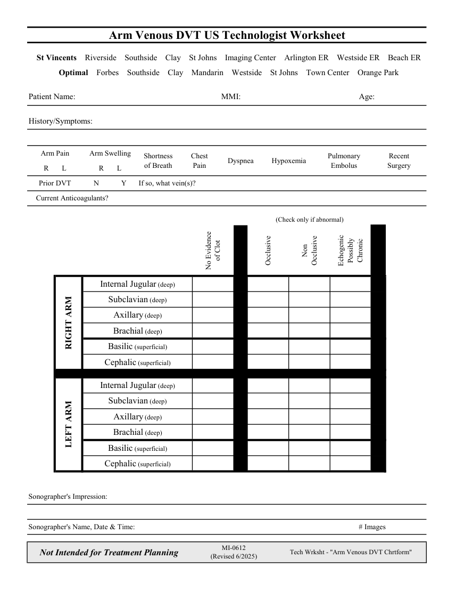

# Ecografie — Fișă de lucru: Tromboză venoasă profundă: membru superior (MCB)

## Documentul original MCB — Fișă de lucru: Tromboză venoasă profundă: membru superior

**Fișă de lucru · 1 pagini · consultat la 2026-09-27.**

[Descarcă PDF-ul integral](../../assets/mcb-modalities/eco-fisa-de-lucru-tromboza-venoasa-profunda-membru-superior-mcb/document.pdf) · [Sursa MCB](https://ref.mcbradiology.com/Protocols,%20Policies,%20Worksheets%20&%20Forms/US/Tech%20Worksheets/Arm%20DVT.pdf) · [Catalogul MCB pentru această modalitate](../mcb/index.md)

Instrucțiunile, valorile și ilustrațiile din documentul original sunt păstrate în **engleză**. Titlul și navigarea sunt în română.

### Pagina 1

{ loading=lazy }

## Textul documentului original

??? abstract "Pagina 1 — text în engleză"

    
Arm Venous DVT US Technologist Worksheet
      St Vincents    Riverside    Southside    Clay    St Johns    Imaging Center    Arlington ER    Westside ER    Beach ER
      Optimal    Forbes    Southside    Clay    Mandarin    Westside    St Johns    Town Center    Orange Park
    Patient Name:
    MMI:
    Age:
    History/Symptoms:
    Arm Pain
    Arm Swelling
    Shortness                                   
    Chest                      
    Recent                   
    of Breath
    Pain
    Dyspnea
    Hypoxemia
    Pulmonary 
    Embolus
    Surgery
    R       L
    R       L
    Prior DVT
    N
    Y
    If so, what vein(s)?
        Current Anticoagulants?
    (Check only if abnormal)
    Non                                  
    of Clot
    Chronic
    Possibly 
    Occlusive
    Occlusive
    Echogenic                       
    No Evidence                                  
    Internal Jugular (deep)
    Subclavian (deep)
    Axillary (deep)
    Brachial (deep)
    Basilic (superficial)
    Cephalic (superficial)
    Internal Jugular (deep)
    Subclavian (deep)
    Axillary (deep)
    Brachial (deep)
    LEFT ARM
    RIGHT ARM
    Basilic (superficial)
    Cephalic (superficial)
    Sonographer&#x27;s Impression:
    Sonographer&#x27;s Name, Date &amp; Time:
    # Images
    Not Intended for Treatment Planning
    MI-0612                                                    
    (Revised 6/2025)
    Tech Wrksht - &quot;Arm Venous DVT Chrtform&quot;
    

