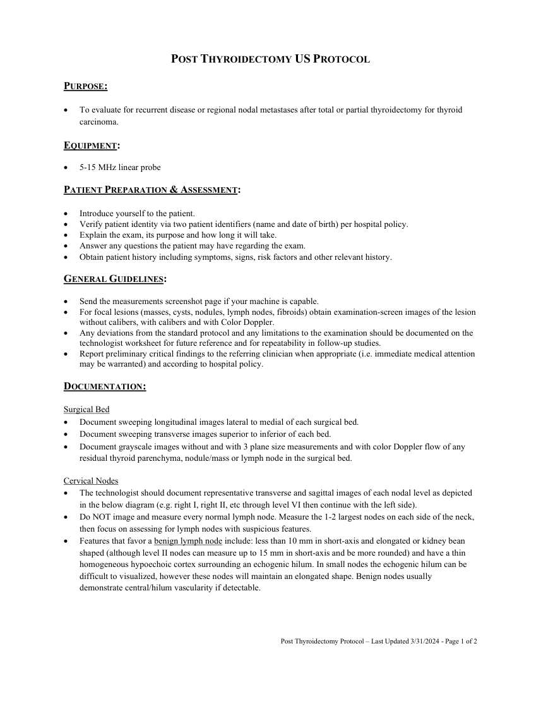
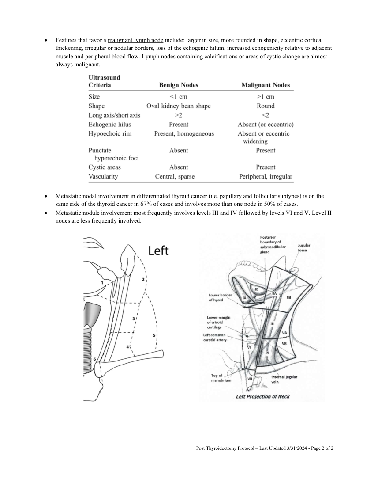

# Ecografie — După tiroidectomie (MCB)

## Documentul original MCB — După tiroidectomie

**Protocol · 2 pagini · consultat la 2026-09-27.**

[Descarcă PDF-ul integral](../../assets/mcb-modalities/eco-dupa-tiroidectomie-mcb/document.pdf) · [Sursa MCB](https://ref.mcbradiology.com/Protocols,%20Policies,%20Worksheets%20&%20Forms/US/Protocols/Post%20Thyroidectomy.pdf) · [Catalogul MCB pentru această modalitate](../mcb/index.md)

Instrucțiunile, valorile și ilustrațiile din documentul original sunt păstrate în **engleză**. Titlul și navigarea sunt în română.

### Pagina 1

{ loading=lazy }

### Pagina 2

{ loading=lazy }

## Textul documentului original

??? abstract "Pagina 1 — text în engleză"

    
 
    POST THYROIDECTOMY US PROTOCOL 
     
    PURPOSE:  
     
    To evaluate for recurrent disease or regional nodal metastases after total or partial thyroidectomy for thyroid 
    carcinoma. 
    EQUIPMENT: 
     
    5-15 MHz linear probe 
    PATIENT PREPARATION &amp; ASSESSMENT: 
     
    Introduce yourself to the patient.  
     
    Verify patient identity via two patient identifiers (name and date of birth) per hospital policy. 
     
    Explain the exam, its purpose and how long it will take. 
     
    Answer any questions the patient may have regarding the exam. 
     
    Obtain patient history including symptoms, signs, risk factors and other relevant history. 
    GENERAL GUIDELINES: 
     
    Send the measurements screenshot page if your machine is capable. 
     
    For focal lesions (masses, cysts, nodules, lymph nodes, fibroids) obtain examination-screen images of the lesion 
    without calibers, with calibers and with Color Doppler.  
     
    Any deviations from the standard protocol and any limitations to the examination should be documented on the 
    technologist worksheet for future reference and for repeatability in follow-up studies. 
     
    Report preliminary critical findings to the referring clinician when appropriate (i.e. immediate medical attention 
    may be warranted) and according to hospital policy. 
    DOCUMENTATION: 
    Surgical Bed 
     
    Document sweeping longitudinal images lateral to medial of each surgical bed. 
     
    Document sweeping transverse images superior to inferior of each bed. 
     
    Document grayscale images without and with 3 plane size measurements and with color Doppler flow of any 
    residual thyroid parenchyma, nodule/mass or lymph node in the surgical bed. 
    Cervical Nodes 
     
    The technologist should document representative transverse and sagittal images of each nodal level as depicted 
    in the below diagram (e.g. right I, right II, etc through level VI then continue with the left side).  
     
    Do NOT image and measure every normal lymph node. Measure the 1-2 largest nodes on each side of the neck, 
    then focus on assessing for lymph nodes with suspicious features. 
     
    Features that favor a benign lymph node include: less than 10 mm in short-axis and elongated or kidney bean 
    shaped (although level II nodes can measure up to 15 mm in short-axis and be more rounded) and have a thin 
    homogeneous hypoechoic cortex surrounding an echogenic hilum. In small nodes the echogenic hilum can be 
    difficult to visualized, however these nodes will maintain an elongated shape. Benign nodes usually 
    demonstrate central/hilum vascularity if detectable. 
     
     
     
     
    Post Thyroidectomy Protocol – Last Updated 3/31/2024 - Page 1 of 2 
     
     
    

??? abstract "Pagina 2 — text în engleză"

    
 
     
    Features that favor a malignant lymph node include: larger in size, more rounded in shape, eccentric cortical 
    thickening, irregular or nodular borders, loss of the echogenic hilum, increased echogenicity relative to adjacent 
    muscle and peripheral blood flow. Lymph nodes containing calcifications or areas of cystic change are almost 
    always malignant. 
     
     
     
     
     
     
     
     
     
     
     
     
     
     
     
     
    Metastatic nodal involvement in differentiated thyroid cancer (i.e. papillary and follicular subtypes) is on the 
    same side of the thyroid cancer in 67% of cases and involves more than one node in 50% of cases. 
     
    Metastatic nodule involvement most frequently involves levels III and IV followed by levels VI and V. Level II 
    nodes are less frequently involved. 
     
     
     
     
     
     
     
     
     
     
     
    Post Thyroidectomy Protocol – Last Updated 3/31/2024 - Page 2 of 2 
     
     
    

