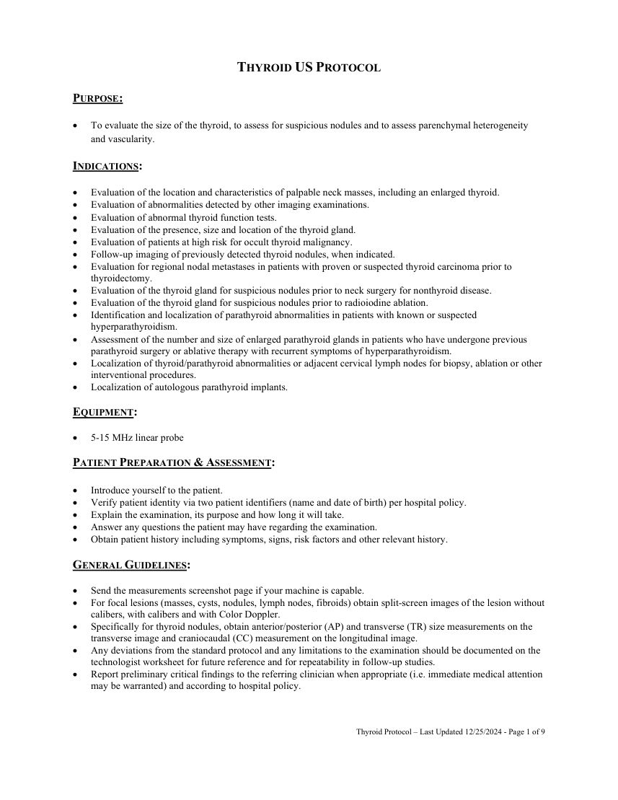
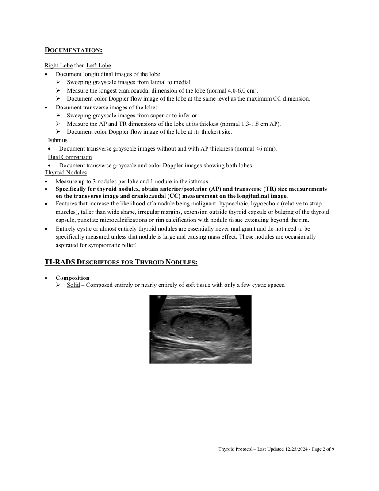
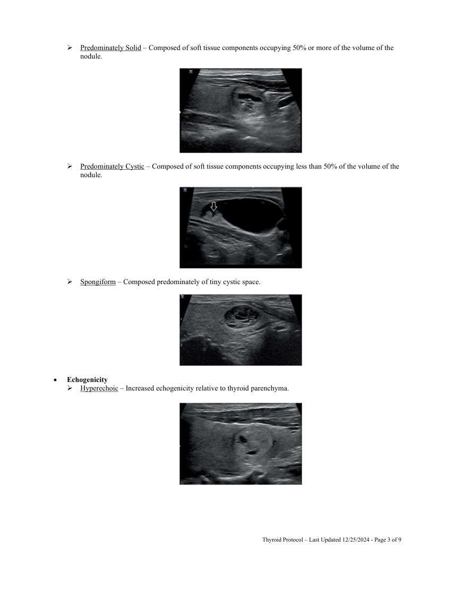
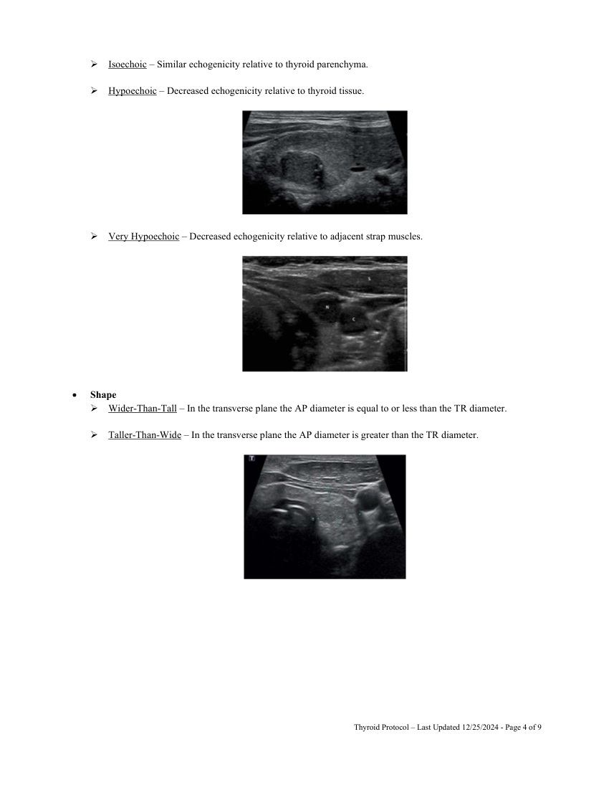
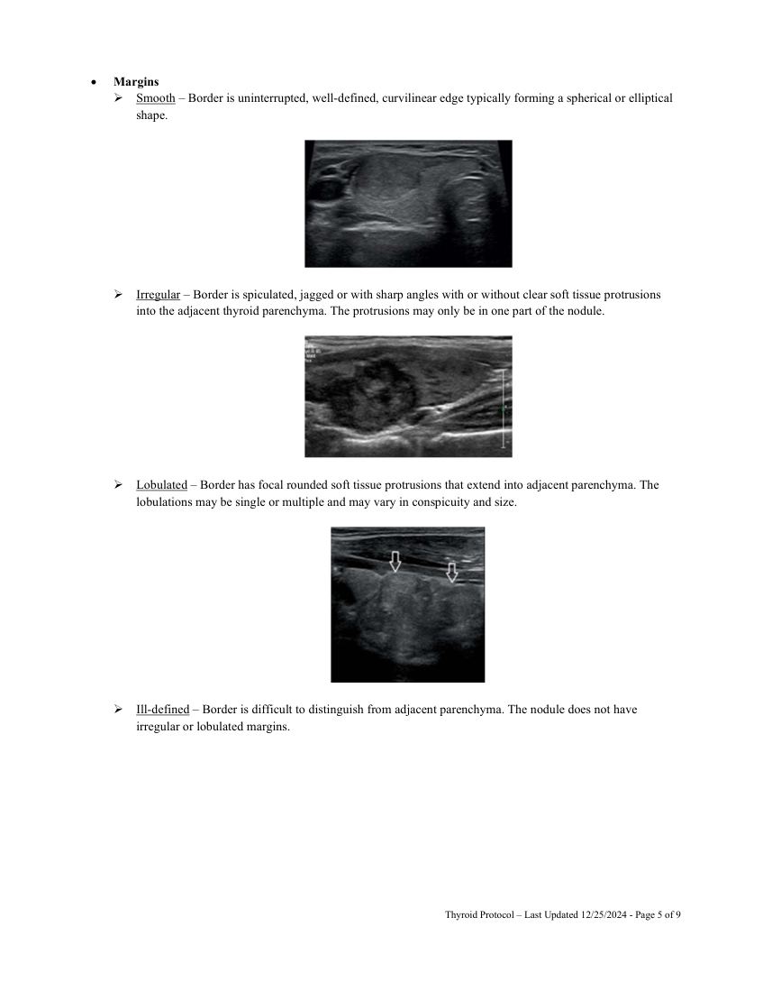
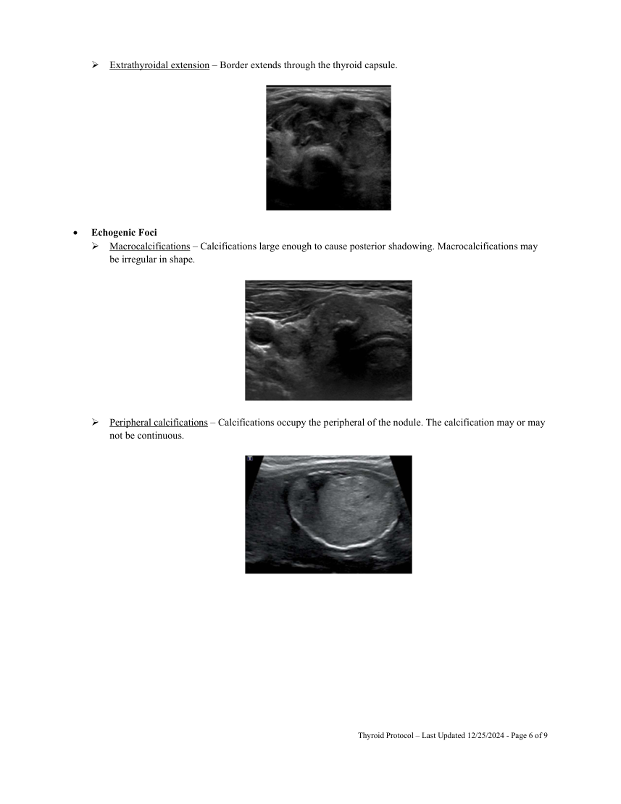
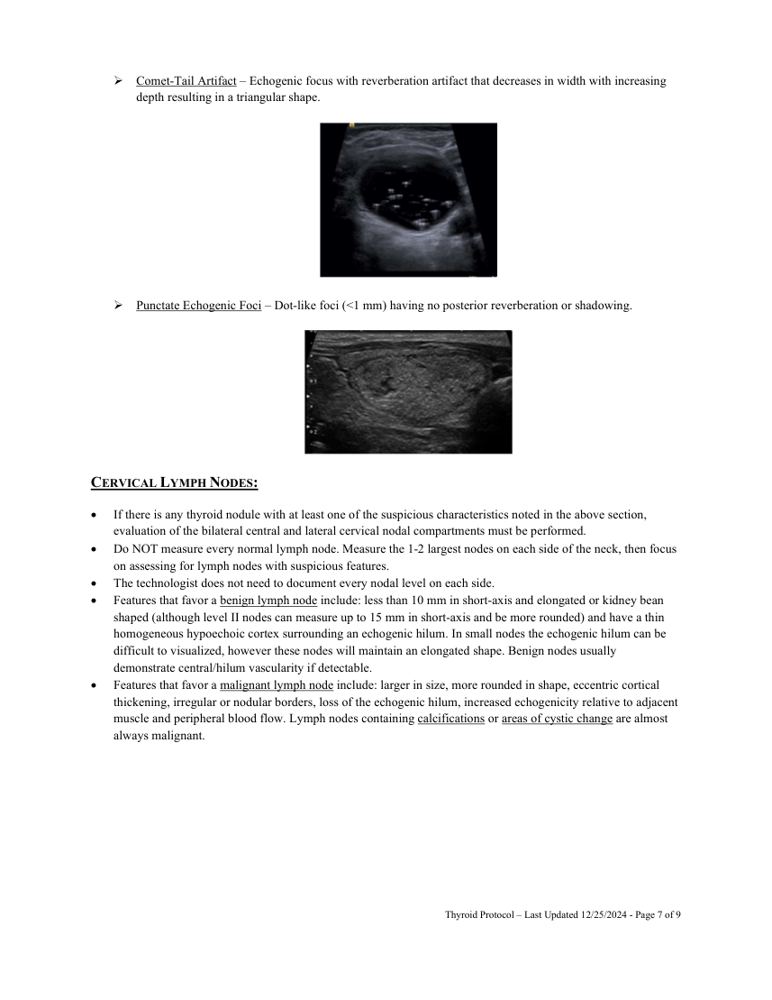
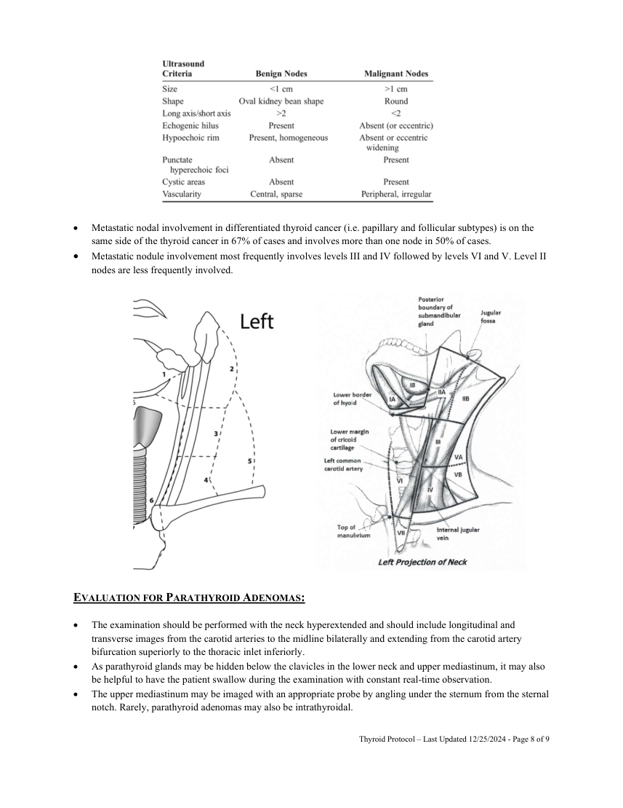
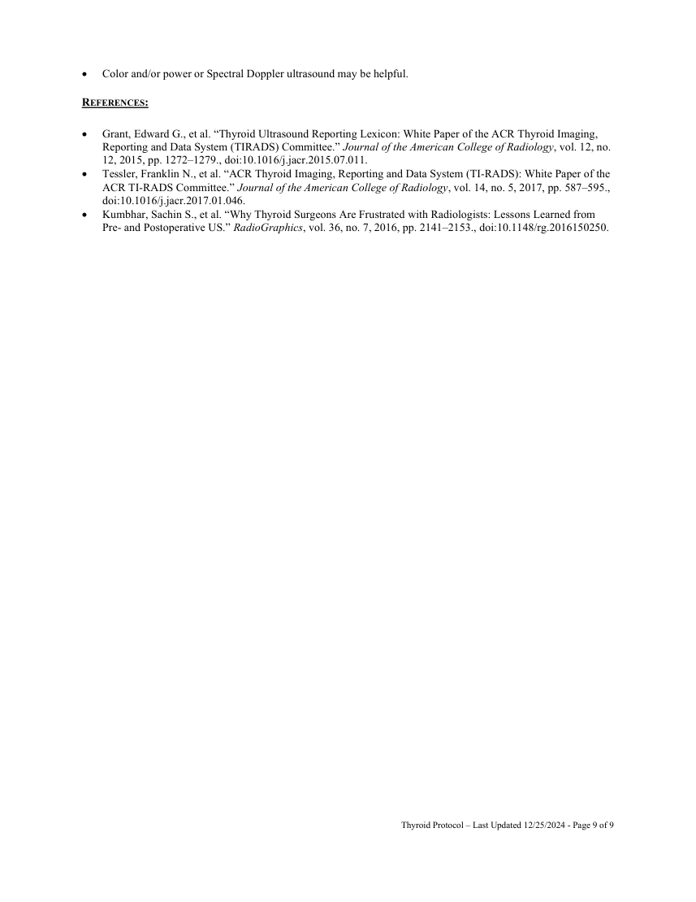

# Ecografie — Tiroidă (MCB)

## Documentul original MCB — Tiroidă

**Protocol · 9 pagini · consultat la 2026-09-27.**

[Descarcă PDF-ul integral](../../assets/mcb-modalities/eco-tiroida-mcb/document.pdf) · [Sursa MCB](https://ref.mcbradiology.com/Protocols,%20Policies,%20Worksheets%20&%20Forms/US/Protocols/Thyroid.pdf) · [Catalogul MCB pentru această modalitate](../mcb/index.md)

Instrucțiunile, valorile și ilustrațiile din documentul original sunt păstrate în **engleză**. Titlul și navigarea sunt în română.

### Pagina 1

{ loading=lazy }

### Pagina 2

{ loading=lazy }

### Pagina 3

{ loading=lazy }

### Pagina 4

{ loading=lazy }

### Pagina 5

{ loading=lazy }

### Pagina 6

{ loading=lazy }

### Pagina 7

{ loading=lazy }

### Pagina 8

{ loading=lazy }

### Pagina 9

{ loading=lazy }

## Textul documentului original

??? abstract "Pagina 1 — text în engleză"

    
THYROID US PROTOCOL 
     
    PURPOSE:  
     
    To evaluate the size of the thyroid, to assess for suspicious nodules and to assess parenchymal heterogeneity 
    and vascularity. 
    INDICATIONS: 
     
     
    Evaluation of the location and characteristics of palpable neck masses, including an enlarged thyroid. 
     
    Evaluation of abnormalities detected by other imaging examinations. 
     
    Evaluation of abnormal thyroid function tests. 
     
    Evaluation of the presence, size and location of the thyroid gland. 
     
    Evaluation of patients at high risk for occult thyroid malignancy. 
     
    Follow-up imaging of previously detected thyroid nodules, when indicated. 
     
    Evaluation for regional nodal metastases in patients with proven or suspected thyroid carcinoma prior to 
    thyroidectomy. 
     
    Evaluation of the thyroid gland for suspicious nodules prior to neck surgery for nonthyroid disease. 
     
    Evaluation of the thyroid gland for suspicious nodules prior to radioiodine ablation. 
     
    Identification and localization of parathyroid abnormalities in patients with known or suspected 
    hyperparathyroidism. 
     
    Assessment of the number and size of enlarged parathyroid glands in patients who have undergone previous 
    parathyroid surgery or ablative therapy with recurrent symptoms of hyperparathyroidism. 
     
    Localization of thyroid/parathyroid abnormalities or adjacent cervical lymph nodes for biopsy, ablation or other 
    interventional procedures. 
     
    Localization of autologous parathyroid implants. 
    EQUIPMENT: 
     
    5-15 MHz linear probe 
    PATIENT PREPARATION &amp; ASSESSMENT: 
     
    Introduce yourself to the patient.  
     
    Verify patient identity via two patient identifiers (name and date of birth) per hospital policy. 
     
    Explain the examination, its purpose and how long it will take. 
     
    Answer any questions the patient may have regarding the examination. 
     
    Obtain patient history including symptoms, signs, risk factors and other relevant history. 
    GENERAL GUIDELINES: 
     
    Send the measurements screenshot page if your machine is capable. 
     
    For focal lesions (masses, cysts, nodules, lymph nodes, fibroids) obtain split-screen images of the lesion without 
    calibers, with calibers and with Color Doppler.  
     
    Specifically for thyroid nodules, obtain anterior/posterior (AP) and transverse (TR) size measurements on the 
    transverse image and craniocaudal (CC) measurement on the longitudinal image. 
     
    Any deviations from the standard protocol and any limitations to the examination should be documented on the 
    technologist worksheet for future reference and for repeatability in follow-up studies. 
     
    Report preliminary critical findings to the referring clinician when appropriate (i.e. immediate medical attention 
    may be warranted) and according to hospital policy. 
     
     
     
    Thyroid Protocol – Last Updated 12/25/2024 - Page 1 of 9 
     
     
    

??? abstract "Pagina 2 — text în engleză"

    
 
    DOCUMENTATION: 
    Right Lobe then Left Lobe 
     
    Document longitudinal images of the lobe: 
     Sweeping grayscale images from lateral to medial. 
     Measure the longest craniocaudal dimension of the lobe (normal 4.0-6.0 cm). 
     Document color Doppler flow image of the lobe at the same level as the maximum CC dimension.  
     
    Document transverse images of the lobe: 
     Sweeping grayscale images from superior to inferior. 
     Measure the AP and TR dimensions of the lobe at its thickest (normal 1.3-1.8 cm AP). 
     Document color Doppler flow image of the lobe at its thickest site.  
    Isthmus 
     
    Document transverse grayscale images without and with AP thickness (normal &lt;6 mm). 
    Dual Comparison 
     
    Document transverse grayscale and color Doppler images showing both lobes. 
     
    Thyroid Nodules 
     
    Measure up to 3 nodules per lobe and 1 nodule in the isthmus. 
     
    Specifically for thyroid nodules, obtain anterior/posterior (AP) and transverse (TR) size measurements 
    on the transverse image and craniocaudal (CC) measurement on the longitudinal image. 
     
    Features that increase the likelihood of a nodule being malignant: hypoechoic, hypoechoic (relative to strap 
    muscles), taller than wide shape, irregular margins, extension outside thyroid capsule or bulging of the thyroid 
    capsule, punctate microcalcifications or rim calcification with nodule tissue extending beyond the rim.  
     
    Entirely cystic or almost entirely thyroid nodules are essentially never malignant and do not need to be 
    specifically measured unless that nodule is large and causing mass effect. These nodules are occasionally 
    aspirated for symptomatic relief.  
     
    TI-RADS DESCRIPTORS FOR THYROID NODULES: 
     
    Composition 
     Solid – Composed entirely or nearly entirely of soft tissue with only a few cystic spaces. 
     
     
     
     
     
     
     
     
     
     
     
     
    Thyroid Protocol – Last Updated 12/25/2024 - Page 2 of 9 
     
     
    

??? abstract "Pagina 3 — text în engleză"

    
 Predominately Solid – Composed of soft tissue components occupying 50% or more of the volume of the 
    nodule. 
     
     
     
     Predominately Cystic – Composed of soft tissue components occupying less than 50% of the volume of the 
    nodule. 
     
     
     
     Spongiform – Composed predominately of tiny cystic space. 
     
     
     
     
    Echogenicity 
     Hyperechoic – Increased echogenicity relative to thyroid parenchyma. 
     
     
     
     
     
     
     
    Thyroid Protocol – Last Updated 12/25/2024 - Page 3 of 9 
     
     
    

??? abstract "Pagina 4 — text în engleză"

    
 Isoechoic – Similar echogenicity relative to thyroid parenchyma. 
     
     Hypoechoic – Decreased echogenicity relative to thyroid tissue. 
     
     
     
     Very Hypoechoic – Decreased echogenicity relative to adjacent strap muscles. 
     
     
     
     
    Shape 
     Wider-Than-Tall – In the transverse plane the AP diameter is equal to or less than the TR diameter. 
     
     Taller-Than-Wide – In the transverse plane the AP diameter is greater than the TR diameter. 
     
     
     
     
     
     
     
     
     
     
     
     
     
    Thyroid Protocol – Last Updated 12/25/2024 - Page 4 of 9 
     
     
    

??? abstract "Pagina 5 — text în engleză"

    
 
    Margins 
     Smooth – Border is uninterrupted, well-defined, curvilinear edge typically forming a spherical or elliptical 
    shape. 
     
     
     
     Irregular – Border is spiculated, jagged or with sharp angles with or without clear soft tissue protrusions 
    into the adjacent thyroid parenchyma. The protrusions may only be in one part of the nodule. 
     
     
     
     Lobulated – Border has focal rounded soft tissue protrusions that extend into adjacent parenchyma. The 
    lobulations may be single or multiple and may vary in conspicuity and size. 
     
     
     
     Ill-defined – Border is difficult to distinguish from adjacent parenchyma. The nodule does not have 
    irregular or lobulated margins. 
     
     
     
     
     
     
     
     
     
     
    Thyroid Protocol – Last Updated 12/25/2024 - Page 5 of 9 
     
     
    

??? abstract "Pagina 6 — text în engleză"

    
 Extrathyroidal extension – Border extends through the thyroid capsule. 
     
     
     
     
    Echogenic Foci 
     Macrocalcifications – Calcifications large enough to cause posterior shadowing. Macrocalcifications may 
    be irregular in shape. 
     
     
     
     Peripheral calcifications – Calcifications occupy the peripheral of the nodule. The calcification may or may 
    not be continuous.  
     
     
     
     
     
     
     
     
     
     
     
     
     
    Thyroid Protocol – Last Updated 12/25/2024 - Page 6 of 9 
     
     
    

??? abstract "Pagina 7 — text în engleză"

    
 Comet-Tail Artifact – Echogenic focus with reverberation artifact that decreases in width with increasing 
    depth resulting in a triangular shape.  
     
     
     
     Punctate Echogenic Foci – Dot-like foci (&lt;1 mm) having no posterior reverberation or shadowing. 
     
     
     
    CERVICAL LYMPH NODES: 
     
    If there is any thyroid nodule with at least one of the suspicious characteristics noted in the above section, 
    evaluation of the bilateral central and lateral cervical nodal compartments must be performed. 
     
    Do NOT measure every normal lymph node. Measure the 1-2 largest nodes on each side of the neck, then focus 
    on assessing for lymph nodes with suspicious features. 
     
    The technologist does not need to document every nodal level on each side.  
     
    Features that favor a benign lymph node include: less than 10 mm in short-axis and elongated or kidney bean 
    shaped (although level II nodes can measure up to 15 mm in short-axis and be more rounded) and have a thin 
    homogeneous hypoechoic cortex surrounding an echogenic hilum. In small nodes the echogenic hilum can be 
    difficult to visualized, however these nodes will maintain an elongated shape. Benign nodes usually 
    demonstrate central/hilum vascularity if detectable. 
     
    Features that favor a malignant lymph node include: larger in size, more rounded in shape, eccentric cortical 
    thickening, irregular or nodular borders, loss of the echogenic hilum, increased echogenicity relative to adjacent 
    muscle and peripheral blood flow. Lymph nodes containing calcifications or areas of cystic change are almost 
    always malignant. 
     
     
    Thyroid Protocol – Last Updated 12/25/2024 - Page 7 of 9 
     
     
    

??? abstract "Pagina 8 — text în engleză"

    
 
     
     
     
     
     
     
     
     
     
     
     
     
    Metastatic nodal involvement in differentiated thyroid cancer (i.e. papillary and follicular subtypes) is on the 
    same side of the thyroid cancer in 67% of cases and involves more than one node in 50% of cases. 
     
    Metastatic nodule involvement most frequently involves levels III and IV followed by levels VI and V. Level II 
    nodes are less frequently involved. 
     
     
     
     
     
     
     
     
     
     
     
     
     
     
     
     
     
     
     
     
     
     
     
    EVALUATION FOR PARATHYROID ADENOMAS: 
     
    The examination should be performed with the neck hyperextended and should include longitudinal and 
    transverse images from the carotid arteries to the midline bilaterally and extending from the carotid artery 
    bifurcation superiorly to the thoracic inlet inferiorly.  
     
    As parathyroid glands may be hidden below the clavicles in the lower neck and upper mediastinum, it may also 
    be helpful to have the patient swallow during the examination with constant real-time observation.  
     
    The upper mediastinum may be imaged with an appropriate probe by angling under the sternum from the sternal 
    notch. Rarely, parathyroid adenomas may also be intrathyroidal. 
     
     
    Thyroid Protocol – Last Updated 12/25/2024 - Page 8 of 9 
     
     
    

??? abstract "Pagina 9 — text în engleză"

    
 
    Color and/or power or Spectral Doppler ultrasound may be helpful. 
    REFERENCES: 
     
    Grant, Edward G., et al. “Thyroid Ultrasound Reporting Lexicon: White Paper of the ACR Thyroid Imaging, 
    Reporting and Data System (TIRADS) Committee.” Journal of the American College of Radiology, vol. 12, no. 
    12, 2015, pp. 1272–1279., doi:10.1016/j.jacr.2015.07.011. 
     
    Tessler, Franklin N., et al. “ACR Thyroid Imaging, Reporting and Data System (TI-RADS): White Paper of the 
    ACR TI-RADS Committee.” Journal of the American College of Radiology, vol. 14, no. 5, 2017, pp. 587–595., 
    doi:10.1016/j.jacr.2017.01.046. 
     
    Kumbhar, Sachin S., et al. “Why Thyroid Surgeons Are Frustrated with Radiologists: Lessons Learned from 
    Pre- and Postoperative US.” RadioGraphics, vol. 36, no. 7, 2016, pp. 2141–2153., doi:10.1148/rg.2016150250. 
     
     
    Thyroid Protocol – Last Updated 12/25/2024 - Page 9 of 9 
     
     
    

