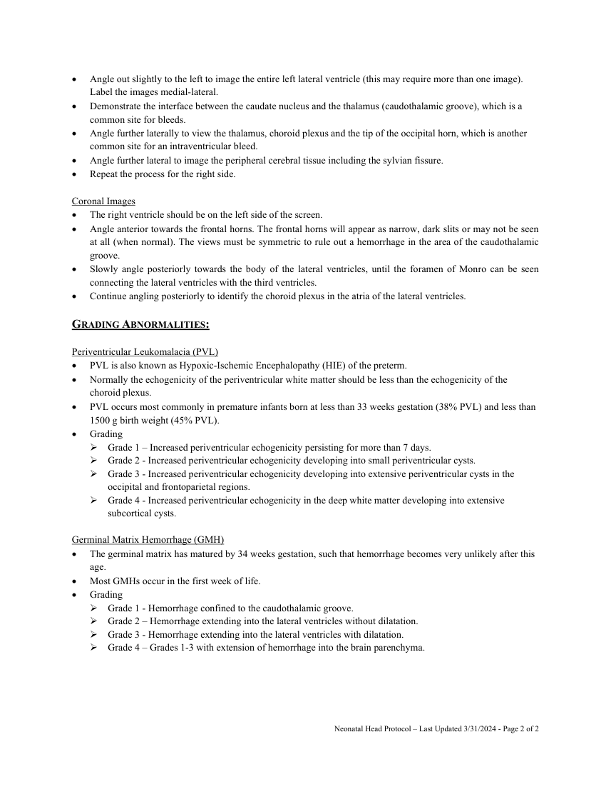

# Ecografie — Creier neonatal (MCB)

## Documentul original MCB — Creier neonatal

**Protocol · 2 pagini · consultat la 2026-09-27.**

[Descarcă PDF-ul integral](../../assets/mcb-modalities/eco-creier-neonatal-mcb/document.pdf) · [Sursa MCB](https://ref.mcbradiology.com/Protocols,%20Policies,%20Worksheets%20&%20Forms/US/Protocols/Neonatal%20Head.pdf) · [Catalogul MCB pentru această modalitate](../mcb/index.md)

Instrucțiunile, valorile și ilustrațiile din documentul original sunt păstrate în **engleză**. Titlul și navigarea sunt în română.

### Pagina 1

{ loading=lazy }

### Pagina 2

{ loading=lazy }

## Textul documentului original

??? abstract "Pagina 1 — text în engleză"

    
NEONATAL HEAD US PROTOCOL 
     
    PURPOSE: 
     
     
    To evaluate the neonatal brain for abnormalities. 
     
    INDICATIONS: 
     
     
    Evaluation for hemorrhage or parenchymal abnormalities in preterm and term infants. 
     
    Evaluation for hydrocephalus. 
     
    Evaluation for the presence of vascular abnormalities. 
     
    Evaluation of cephalohematoma, subgaleal hematoma, subdural hematoma or subarachnoid hemorrhage. 
     
    Follow-up or surveillance of previously documented abnormalities. 
     
    EQUIPMENT: 
     
     
    8 MHz sector probe 
     
    PATIENT PREPARATION &amp; ASSESSMENT: 
     
     
    Introduce yourself to the parents.  
     
    Verify patient identity via two patient identifiers (name and date of birth) per hospital policy. 
     
    Explain the examination, its purpose and how long it will take. 
     
    Answer any questions the parents may have regarding the examination. 
     
    Obtain patient history including symptoms, signs, risk factors and other relevant history. 
     
    GENERAL GUIDELINES: 
     
     
    Document the estimated gestational age and head circumference on the technologist worksheet. 
     
    Send the measurements screenshot page if your machine is capable. 
     
    Any deviations from the standard protocol and any limitations to the examination should be documented on the 
    technologist worksheet for future reference and for repeatability in follow-up studies. 
     
    Report preliminary critical findings to the referring clinician when appropriate (i.e. immediate medical attention 
    may be warranted) and according to hospital policy. 
     
    DOCUMENTATION: 
     
     
    Apply gel to the area of the anterior fontanel. 
     
    Use a delicate touch while scanning to avoid damaging the brain. 
     
    Sagittal Images 
     
    Place the transducer on the anterior fontanel along the plane of the sagittal suture. 
     
    Scan the midline making sure to identify the cavum septum pellucidum, the brain stem and the area of the third 
    and fourth ventricles. Adjust the depth to include the cerebellum, which will have bright level echoes. 
     
     
    Neonatal Head Protocol – Last Updated 3/31/2024 - Page 1 of 2 
     
     
    

??? abstract "Pagina 2 — text în engleză"

    
 
    Angle out slightly to the left to image the entire left lateral ventricle (this may require more than one image). 
    Label the images medial-lateral.  
     
    Demonstrate the interface between the caudate nucleus and the thalamus (caudothalamic groove), which is a 
    common site for bleeds. 
     
    Angle further laterally to view the thalamus, choroid plexus and the tip of the occipital horn, which is another 
    common site for an intraventricular bleed. 
     
    Angle further lateral to image the peripheral cerebral tissue including the sylvian fissure. 
     
    Repeat the process for the right side. 
     
    Coronal Images 
     
    The right ventricle should be on the left side of the screen. 
     
    Angle anterior towards the frontal horns. The frontal horns will appear as narrow, dark slits or may not be seen 
    at all (when normal). The views must be symmetric to rule out a hemorrhage in the area of the caudothalamic 
    groove.  
     
    Slowly angle posteriorly towards the body of the lateral ventricles, until the foramen of Monro can be seen 
    connecting the lateral ventricles with the third ventricles. 
     
    Continue angling posteriorly to identify the choroid plexus in the atria of the lateral ventricles. 
     
    GRADING ABNORMALITIES: 
     
    Periventricular Leukomalacia (PVL) 
     
    PVL is also known as Hypoxic-Ischemic Encephalopathy (HIE) of the preterm. 
     
    Normally the echogenicity of the periventricular white matter should be less than the echogenicity of the 
    choroid plexus.  
     
    PVL occurs most commonly in premature infants born at less than 33 weeks gestation (38% PVL) and less than 
    1500 g birth weight (45% PVL). 
     
    Grading 
     Grade 1 – Increased periventricular echogenicity persisting for more than 7 days. 
     Grade 2 - Increased periventricular echogenicity developing into small periventricular cysts. 
     Grade 3 - Increased periventricular echogenicity developing into extensive periventricular cysts in the 
    occipital and frontoparietal regions. 
     Grade 4 - Increased periventricular echogenicity in the deep white matter developing into extensive 
    subcortical cysts. 
     
    Germinal Matrix Hemorrhage (GMH) 
     
    The germinal matrix has matured by 34 weeks gestation, such that hemorrhage becomes very unlikely after this 
    age. 
     
    Most GMHs occur in the first week of life. 
     
    Grading 
     Grade 1 - Hemorrhage confined to the caudothalamic groove. 
     Grade 2 – Hemorrhage extending into the lateral ventricles without dilatation. 
     Grade 3 - Hemorrhage extending into the lateral ventricles with dilatation. 
     Grade 4 – Grades 1-3 with extension of hemorrhage into the brain parenchyma.  
     
     
    Neonatal Head Protocol – Last Updated 3/31/2024 - Page 2 of 2 
     
     
    

