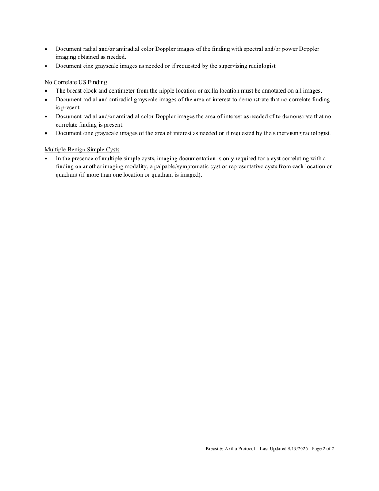

# Ecografie — Sân și axilă (MCB)

## Documentul original MCB — Sân și axilă

**Protocol · 2 pagini · consultat la 2026-09-27.**

[Descarcă PDF-ul integral](../../assets/mcb-modalities/eco-san-si-axila-mcb/document.pdf) · [Sursa MCB](https://ref.mcbradiology.com/Protocols,%20Policies,%20Worksheets%20&%20Forms/US/Protocols/Breast%20&%20Axilla.pdf) · [Catalogul MCB pentru această modalitate](../mcb/index.md)

Instrucțiunile, valorile și ilustrațiile din documentul original sunt păstrate în **engleză**. Titlul și navigarea sunt în română.

### Pagina 1

{ loading=lazy }

### Pagina 2

{ loading=lazy }

## Textul documentului original

??? abstract "Pagina 1 — text în engleză"

    
 
     
     
    BREAST &amp; AXILLA PROTOCOL 
     
    PURPOSE:  
     
     
    To evaluate patients with indeterminate findings on other imaging modalities and symptomatic patients. 
     
    INDICATIONS: 
     
     
    Indeterminate breast findings on other imaging modalities and patients with breast symptoms. 
     
    EQUIPMENT: 
     
     
    10-18 MHz linear probe 
     
    PATIENT PREPARATION &amp; ASSESSMENT: 
     
     
    Introduce yourself to the patient.  
     
    Verify patient identity via two patient identifiers (name and date of birth) per hospital policy. 
     
    Explain the examination, its purpose and how long it will take. 
     
    Answer any questions the patient may have regarding the examination. 
     
    Obtain patient history including symptoms, signs, risk factors and other relevant history. 
     
    GENERAL GUIDELINES: 
     
     
    Optimize equipment gain and display settings with respect to depth, dynamic range and focal zones while 
    imaging vessels. 
     
    Add color Doppler to supplement grayscale images with proper color scale to demonstrate areas of high flow 
    and color aliasing. 
     
    Set spectral Doppler gains to allow a spectral window and optimized to reduce artifacts. 
     
    Cursor sample size will be small and positioned parallel to the vessel wall and/or direction of blood flow. 
     
    A spectral Doppler angle of 45-60 degrees or less will be used to measure velocities. Note exceptions to these 
    angles on the technologist worksheet. 
     
    Send the measurements screenshot page if your machine is capable. 
     
    Any deviations from the standard protocol and any limitations to the examination should be documented on the 
    technologist worksheet for future reference and for repeatability in follow-up studies. 
     
    Report preliminary critical findings to the referring clinician when appropriate (i.e. immediate medical attention 
    may be warranted) and according to hospital policy. 
     
    Whole breast screening US (handheld or automated) is not performed at any St Vincents or Optimal Imaging 
    facility. 
     
    DOCUMENTATION: 
     
    Focal Breast or Axillary Finding 
     
    The breast clock and centimeter from the nipple location or axilla location must be annotated on all images. 
     
    Document radial and antiradial grayscale images of the finding without and with measurement calibers. 
     
     
    Breast &amp; Axilla Protocol – Last Updated 8/19/2026 - Page 1 of 2 
     
     
    

??? abstract "Pagina 2 — text în engleză"

    
 
     
     
     
    Document radial and/or antiradial color Doppler images of the finding with spectral and/or power Doppler 
    imaging obtained as needed. 
     
    Document cine grayscale images as needed or if requested by the supervising radiologist. 
     
    No Correlate US Finding 
     
    The breast clock and centimeter from the nipple location or axilla location must be annotated on all images. 
     
    Document radial and antiradial grayscale images of the area of interest to demonstrate that no correlate finding 
    is present. 
     
    Document radial and/or antiradial color Doppler images the area of interest as needed of to demonstrate that no 
    correlate finding is present. 
     
    Document cine grayscale images of the area of interest as needed or if requested by the supervising radiologist. 
     
    Multiple Benign Simple Cysts 
     
    In the presence of multiple simple cysts, imaging documentation is only required for a cyst correlating with a 
    finding on another imaging modality, a palpable/symptomatic cyst or representative cysts from each location or 
    quadrant (if more than one location or quadrant is imaged). 
     
     
    Breast &amp; Axilla Protocol – Last Updated 8/19/2026 - Page 2 of 2 
     
     
    

