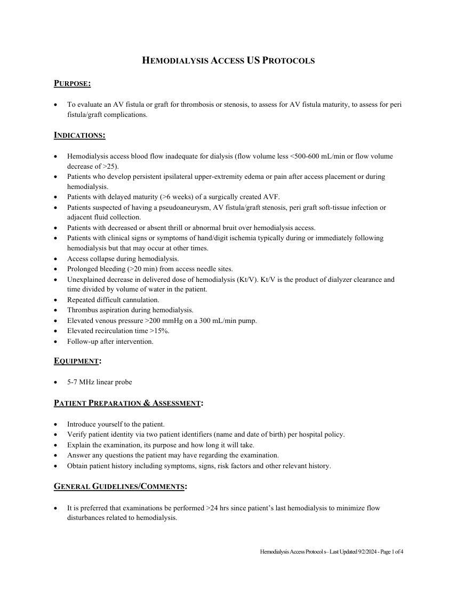
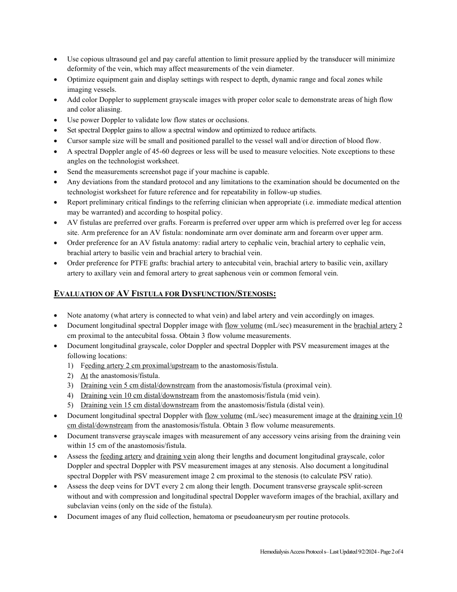
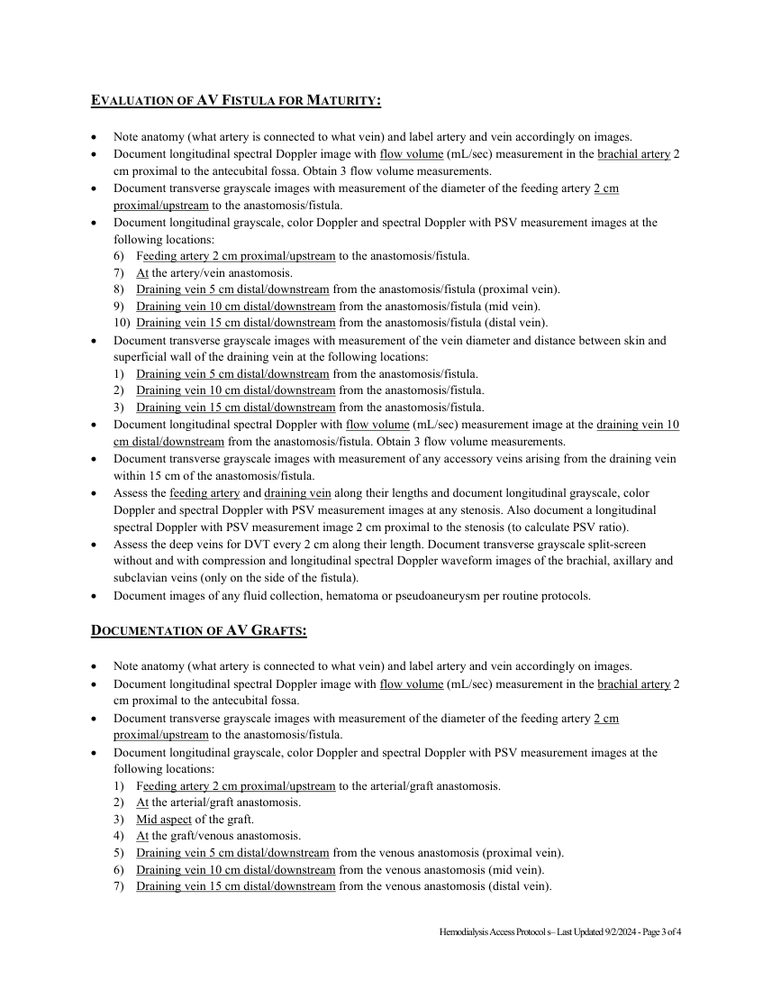
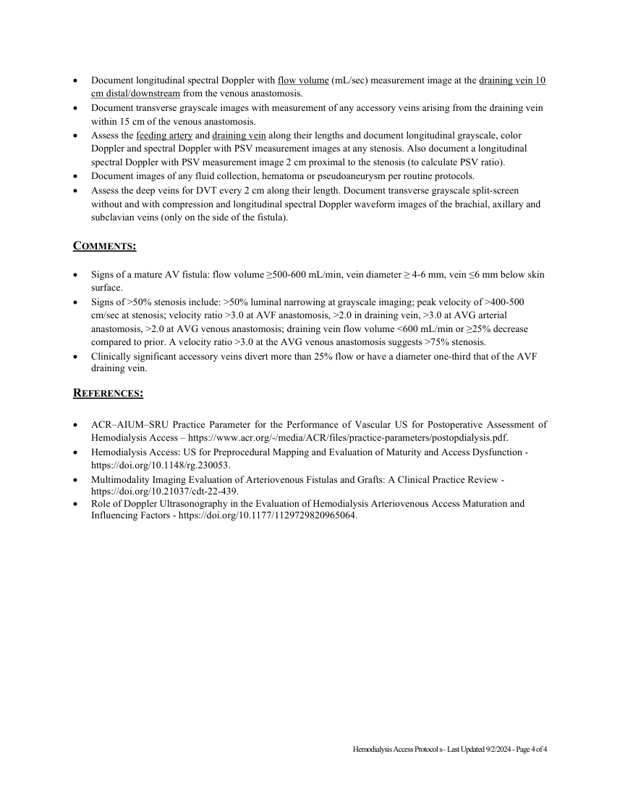

# Ecografie — Acces vascular pentru hemodializă (MCB)

## Documentul original MCB — Acces vascular pentru hemodializă

**Protocol · 4 pagini · consultat la 2026-09-27.**

[Descarcă PDF-ul integral](../../assets/mcb-modalities/eco-acces-vascular-pentru-hemodializa-mcb/document.pdf) · [Sursa MCB](https://ref.mcbradiology.com/Protocols,%20Policies,%20Worksheets%20&%20Forms/US/Protocols/Hemodialysis%20Access.pdf) · [Catalogul MCB pentru această modalitate](../mcb/index.md)

Instrucțiunile, valorile și ilustrațiile din documentul original sunt păstrate în **engleză**. Titlul și navigarea sunt în română.

### Pagina 1

{ loading=lazy }

### Pagina 2

{ loading=lazy }

### Pagina 3

{ loading=lazy }

### Pagina 4

{ loading=lazy }

## Textul documentului original

??? abstract "Pagina 1 — text în engleză"

    
HEMODIALYSIS ACCESS US PROTOCOLS 
     
    PURPOSE:  
     
     
    To evaluate an AV fistula or graft for thrombosis or stenosis, to assess for AV fistula maturity, to assess for peri 
    fistula/graft complications. 
     
    INDICATIONS: 
     
     
    Hemodialysis access blood flow inadequate for dialysis (flow volume less &lt;500-600 mL/min or flow volume 
    decrease of &gt;25).  
     
    Patients who develop persistent ipsilateral upper-extremity edema or pain after access placement or during 
    hemodialysis.  
     
    Patients with delayed maturity (&gt;6 weeks) of a surgically created AVF.  
     
    Patients suspected of having a pseudoaneurysm, AV fistula/graft stenosis, peri graft soft-tissue infection or 
    adjacent fluid collection. 
     
    Patients with decreased or absent thrill or abnormal bruit over hemodialysis access.  
     
    Patients with clinical signs or symptoms of hand/digit ischemia typically during or immediately following 
    hemodialysis but that may occur at other times.  
     
    Access collapse during hemodialysis.  
     
    Prolonged bleeding (&gt;20 min) from access needle sites.  
     
    Unexplained decrease in delivered dose of hemodialysis (Kt/V). Kt/V is the product of dialyzer clearance and 
    time divided by volume of water in the patient.  
     
    Repeated difficult cannulation.  
     
    Thrombus aspiration during hemodialysis.  
     
    Elevated venous pressure &gt;200 mmHg on a 300 mL/min pump.  
     
    Elevated recirculation time &gt;15%.  
     
    Follow-up after intervention.  
     
    EQUIPMENT: 
     
     
    5-7 MHz linear probe 
     
    PATIENT PREPARATION &amp; ASSESSMENT: 
     
     
    Introduce yourself to the patient.  
     
    Verify patient identity via two patient identifiers (name and date of birth) per hospital policy. 
     
    Explain the examination, its purpose and how long it will take. 
     
    Answer any questions the patient may have regarding the examination. 
     
    Obtain patient history including symptoms, signs, risk factors and other relevant history. 
     
    GENERAL GUIDELINES/COMMENTS: 
     
     
    It is preferred that examinations be performed &gt;24 hrs since patient’s last hemodialysis to minimize flow 
    disturbances related to hemodialysis.  
     
     
    Hemodialysis Access Protocol s– Last Updated 9/2/2024 - Page 1 of 4 
     
    

??? abstract "Pagina 2 — text în engleză"

    
 
    Use copious ultrasound gel and pay careful attention to limit pressure applied by the transducer will minimize 
    deformity of the vein, which may affect measurements of the vein diameter. 
     
    Optimize equipment gain and display settings with respect to depth, dynamic range and focal zones while 
    imaging vessels. 
     
    Add color Doppler to supplement grayscale images with proper color scale to demonstrate areas of high flow 
    and color aliasing. 
     
    Use power Doppler to validate low flow states or occlusions. 
     
    Set spectral Doppler gains to allow a spectral window and optimized to reduce artifacts. 
     
    Cursor sample size will be small and positioned parallel to the vessel wall and/or direction of blood flow. 
     
    A spectral Doppler angle of 45-60 degrees or less will be used to measure velocities. Note exceptions to these 
    angles on the technologist worksheet. 
     
    Send the measurements screenshot page if your machine is capable. 
     
    Any deviations from the standard protocol and any limitations to the examination should be documented on the 
    technologist worksheet for future reference and for repeatability in follow-up studies. 
     
    Report preliminary critical findings to the referring clinician when appropriate (i.e. immediate medical attention 
    may be warranted) and according to hospital policy. 
     
    AV fistulas are preferred over grafts. Forearm is preferred over upper arm which is preferred over leg for access 
    site. Arm preference for an AV fistula: nondominate arm over dominate arm and forearm over upper arm. 
     
    Order preference for an AV fistula anatomy: radial artery to cephalic vein, brachial artery to cephalic vein, 
    brachial artery to basilic vein and brachial artery to brachial vein. 
     
    Order preference for PTFE grafts: brachial artery to antecubital vein, brachial artery to basilic vein, axillary 
    artery to axillary vein and femoral artery to great saphenous vein or common femoral vein. 
     
    EVALUATION OF AV FISTULA FOR DYSFUNCTION/STENOSIS: 
     
     
    Note anatomy (what artery is connected to what vein) and label artery and vein accordingly on images. 
     
    Document longitudinal spectral Doppler image with flow volume (mL/sec) measurement in the brachial artery 2 
    cm proximal to the antecubital fossa. Obtain 3 flow volume measurements. 
     
    Document longitudinal grayscale, color Doppler and spectral Doppler with PSV measurement images at the 
    following locations: 
    1) Feeding artery 2 cm proximal/upstream to the anastomosis/fistula. 
    2) At the anastomosis/fistula. 
    3) Draining vein 5 cm distal/downstream from the anastomosis/fistula (proximal vein). 
    4) Draining vein 10 cm distal/downstream from the anastomosis/fistula (mid vein). 
    5) Draining vein 15 cm distal/downstream from the anastomosis/fistula (distal vein). 
     
    Document longitudinal spectral Doppler with flow volume (mL/sec) measurement image at the draining vein 10 
    cm distal/downstream from the anastomosis/fistula. Obtain 3 flow volume measurements. 
     
    Document transverse grayscale images with measurement of any accessory veins arising from the draining vein 
    within 15 cm of the anastomosis/fistula. 
     
    Assess the feeding artery and draining vein along their lengths and document longitudinal grayscale, color 
    Doppler and spectral Doppler with PSV measurement images at any stenosis. Also document a longitudinal 
    spectral Doppler with PSV measurement image 2 cm proximal to the stenosis (to calculate PSV ratio). 
     
    Assess the deep veins for DVT every 2 cm along their length. Document transverse grayscale split-screen 
    without and with compression and longitudinal spectral Doppler waveform images of the brachial, axillary and 
    subclavian veins (only on the side of the fistula). 
     
    Document images of any fluid collection, hematoma or pseudoaneurysm per routine protocols. 
     
     
     
    Hemodialysis Access Protocol s– Last Updated 9/2/2024 - Page 2 of 4 
     
    

??? abstract "Pagina 3 — text în engleză"

    
EVALUATION OF AV FISTULA FOR MATURITY: 
     
     
    Note anatomy (what artery is connected to what vein) and label artery and vein accordingly on images. 
     
    Document longitudinal spectral Doppler image with flow volume (mL/sec) measurement in the brachial artery 2 
    cm proximal to the antecubital fossa. Obtain 3 flow volume measurements. 
     
    Document transverse grayscale images with measurement of the diameter of the feeding artery 2 cm 
    proximal/upstream to the anastomosis/fistula. 
     
    Document longitudinal grayscale, color Doppler and spectral Doppler with PSV measurement images at the 
    following locations: 
    6) Feeding artery 2 cm proximal/upstream to the anastomosis/fistula. 
    7) At the artery/vein anastomosis. 
    8) Draining vein 5 cm distal/downstream from the anastomosis/fistula (proximal vein). 
    9) Draining vein 10 cm distal/downstream from the anastomosis/fistula (mid vein). 
    10) Draining vein 15 cm distal/downstream from the anastomosis/fistula (distal vein). 
     
    Document transverse grayscale images with measurement of the vein diameter and distance between skin and 
    superficial wall of the draining vein at the following locations: 
    1) Draining vein 5 cm distal/downstream from the anastomosis/fistula. 
    2) Draining vein 10 cm distal/downstream from the anastomosis/fistula. 
    3) Draining vein 15 cm distal/downstream from the anastomosis/fistula. 
     
    Document longitudinal spectral Doppler with flow volume (mL/sec) measurement image at the draining vein 10 
    cm distal/downstream from the anastomosis/fistula. Obtain 3 flow volume measurements. 
     
    Document transverse grayscale images with measurement of any accessory veins arising from the draining vein 
    within 15 cm of the anastomosis/fistula. 
     
    Assess the feeding artery and draining vein along their lengths and document longitudinal grayscale, color 
    Doppler and spectral Doppler with PSV measurement images at any stenosis. Also document a longitudinal 
    spectral Doppler with PSV measurement image 2 cm proximal to the stenosis (to calculate PSV ratio). 
     
    Assess the deep veins for DVT every 2 cm along their length. Document transverse grayscale split-screen 
    without and with compression and longitudinal spectral Doppler waveform images of the brachial, axillary and 
    subclavian veins (only on the side of the fistula). 
     
    Document images of any fluid collection, hematoma or pseudoaneurysm per routine protocols. 
     
    DOCUMENTATION OF AV GRAFTS: 
     
     
    Note anatomy (what artery is connected to what vein) and label artery and vein accordingly on images. 
     
    Document longitudinal spectral Doppler image with flow volume (mL/sec) measurement in the brachial artery 2 
    cm proximal to the antecubital fossa.  
     
    Document transverse grayscale images with measurement of the diameter of the feeding artery 2 cm 
    proximal/upstream to the anastomosis/fistula. 
     
    Document longitudinal grayscale, color Doppler and spectral Doppler with PSV measurement images at the 
    following locations: 
    1) Feeding artery 2 cm proximal/upstream to the arterial/graft anastomosis. 
    2) At the arterial/graft anastomosis. 
    3) Mid aspect of the graft. 
    4) At the graft/venous anastomosis. 
    5) Draining vein 5 cm distal/downstream from the venous anastomosis (proximal vein). 
    6) Draining vein 10 cm distal/downstream from the venous anastomosis (mid vein). 
    7) Draining vein 15 cm distal/downstream from the venous anastomosis (distal vein). 
     
     
    Hemodialysis Access Protocol s– Last Updated 9/2/2024 - Page 3 of 4 
     
    

??? abstract "Pagina 4 — text în engleză"

    
 
    Document longitudinal spectral Doppler with flow volume (mL/sec) measurement image at the draining vein 10 
    cm distal/downstream from the venous anastomosis.  
     
    Document transverse grayscale images with measurement of any accessory veins arising from the draining vein 
    within 15 cm of the venous anastomosis. 
     
    Assess the feeding artery and draining vein along their lengths and document longitudinal grayscale, color 
    Doppler and spectral Doppler with PSV measurement images at any stenosis. Also document a longitudinal 
    spectral Doppler with PSV measurement image 2 cm proximal to the stenosis (to calculate PSV ratio). 
     
    Document images of any fluid collection, hematoma or pseudoaneurysm per routine protocols. 
     
    Assess the deep veins for DVT every 2 cm along their length. Document transverse grayscale split-screen 
    without and with compression and longitudinal spectral Doppler waveform images of the brachial, axillary and 
    subclavian veins (only on the side of the fistula). 
     
    COMMENTS: 
     
     
    Signs of a mature AV fistula: flow volume ≥500-600 mL/min, vein diameter ≥ 4-6 mm, vein ≤6 mm below skin 
    surface. 
     
    Signs of &gt;50% stenosis include: &gt;50% luminal narrowing at grayscale imaging; peak velocity of &gt;400-500 
    cm/sec at stenosis; velocity ratio &gt;3.0 at AVF anastomosis, &gt;2.0 in draining vein, &gt;3.0 at AVG arterial 
    anastomosis, &gt;2.0 at AVG venous anastomosis; draining vein flow volume &lt;600 mL/min or ≥25% decrease 
    compared to prior. A velocity ratio &gt;3.0 at the AVG venous anastomosis suggests &gt;75% stenosis. 
     
    Clinically significant accessory veins divert more than 25% flow or have a diameter one-third that of the AVF 
    draining vein. 
     
    REFERENCES: 
     
     
    ACR–AIUM–SRU Practice Parameter for the Performance of Vascular US for Postoperative Assessment of 
    Hemodialysis Access – https://www.acr.org/-/media/ACR/files/practice-parameters/postopdialysis.pdf. 
     
    Hemodialysis Access: US for Preprocedural Mapping and Evaluation of Maturity and Access Dysfunction - 
    https://doi.org/10.1148/rg.230053. 
     
    Multimodality Imaging Evaluation of Arteriovenous Fistulas and Grafts: A Clinical Practice Review - 
    https://doi.org/10.21037/cdt-22-439. 
     
    Role of Doppler Ultrasonography in the Evaluation of Hemodialysis Arteriovenous Access Maturation and 
    Influencing Factors - https://doi.org/10.1177/1129729820965064. 
     
     
    Hemodialysis Access Protocol s– Last Updated 9/2/2024 - Page 4 of 4 
     
    

