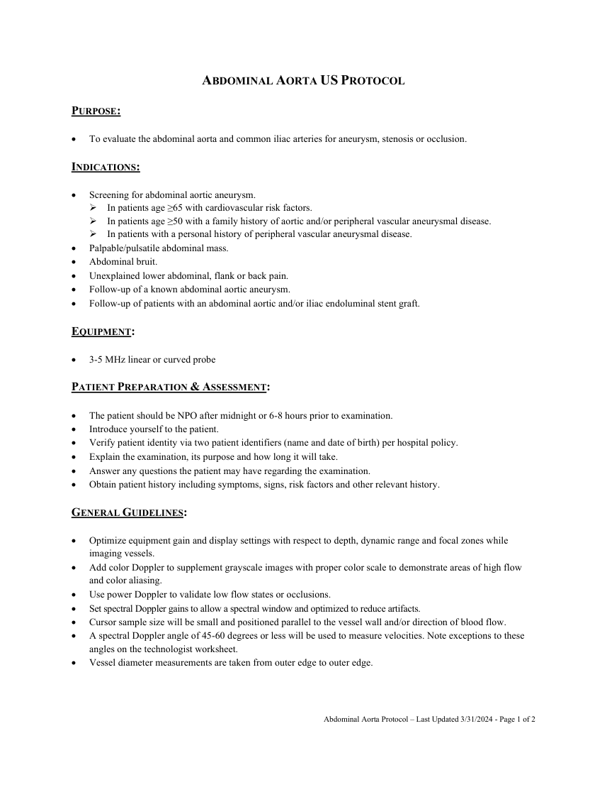
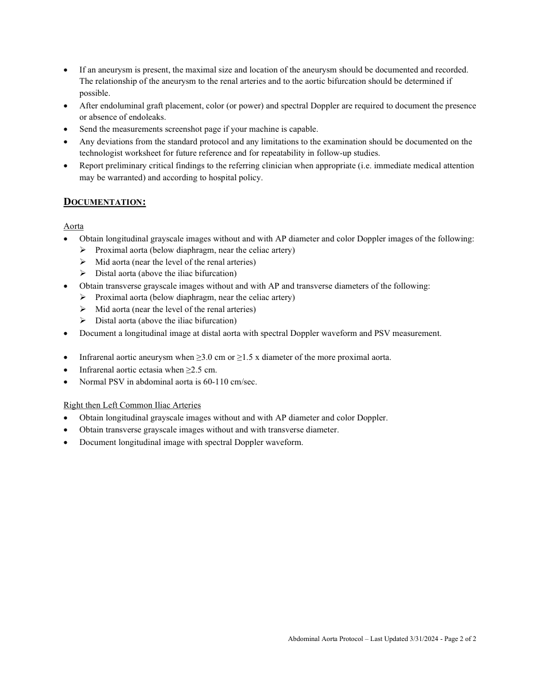

# Ecografie — Aortă abdominală (MCB)

## Documentul original MCB — Aortă abdominală

**Protocol · 2 pagini · consultat la 2026-09-27.**

[Descarcă PDF-ul integral](../../assets/mcb-modalities/eco-aorta-abdominala-mcb/document.pdf) · [Sursa MCB](https://ref.mcbradiology.com/Protocols,%20Policies,%20Worksheets%20&%20Forms/US/Protocols/Abdominal%20Aorta.pdf) · [Catalogul MCB pentru această modalitate](../mcb/index.md)

Instrucțiunile, valorile și ilustrațiile din documentul original sunt păstrate în **engleză**. Titlul și navigarea sunt în română.

### Pagina 1

{ loading=lazy }

### Pagina 2

{ loading=lazy }

## Textul documentului original

??? abstract "Pagina 1 — text în engleză"

    
ABDOMINAL AORTA US PROTOCOL 
     
    PURPOSE:  
     
     
    To evaluate the abdominal aorta and common iliac arteries for aneurysm, stenosis or occlusion. 
     
    INDICATIONS: 
     
     
    Screening for abdominal aortic aneurysm. 
     In patients age ≥65 with cardiovascular risk factors. 
     In patients age ≥50 with a family history of aortic and/or peripheral vascular aneurysmal disease. 
     In patients with a personal history of peripheral vascular aneurysmal disease. 
     
    Palpable/pulsatile abdominal mass. 
     
    Abdominal bruit. 
     
    Unexplained lower abdominal, flank or back pain. 
     
    Follow-up of a known abdominal aortic aneurysm. 
     
    Follow-up of patients with an abdominal aortic and/or iliac endoluminal stent graft. 
     
    EQUIPMENT: 
     
     
    3-5 MHz linear or curved probe 
     
    PATIENT PREPARATION &amp; ASSESSMENT: 
     
     
    The patient should be NPO after midnight or 6-8 hours prior to examination. 
     
    Introduce yourself to the patient.  
     
    Verify patient identity via two patient identifiers (name and date of birth) per hospital policy. 
     
    Explain the examination, its purpose and how long it will take. 
     
    Answer any questions the patient may have regarding the examination. 
     
    Obtain patient history including symptoms, signs, risk factors and other relevant history. 
     
    GENERAL GUIDELINES: 
     
     
    Optimize equipment gain and display settings with respect to depth, dynamic range and focal zones while 
    imaging vessels. 
     
    Add color Doppler to supplement grayscale images with proper color scale to demonstrate areas of high flow 
    and color aliasing. 
     
    Use power Doppler to validate low flow states or occlusions. 
     
    Set spectral Doppler gains to allow a spectral window and optimized to reduce artifacts. 
     
    Cursor sample size will be small and positioned parallel to the vessel wall and/or direction of blood flow. 
     
    A spectral Doppler angle of 45-60 degrees or less will be used to measure velocities. Note exceptions to these 
    angles on the technologist worksheet. 
     
    Vessel diameter measurements are taken from outer edge to outer edge. 
     
     
    Abdominal Aorta Protocol – Last Updated 3/31/2024 - Page 1 of 2 
     
     
    

??? abstract "Pagina 2 — text în engleză"

    
 
    If an aneurysm is present, the maximal size and location of the aneurysm should be documented and recorded. 
    The relationship of the aneurysm to the renal arteries and to the aortic bifurcation should be determined if 
    possible. 
     
    After endoluminal graft placement, color (or power) and spectral Doppler are required to document the presence 
    or absence of endoleaks. 
     
    Send the measurements screenshot page if your machine is capable. 
     
    Any deviations from the standard protocol and any limitations to the examination should be documented on the 
    technologist worksheet for future reference and for repeatability in follow-up studies. 
     
    Report preliminary critical findings to the referring clinician when appropriate (i.e. immediate medical attention 
    may be warranted) and according to hospital policy. 
     
    DOCUMENTATION: 
     
    Aorta 
     
    Obtain longitudinal grayscale images without and with AP diameter and color Doppler images of the following: 
     Proximal aorta (below diaphragm, near the celiac artery) 
     Mid aorta (near the level of the renal arteries) 
     Distal aorta (above the iliac bifurcation) 
     
    Obtain transverse grayscale images without and with AP and transverse diameters of the following: 
     Proximal aorta (below diaphragm, near the celiac artery) 
     Mid aorta (near the level of the renal arteries) 
     Distal aorta (above the iliac bifurcation) 
     
    Document a longitudinal image at distal aorta with spectral Doppler waveform and PSV measurement. 
     
     
    Infrarenal aortic aneurysm when ≥3.0 cm or ≥1.5 x diameter of the more proximal aorta. 
     
    Infrarenal aortic ectasia when ≥2.5 cm. 
     
    Normal PSV in abdominal aorta is 60-110 cm/sec. 
     
    Right then Left Common Iliac Arteries 
     
    Obtain longitudinal grayscale images without and with AP diameter and color Doppler. 
     
    Obtain transverse grayscale images without and with transverse diameter. 
     
    Document longitudinal image with spectral Doppler waveform. 
     
     
     
     
    Abdominal Aorta Protocol – Last Updated 3/31/2024 - Page 2 of 2 
     
     
    

