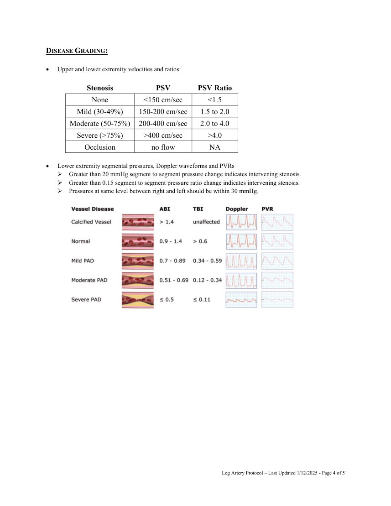
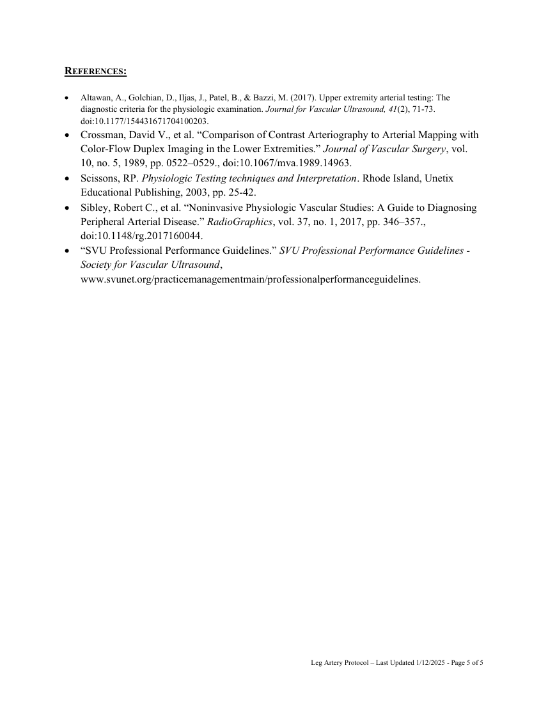

# Ecografie — Artere ale membrului inferior (MCB)

## Documentul original MCB — Artere ale membrului inferior

**Protocol · 5 pagini · consultat la 2026-09-27.**

[Descarcă PDF-ul integral](../../assets/mcb-modalities/eco-artere-ale-membrului-inferior-mcb/document.pdf) · [Sursa MCB](https://ref.mcbradiology.com/Protocols,%20Policies,%20Worksheets%20&%20Forms/US/Protocols/Leg%20Arteries.pdf) · [Catalogul MCB pentru această modalitate](../mcb/index.md)

Instrucțiunile, valorile și ilustrațiile din documentul original sunt păstrate în **engleză**. Titlul și navigarea sunt în română.

### Pagina 1

{ loading=lazy }

### Pagina 2

{ loading=lazy }

### Pagina 3

{ loading=lazy }

### Pagina 4

{ loading=lazy }

### Pagina 5

{ loading=lazy }

## Textul documentului original

??? abstract "Pagina 1 — text în engleză"

    
 
    LEG ARTERY US PROTOCOL 
     
    PURPOSE:  
     
     
    To evaluate lower extremity arteries to characterize plaque location, morphology and severity.   
     
    INDICATIONS: 
     
     
    After a segmental arterial evaluation of the lower extremities has resulted in an ankle-brachial (ABI) of ≤0.5 or 
    &gt;1.40 in one or both lower extremities. The extremity or extremities with the decreased or increased ABI will 
    be imaged.  
     
    Peripheral vascular disease. 
     
    Claudication (pain with exertion). 
     
    Rest pain. 
     
    Numbness. 
     
    Trauma. 
     
    Dialysis fistula. 
     
    Septic emboli. 
     
    Post-operative evaluation or follow-up (including stents, bypass grafts or pseudoaneurysms). 
     
    Orthopedic or other implant complication. 
     
    Buerger’s disease. 
     
    CONTRAINDICATIONS:  
     
     
    Patients with bandages, casts or other hardware that precludes adequate assessment of an artery or arterial 
    segment 
     
    EQUIPMENT: 
     
     
    3.5-10 MHz linear probe 
     
    PATIENT PREPARATION &amp; ASSESSMENT: 
     
     
    Introduce yourself to the patient. 
     
    Verify patient identity via two patient identifiers (name and date of birth) per hospital policy. 
     
    Explain the examination, its purpose and how long it will take. 
     
    Answer any questions the patient may have regarding the examination. 
     
    Obtain patient history including symptoms, signs, risk factors and other relevant history. 
     
    Document signs and symptoms of peripheral vascular disease including bruits, hypertension, claudication, rest 
    pain, ulceration, gangrene, ischemia, hair loss, coolness, pallor, dependent rubor and any prior revascularization 
    procedures. 
     
    The patient should rest in a supine position for 10-15 minutes before beginning the examination. This resting 
    period ensures that peripheral blood flow will be at a resting level and not increased due to walking in to the 
    facility. 
     
    The patient should be supine with the extremities at the same level as the heart, since artifacts can occur from 
    the effect of hydrostatic pressure when the point of measurement is not at the same level with the heart. The 
    Leg Artery Protocol – Last Updated 1/12/2025 - Page 1 of 5 
     
    

??? abstract "Pagina 2 — text în engleză"

    
 
    head of the bed should be flat with the patient’s head on a pillow. If the patient is unable to lie in this position, 
    document on the record that pressures were taken with the head of the bed elevated. 
     
    Efforts should be made to keep the patient’s limbs covered and warm during the study to prevent 
    vasoconstriction. 
     
    GENERAL GUIDELINES: 
     
     
    Optimize equipment gain and display settings with respect to depth, dynamic range and focal zones while 
    imaging vessels. 
     
    Add color Doppler to supplement grayscale images with proper color scale to demonstrate areas of high flow 
    and color aliasing. 
     
    Use power Doppler to validate low flow states or occlusions. 
     
    Set spectral Doppler gains to allow a spectral window and optimized to reduce artifacts. 
     
    Cursor sample size will be small and positioned parallel to the vessel wall and/or direction of blood flow. 
     
    A spectral Doppler angle of 45-60 degrees or less will be used to measure velocities. Note exceptions to these 
    angles on the technologist worksheet. 
     
    Areas of suspected stenosis or occlusion will include spectral Doppler waveforms and velocity measurements 
    recorded at and distal to the stenosis or occlusion. 
     
    Sites of intervention (stents and bypass grafts) will include spectral Doppler waveforms and velocity 
    measurements from the proximal, mid and distal aspects of the stent/graft, as well as, in the native artery just 
    proximal to the stent/graft and in the native vessel just distal to the stent/graft. 
     
    Long stents (e.g. femoral to popliteal) may require multiple mid stent images to localize stenosis. 
     
    Plaque should be assessed for severity and characterized (i.e. hypoechoic, echogenic, shadowing, mixed). 
     
    Send the measurements screenshot page if your machine is capable. 
     
    For focal lesions (masses, cysts, nodules, lymph nodes, fibroids) obtain split-screen images of the lesion without 
    calibers, with calibers and with color Doppler.  
     
    Any deviations from the standard protocol and any limitations to the examination should be documented on the 
    technologist worksheet for future reference and for repeatability in follow-up studies. 
     
    Report preliminary critical findings to the referring clinician when appropriate (i.e. immediate medical attention 
    may be warranted) and according to hospital policy. 
     
    DOCUMENTATION: 
     
    Ankle Brachial Index (ABI) 
     
    ABIs are no longer required on all leg duplex examinations. Only perform ABIs if requested in the order 
    comments or if a segmental evaluation is also placed. 
     
    Use the higher of the two brachial pressures for the ABI calculation on both sides. 
     
    Grayscale Imaging 
     
    Document longitudinal grayscale images of the following: 
     Common Femoral Artery (CFA) 
     Deep Femoral Artery (DFA) (aka Profunda Femoris Artery) 
     Femoral Artery (FA) Proximal 
     Femoral Artery (FA) Mid 
     Femoral Artery (FA) Distal 
     Popliteal Artery 
     Posterior Tibial Artery (PTA) 
    Leg Artery Protocol – Last Updated 1/12/2025 - Page 2 of 5 
     
    

??? abstract "Pagina 3 — text în engleză"

    
 
     Anterior Tibial Artery (ATA) 
     Aorta, common iliac and external iliac arteries when appropriate. 
     Bypass grafts when present including anastomosis sites. 
     Stents when present including proximal and distal ends. 
     
    Color Doppler Imaging 
     
    Document longitudinal color Doppler images of the following: 
     Common Femoral Artery (CFA) 
     Deep Femoral Artery (DFA) (aka Profunda Femoris Artery) 
     Femoral Artery (FA) Proximal 
     Femoral Artery (FA) Mid 
     Femoral Artery (FA) Distal 
     Popliteal Artery 
     Posterior Tibial Artery (PTA) 
     Anterior Tibial Artery (ATA) 
     Aorta, common iliac and external iliac arteries when appropriate. 
     Bypass grafts when present including anastomosis sites. 
     Stents when present including proximal and distal ends. 
     
    Spectral Doppler Waveforms 
     
    Document longitudinal spectral Doppler waveforms and PSV and EDV measurements of the following: 
     Common Femoral Artery (CFA) 
     Deep Femoral Artery (DFA) (aka Profunda Femoris Artery) 
     Femoral Artery (FA) Proximal 
     Femoral Artery (FA) Mid 
     Femoral Artery (FA) Distal 
     Popliteal Artery 
     Posterior Tibial Artery (PTA) 
     Anterior Tibial Artery (ATA) 
     Aorta, common iliac and external iliac arteries when appropriate. 
     Bypass grafts and stents when present including: 
     
    Native artery just proximal to stent/graft 
     
    Proximal aspect of stent/graft 
     
    Mid aspect of stent/graft 
     
    Distal aspect of stent/graft 
     
    Native artery just distal to stent/graft 
     
     
     
     
     
     
     
     
     
     
     
     
    Leg Artery Protocol – Last Updated 1/12/2025 - Page 3 of 5 
     
    

??? abstract "Pagina 4 — text în engleză"

    
 
    DISEASE GRADING: 
     
     
    Upper and lower extremity velocities and ratios: 
     
    Stenosis 
    PSV 
    PSV Ratio 
    None 
    &lt;150 cm/sec 
    &lt;1.5 
    Mild (30-49%) 
    150-200 cm/sec 
    1.5 to 2.0 
    Moderate (50-75%) 
    200-400 cm/sec 
    2.0 to 4.0 
    Severe (&gt;75%) 
    &gt;400 cm/sec 
    &gt;4.0 
    Occlusion 
    no flow 
    NA 
     
     
    Lower extremity segmental pressures, Doppler waveforms and PVRs 
     Greater than 20 mmHg segment to segment pressure change indicates intervening stenosis. 
     Greater than 0.15 segment to segment pressure ratio change indicates intervening stenosis. 
     Pressures at same level between right and left should be within 30 mmHg. 
     
     
     
     
     
     
     
     
     
     
     
     
     
     
     
     
    Leg Artery Protocol – Last Updated 1/12/2025 - Page 4 of 5 
     
    

??? abstract "Pagina 5 — text în engleză"

    
 
    REFERENCES: 
     
    Altawan, A., Golchian, D., Iljas, J., Patel, B., &amp; Bazzi, M. (2017). Upper extremity arterial testing: The 
    diagnostic criteria for the physiologic examination. Journal for Vascular Ultrasound, 41(2), 71-73. 
    doi:10.1177/154431671704100203. 
     Crossman, David V., et al. “Comparison of Contrast Arteriography to Arterial Mapping with 
    Color-Flow Duplex Imaging in the Lower Extremities.” Journal of Vascular Surgery, vol. 
    10, no. 5, 1989, pp. 0522–0529., doi:10.1067/mva.1989.14963.  
     Scissons, RP. Physiologic Testing techniques and Interpretation. Rhode Island, Unetix 
    Educational Publishing, 2003, pp. 25-42. 
     Sibley, Robert C., et al. “Noninvasive Physiologic Vascular Studies: A Guide to Diagnosing 
    Peripheral Arterial Disease.” RadioGraphics, vol. 37, no. 1, 2017, pp. 346–357., 
    doi:10.1148/rg.2017160044.  
     “SVU Professional Performance Guidelines.” SVU Professional Performance Guidelines - 
    Society for Vascular Ultrasound, 
    www.svunet.org/practicemanagementmain/professionalperformanceguidelines. 
     
    Leg Artery Protocol – Last Updated 1/12/2025 - Page 5 of 5 
     
    

