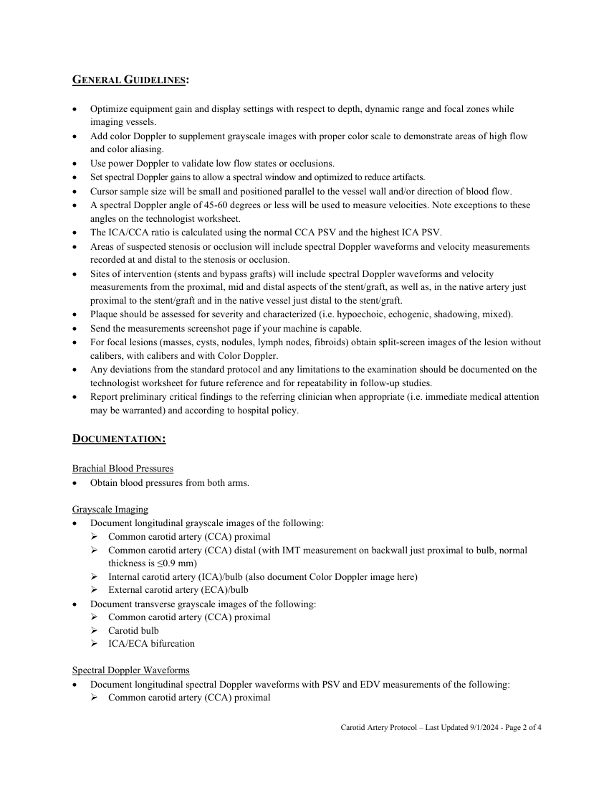
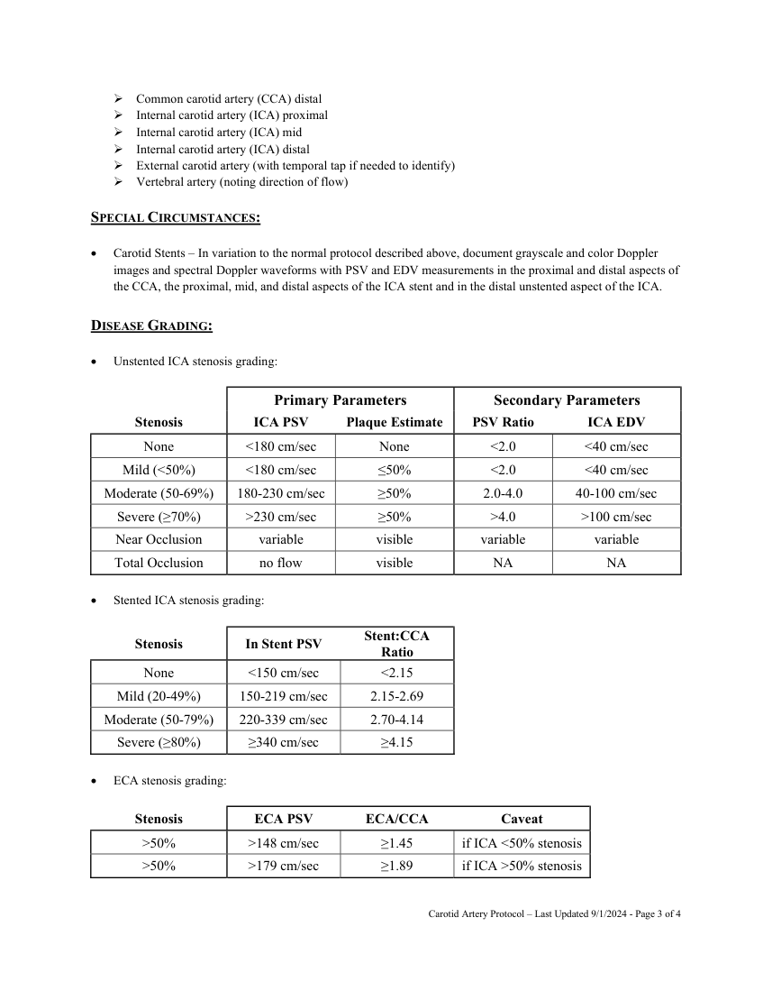
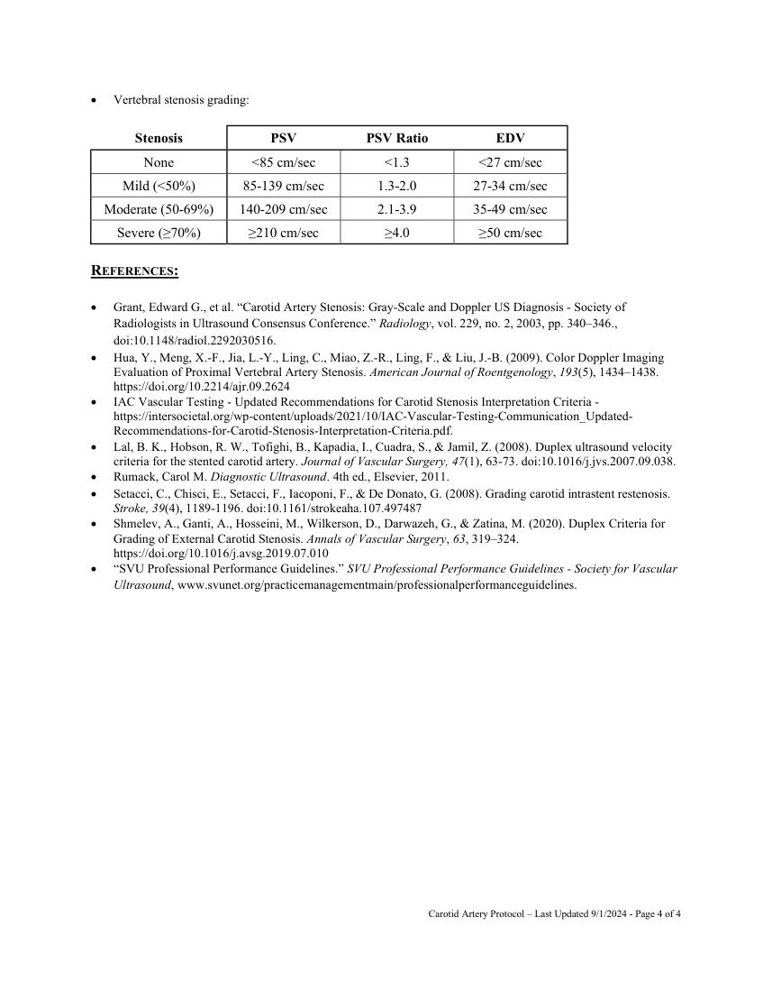

# Ecografie — Artere carotide (MCB)

## Documentul original MCB — Artere carotide

**Protocol · 4 pagini · consultat la 2026-09-27.**

[Descarcă PDF-ul integral](../../assets/mcb-modalities/eco-artere-carotide-mcb/document.pdf) · [Sursa MCB](https://ref.mcbradiology.com/Protocols,%20Policies,%20Worksheets%20&%20Forms/US/Protocols/Carotid%20Arteries.pdf) · [Catalogul MCB pentru această modalitate](../mcb/index.md)

Instrucțiunile, valorile și ilustrațiile din documentul original sunt păstrate în **engleză**. Titlul și navigarea sunt în română.

### Pagina 1

{ loading=lazy }

### Pagina 2

{ loading=lazy }

### Pagina 3

{ loading=lazy }

### Pagina 4

{ loading=lazy }

## Textul documentului original

??? abstract "Pagina 1 — text în engleză"

    
CAROTID ARTERY US PROTOCOL 
     
    Purpose: 
     
     
    To evaluate the extracranial carotid and vertebral arteries to characterize plaque location, morphology and 
    severity.   
     
    INDICATIONS: 
     
     
    Cerebrovascular disease. 
     
    Transient ischemic attack. 
     
    Cerebral infarct. 
     
    Stroke symptoms. 
     
    Unilateral weakness/paralysis (hemiparesis/hemiplegia). 
     
    Slurred speech. 
     
    Syncope. 
     
    Vision changes. 
     
    Carotid bruit. 
     
    Status post carotid endarterectomy. 
     
    Stenosis follow-up. 
     
    Vertebro-basilar syndrome/insufficiency. 
     
    Preoperative evaluation. 
     
    Trauma. 
     
    Retinal artery emboli. 
     
    Giant cell arteritis. 
     
    Head or neck mass. 
     
    CONTRAINDICATIONS: 
     
     
    Patients with bandages, casts or other hardware that precludes adequate assessment of an artery or arterial 
    segment. 
     
    Patients who are unable to cooperate due to mental status changes or involuntary movements. 
     
    EQUIPMENT: 
     
     
    5-7 MHz linear probe 
     
    PATIENT PREPARATION &amp; ASSESSMENT: 
     
     
    Introduce yourself to the patient. 
     
    Verify patient identity via two patient identifiers (name and date of birth) per hospital policy. 
     
    Explain the examination, its purpose and how long it will take. 
     
    Answer any questions the patient may have regarding the examination. 
     
    Obtain patient history including symptoms, signs, risk factors and other relevant history. 
     
     
    Carotid Artery Protocol – Last Updated 9/1/2024 - Page 1 of 4 
     
     
    

??? abstract "Pagina 2 — text în engleză"

    
GENERAL GUIDELINES: 
     
     
    Optimize equipment gain and display settings with respect to depth, dynamic range and focal zones while 
    imaging vessels. 
     
    Add color Doppler to supplement grayscale images with proper color scale to demonstrate areas of high flow 
    and color aliasing. 
     
    Use power Doppler to validate low flow states or occlusions. 
     
    Set spectral Doppler gains to allow a spectral window and optimized to reduce artifacts. 
     
    Cursor sample size will be small and positioned parallel to the vessel wall and/or direction of blood flow. 
     
    A spectral Doppler angle of 45-60 degrees or less will be used to measure velocities. Note exceptions to these 
    angles on the technologist worksheet. 
     
    The ICA/CCA ratio is calculated using the normal CCA PSV and the highest ICA PSV. 
     
    Areas of suspected stenosis or occlusion will include spectral Doppler waveforms and velocity measurements 
    recorded at and distal to the stenosis or occlusion. 
     
    Sites of intervention (stents and bypass grafts) will include spectral Doppler waveforms and velocity 
    measurements from the proximal, mid and distal aspects of the stent/graft, as well as, in the native artery just 
    proximal to the stent/graft and in the native vessel just distal to the stent/graft. 
     
    Plaque should be assessed for severity and characterized (i.e. hypoechoic, echogenic, shadowing, mixed). 
     
    Send the measurements screenshot page if your machine is capable. 
     
    For focal lesions (masses, cysts, nodules, lymph nodes, fibroids) obtain split-screen images of the lesion without 
    calibers, with calibers and with Color Doppler.  
     
    Any deviations from the standard protocol and any limitations to the examination should be documented on the 
    technologist worksheet for future reference and for repeatability in follow-up studies. 
     
    Report preliminary critical findings to the referring clinician when appropriate (i.e. immediate medical attention 
    may be warranted) and according to hospital policy. 
     
    DOCUMENTATION: 
     
    Brachial Blood Pressures 
     
    Obtain blood pressures from both arms. 
     
    Grayscale Imaging 
     
    Document longitudinal grayscale images of the following: 
     Common carotid artery (CCA) proximal 
     Common carotid artery (CCA) distal (with IMT measurement on backwall just proximal to bulb, normal 
    thickness is ≤0.9 mm) 
     Internal carotid artery (ICA)/bulb (also document Color Doppler image here) 
     External carotid artery (ECA)/bulb 
     
    Document transverse grayscale images of the following: 
     Common carotid artery (CCA) proximal 
     Carotid bulb 
     ICA/ECA bifurcation 
     
    Spectral Doppler Waveforms 
     
    Document longitudinal spectral Doppler waveforms with PSV and EDV measurements of the following: 
     Common carotid artery (CCA) proximal 
     
     
    Carotid Artery Protocol – Last Updated 9/1/2024 - Page 2 of 4 
     
     
    

??? abstract "Pagina 3 — text în engleză"

    
 Common carotid artery (CCA) distal 
     Internal carotid artery (ICA) proximal 
     Internal carotid artery (ICA) mid 
     Internal carotid artery (ICA) distal 
     External carotid artery (with temporal tap if needed to identify) 
     Vertebral artery (noting direction of flow) 
     
    SPECIAL CIRCUMSTANCES: 
     
     
    Carotid Stents – In variation to the normal protocol described above, document grayscale and color Doppler 
    images and spectral Doppler waveforms with PSV and EDV measurements in the proximal and distal aspects of 
    the CCA, the proximal, mid, and distal aspects of the ICA stent and in the distal unstented aspect of the ICA. 
     
    DISEASE GRADING: 
     
     
    Unstented ICA stenosis grading: 
     
     
     
     
     
     
     
    Primary Parameters 
    Secondary Parameters 
    Stenosis 
    ICA PSV 
    Plaque Estimate 
    PSV Ratio 
    ICA EDV 
    None 
    &lt;180 cm/sec 
    None 
    &lt;2.0 
    &lt;40 cm/sec 
    Mild (&lt;50%) 
    &lt;180 cm/sec 
    ≤50% 
    &lt;2.0 
    &lt;40 cm/sec 
    Moderate (50-69%) 
    180-230 cm/sec 
    ≥50% 
    2.0-4.0 
    40-100 cm/sec 
    Severe (≥70%) 
    &gt;230 cm/sec 
    ≥50% 
    &gt;4.0 
    &gt;100 cm/sec 
    Near Occlusion 
    variable 
    visible 
    variable 
    variable 
    Total Occlusion 
    no flow 
    visible 
    NA 
    NA 
     
     
    Stented ICA stenosis grading: 
     
    Stenosis 
    In Stent PSV 
    Stent:CCA 
    Ratio 
    None 
    &lt;150 cm/sec 
    &lt;2.15 
    Mild (20-49%) 
    150-219 cm/sec 
    2.15-2.69 
    Moderate (50-79%) 
    220-339 cm/sec 
    2.70-4.14 
    Severe (≥80%) 
    ≥340 cm/sec 
    ≥4.15 
     
     
    ECA stenosis grading: 
     
    Stenosis 
    ECA PSV 
    ECA/CCA 
    Caveat 
    &gt;50% 
    &gt;148 cm/sec 
    ≥1.45 
    if ICA &lt;50% stenosis 
    &gt;50% 
    &gt;179 cm/sec 
    ≥1.89 
    if ICA &gt;50% stenosis 
     
     
    Carotid Artery Protocol – Last Updated 9/1/2024 - Page 3 of 4 
     
     
    

??? abstract "Pagina 4 — text în engleză"

    
 
    Vertebral stenosis grading: 
     
    Stenosis 
    PSV 
    PSV Ratio 
    EDV 
    None 
    &lt;85 cm/sec 
    &lt;1.3 
    &lt;27 cm/sec 
    Mild (&lt;50%) 
    85-139 cm/sec 
    1.3-2.0 
    27-34 cm/sec 
    Moderate (50-69%) 
    140-209 cm/sec 
    2.1-3.9 
    35-49 cm/sec 
    Severe (≥70%) 
    ≥210 cm/sec 
    ≥4.0 
    ≥50 cm/sec 
     
    REFERENCES: 
     
     
    Grant, Edward G., et al. “Carotid Artery Stenosis: Gray-Scale and Doppler US Diagnosis - Society of 
    Radiologists in Ultrasound Consensus Conference.” Radiology, vol. 229, no. 2, 2003, pp. 340–346., 
    doi:10.1148/radiol.2292030516.  
     
    Hua, Y., Meng, X.-F., Jia, L.-Y., Ling, C., Miao, Z.-R., Ling, F., &amp; Liu, J.-B. (2009). Color Doppler Imaging 
    Evaluation of Proximal Vertebral Artery Stenosis. American Journal of Roentgenology, 193(5), 1434–1438. 
    https://doi.org/10.2214/ajr.09.2624  
     
    IAC Vascular Testing - Updated Recommendations for Carotid Stenosis Interpretation Criteria - 
    https://intersocietal.org/wp-content/uploads/2021/10/IAC-Vascular-Testing-Communication_Updated-
    Recommendations-for-Carotid-Stenosis-Interpretation-Criteria.pdf. 
     
    Lal, B. K., Hobson, R. W., Tofighi, B., Kapadia, I., Cuadra, S., &amp; Jamil, Z. (2008). Duplex ultrasound velocity 
    criteria for the stented carotid artery. Journal of Vascular Surgery, 47(1), 63-73. doi:10.1016/j.jvs.2007.09.038. 
     
    Rumack, Carol M. Diagnostic Ultrasound. 4th ed., Elsevier, 2011. 
     
    Setacci, C., Chisci, E., Setacci, F., Iacoponi, F., &amp; De Donato, G. (2008). Grading carotid intrastent restenosis. 
    Stroke, 39(4), 1189-1196. doi:10.1161/strokeaha.107.497487 
     
    Shmelev, A., Ganti, A., Hosseini, M., Wilkerson, D., Darwazeh, G., &amp; Zatina, M. (2020). Duplex Criteria for 
    Grading of External Carotid Stenosis. Annals of Vascular Surgery, 63, 319–324. 
    https://doi.org/10.1016/j.avsg.2019.07.010  
     
    “SVU Professional Performance Guidelines.” SVU Professional Performance Guidelines - Society for Vascular 
    Ultrasound, www.svunet.org/practicemanagementmain/professionalperformanceguidelines.  
     
     
     
     
     
    Carotid Artery Protocol – Last Updated 9/1/2024 - Page 4 of 4 
     
     
    

