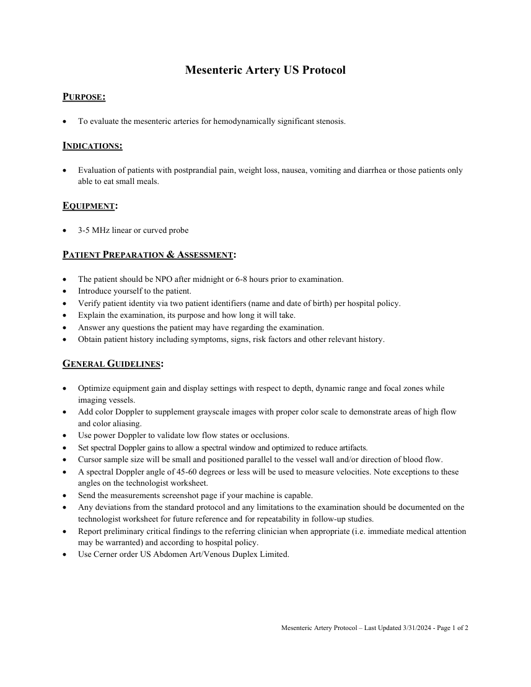
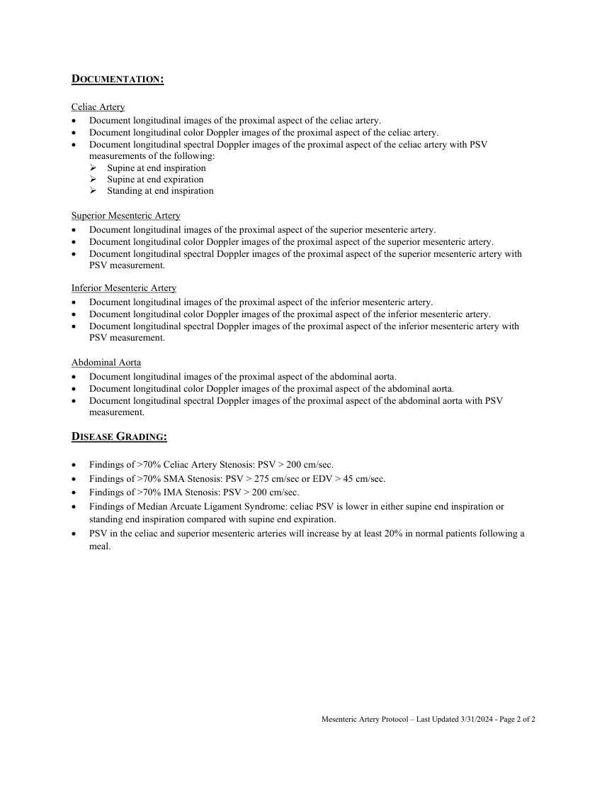

# Ecografie — Artere mezenterice (MCB)

## Documentul original MCB — Artere mezenterice

**Protocol · 2 pagini · consultat la 2026-09-27.**

[Descarcă PDF-ul integral](../../assets/mcb-modalities/eco-artere-mezenterice-mcb/document.pdf) · [Sursa MCB](https://ref.mcbradiology.com/Protocols,%20Policies,%20Worksheets%20&%20Forms/US/Protocols/Mesenteric%20Artery.pdf) · [Catalogul MCB pentru această modalitate](../mcb/index.md)

Instrucțiunile, valorile și ilustrațiile din documentul original sunt păstrate în **engleză**. Titlul și navigarea sunt în română.

### Pagina 1

{ loading=lazy }

### Pagina 2

{ loading=lazy }

## Textul documentului original

??? abstract "Pagina 1 — text în engleză"

    
Mesenteric Artery US Protocol 
     
    PURPOSE:  
     
     
    To evaluate the mesenteric arteries for hemodynamically significant stenosis. 
     
    INDICATIONS: 
     
     
    Evaluation of patients with postprandial pain, weight loss, nausea, vomiting and diarrhea or those patients only 
    able to eat small meals. 
     
    EQUIPMENT: 
     
     
    3-5 MHz linear or curved probe 
     
    PATIENT PREPARATION &amp; ASSESSMENT: 
     
     
    The patient should be NPO after midnight or 6-8 hours prior to examination. 
     
    Introduce yourself to the patient.  
     
    Verify patient identity via two patient identifiers (name and date of birth) per hospital policy. 
     
    Explain the examination, its purpose and how long it will take. 
     
    Answer any questions the patient may have regarding the examination. 
     
    Obtain patient history including symptoms, signs, risk factors and other relevant history. 
     
    GENERAL GUIDELINES: 
     
     
    Optimize equipment gain and display settings with respect to depth, dynamic range and focal zones while 
    imaging vessels. 
     
    Add color Doppler to supplement grayscale images with proper color scale to demonstrate areas of high flow 
    and color aliasing. 
     
    Use power Doppler to validate low flow states or occlusions. 
     
    Set spectral Doppler gains to allow a spectral window and optimized to reduce artifacts. 
     
    Cursor sample size will be small and positioned parallel to the vessel wall and/or direction of blood flow. 
     
    A spectral Doppler angle of 45-60 degrees or less will be used to measure velocities. Note exceptions to these 
    angles on the technologist worksheet. 
     
    Send the measurements screenshot page if your machine is capable. 
     
    Any deviations from the standard protocol and any limitations to the examination should be documented on the 
    technologist worksheet for future reference and for repeatability in follow-up studies. 
     
    Report preliminary critical findings to the referring clinician when appropriate (i.e. immediate medical attention 
    may be warranted) and according to hospital policy. 
     
    Use Cerner order US Abdomen Art/Venous Duplex Limited. 
     
     
     
     
     
     
    Mesenteric Artery Protocol – Last Updated 3/31/2024 - Page 1 of 2 
     
     
    

??? abstract "Pagina 2 — text în engleză"

    
DOCUMENTATION: 
     
    Celiac Artery 
     
    Document longitudinal images of the proximal aspect of the celiac artery. 
     
    Document longitudinal color Doppler images of the proximal aspect of the celiac artery. 
     
    Document longitudinal spectral Doppler images of the proximal aspect of the celiac artery with PSV 
    measurements of the following: 
     Supine at end inspiration 
     Supine at end expiration 
     Standing at end inspiration 
     
    Superior Mesenteric Artery 
     
    Document longitudinal images of the proximal aspect of the superior mesenteric artery. 
     
    Document longitudinal color Doppler images of the proximal aspect of the superior mesenteric artery. 
     
    Document longitudinal spectral Doppler images of the proximal aspect of the superior mesenteric artery with 
    PSV measurement. 
     
    Inferior Mesenteric Artery 
     
    Document longitudinal images of the proximal aspect of the inferior mesenteric artery. 
     
    Document longitudinal color Doppler images of the proximal aspect of the inferior mesenteric artery. 
     
    Document longitudinal spectral Doppler images of the proximal aspect of the inferior mesenteric artery with 
    PSV measurement. 
     
    Abdominal Aorta 
     
    Document longitudinal images of the proximal aspect of the abdominal aorta. 
     
    Document longitudinal color Doppler images of the proximal aspect of the abdominal aorta. 
     
    Document longitudinal spectral Doppler images of the proximal aspect of the abdominal aorta with PSV 
    measurement. 
     
    DISEASE GRADING: 
     
     
    Findings of &gt;70% Celiac Artery Stenosis: PSV &gt; 200 cm/sec. 
     
    Findings of &gt;70% SMA Stenosis: PSV &gt; 275 cm/sec or EDV &gt; 45 cm/sec. 
     
    Findings of &gt;70% IMA Stenosis: PSV &gt; 200 cm/sec. 
     
    Findings of Median Arcuate Ligament Syndrome: celiac PSV is lower in either supine end inspiration or 
    standing end inspiration compared with supine end expiration. 
     
    PSV in the celiac and superior mesenteric arteries will increase by at least 20% in normal patients following a 
    meal. 
     
     
     
    Mesenteric Artery Protocol – Last Updated 3/31/2024 - Page 2 of 2 
     
     
    

