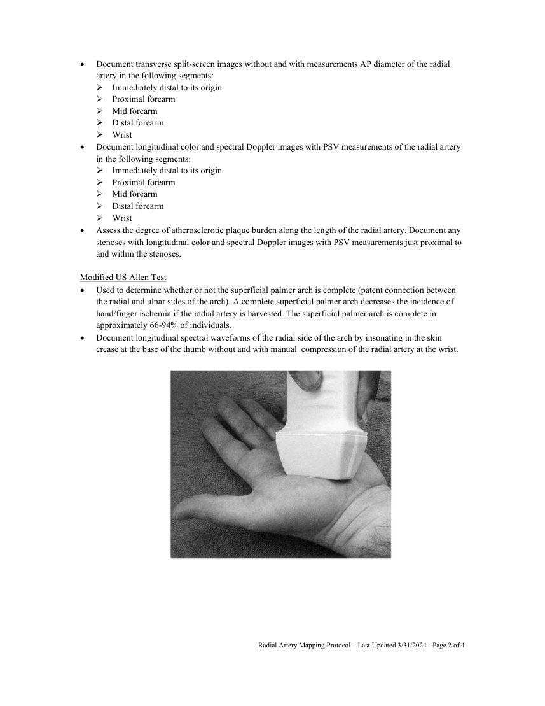
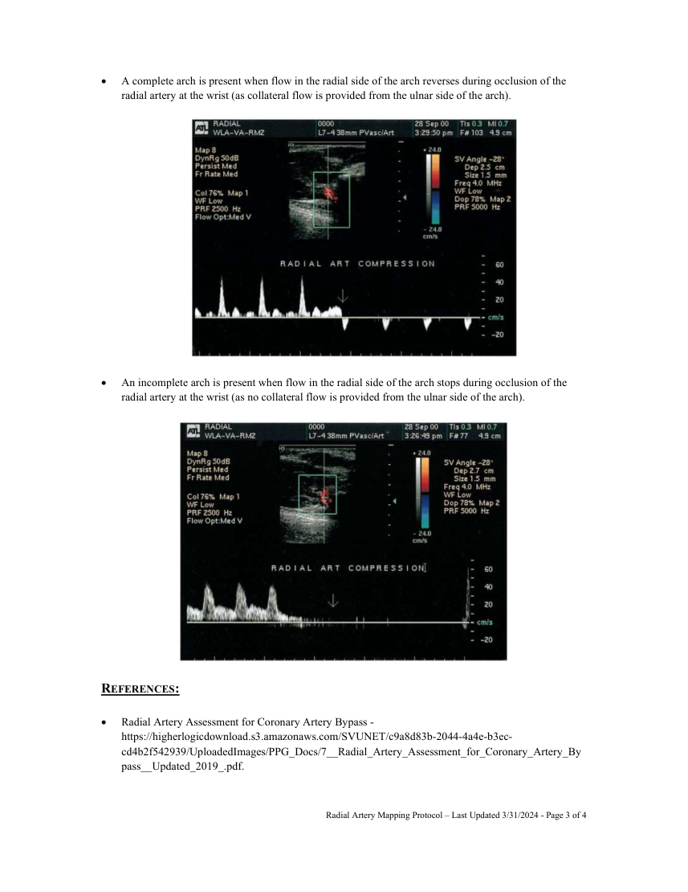

# Ecografie — Cartografiere arteră radială (MCB)

## Documentul original MCB — Cartografiere arteră radială

**Protocol · 4 pagini · consultat la 2026-09-27.**

[Descarcă PDF-ul integral](../../assets/mcb-modalities/eco-cartografiere-artera-radiala-mcb/document.pdf) · [Sursa MCB](https://ref.mcbradiology.com/Protocols,%20Policies,%20Worksheets%20&%20Forms/US/Protocols/Radial%20Artery%20Map.pdf) · [Catalogul MCB pentru această modalitate](../mcb/index.md)

Instrucțiunile, valorile și ilustrațiile din documentul original sunt păstrate în **engleză**. Titlul și navigarea sunt în română.

### Pagina 1

{ loading=lazy }

### Pagina 2

{ loading=lazy }

### Pagina 3

{ loading=lazy }

### Pagina 4

{ loading=lazy }

## Textul documentului original

??? abstract "Pagina 1 — text în engleză"

    
RADIAL ARTERY MAPPING US PROTOCOL 
     
    PURPOSE:  
     
     
    To assess the suitability of the radial artery for use as a conduit for CABG and to assess the patency of 
    the superficial palmer arch. 
     
    EQUIPMENT: 
     
     
    High-frequency 8-15 MHz linear probe  
     
    PATIENT PREPARATION &amp; ASSESSMENT: 
     
     
    Introduce yourself to the patient.  
     
    Verify patient identity via two patient identifiers (name and date of birth) per hospital policy. 
     
    Explain the examination, its purpose and how long it will take. 
     
    Answer any questions the patient may have regarding the examination. 
     
    Obtain patient history including symptoms, signs, risk factors and other relevant history. 
     
    GENERAL GUIDELINES: 
     
     
    Complete assessment of the radial artery includes evaluation of anatomic variants, vessel caliber and 
    degree of vessel plaque and stenoses. 
     
    The patency of the superficial palmer arch must also be assessed. 
     
    Contraindications to use of the radial artery for CABG include non-compressible vessels, the presence 
    of an AV fistula/graft, an incomplete palmar arch, ischemic digits and Raynaud’s syndrome. 
     
    Set spectral Doppler gains to allow a spectral window and optimized to reduce artifacts. 
     
    Cursor sample size will be small and positioned parallel to the vessel wall and/or direction of blood 
    flow. 
     
    A spectral Doppler angle of 45-60 degrees or less will be used to measure velocities. Note exceptions 
    to these angles on the technologist worksheet. 
     
    Vessel diameter measurements are taken from outer edge to outer edge. 
     
    Any deviations from the standard protocol and any limitations to the examination should be 
    documented on the technologist worksheet for future reference and for repeatability in follow-up 
    studies. 
     
    Report preliminary critical findings to the referring clinician when appropriate (i.e. immediate medical 
    attention may be warranted) and according to hospital policy. 
     
    DOCUMENTATION: 
     
     
    Document a transverse image at the origin of the radial artery displaying the radial and ulnar arteries 
    side by side. The radial artery origin is normally in the antecubital fossa but can occasionally arise 
    more proximally in the upper arm. 
     
     
     
    Radial Artery Mapping Protocol – Last Updated 3/31/2024 - Page 1 of 4 
     
     
    

??? abstract "Pagina 2 — text în engleză"

    
 
    Document transverse split-screen images without and with measurements AP diameter of the radial 
    artery in the following segments: 
     Immediately distal to its origin 
     Proximal forearm 
     Mid forearm 
     Distal forearm 
     Wrist 
     
    Document longitudinal color and spectral Doppler images with PSV measurements of the radial artery 
    in the following segments: 
     Immediately distal to its origin 
     Proximal forearm 
     Mid forearm 
     Distal forearm 
     Wrist 
     
    Assess the degree of atherosclerotic plaque burden along the length of the radial artery. Document any 
    stenoses with longitudinal color and spectral Doppler images with PSV measurements just proximal to 
    and within the stenoses. 
     
    Modified US Allen Test 
     
    Used to determine whether or not the superficial palmer arch is complete (patent connection between 
    the radial and ulnar sides of the arch). A complete superficial palmer arch decreases the incidence of 
    hand/finger ischemia if the radial artery is harvested. The superficial palmer arch is complete in 
    approximately 66-94% of individuals. 
     
    Document longitudinal spectral waveforms of the radial side of the arch by insonating in the skin 
    crease at the base of the thumb without and with manual  compression of the radial artery at the wrist. 
     
     
     
     
     
     
     
     
    Radial Artery Mapping Protocol – Last Updated 3/31/2024 - Page 2 of 4 
     
     
    

??? abstract "Pagina 3 — text în engleză"

    
 
    A complete arch is present when flow in the radial side of the arch reverses during occlusion of the 
    radial artery at the wrist (as collateral flow is provided from the ulnar side of the arch).  
     
     
     
     
    An incomplete arch is present when flow in the radial side of the arch stops during occlusion of the 
    radial artery at the wrist (as no collateral flow is provided from the ulnar side of the arch).  
     
     
     
    REFERENCES: 
     
    Radial Artery Assessment for Coronary Artery Bypass - 
    https://higherlogicdownload.s3.amazonaws.com/SVUNET/c9a8d83b-2044-4a4e-b3ec-
    cd4b2f542939/UploadedImages/PPG_Docs/7__Radial_Artery_Assessment_for_Coronary_Artery_By
    pass__Updated_2019_.pdf. 
     
     
    Radial Artery Mapping Protocol – Last Updated 3/31/2024 - Page 3 of 4 
     
     
    

??? abstract "Pagina 4 — text în engleză"

    
 
    Zimmerman, P., Chin, E. E., Laifer‐Narin, S., Ragavendra, N., &amp; Grant, E. G. (2001). Radial artery 
    mapping for coronary artery bypass graft placement. Radiology, 220(2), 299–302. 
    https://doi.org/10.1148/radiology.220.2.r01au40299. 
     
     
    Radial Artery Mapping Protocol – Last Updated 3/31/2024 - Page 4 of 4 
     
     
    

