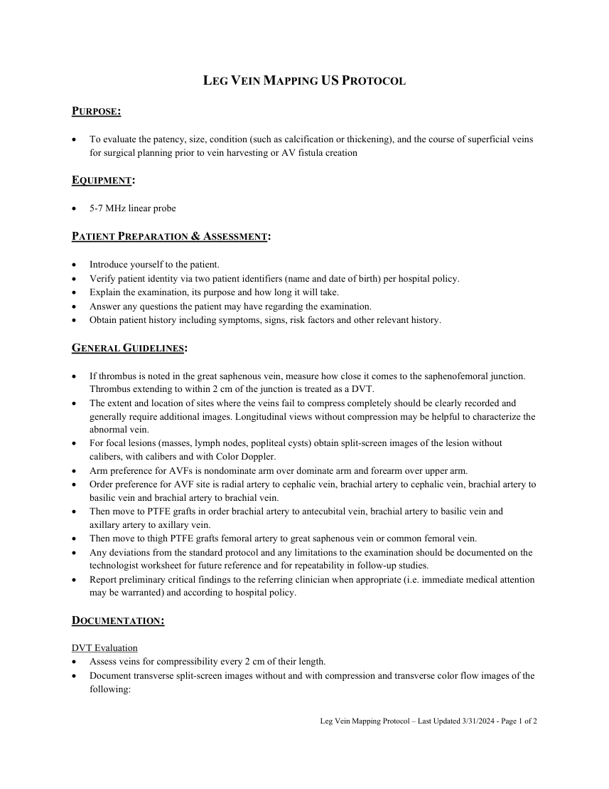
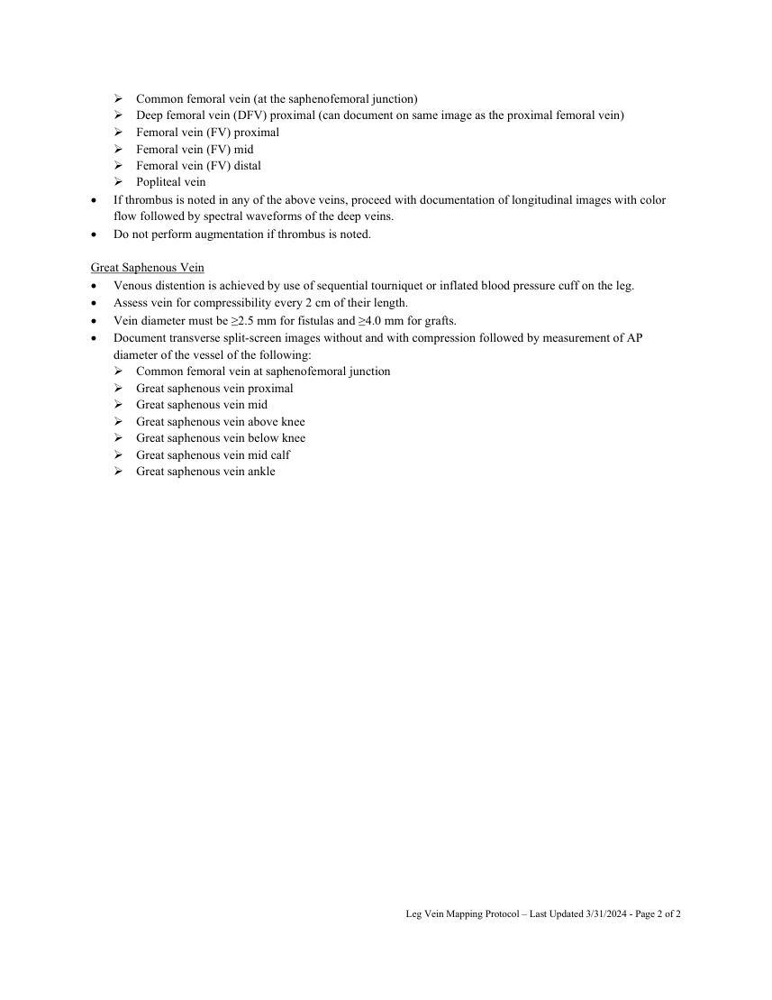

# Ecografie — Cartografiere venoasă: membru inferior (MCB)

## Documentul original MCB — Cartografiere venoasă: membru inferior

**Protocol · 2 pagini · consultat la 2026-09-27.**

[Descarcă PDF-ul integral](../../assets/mcb-modalities/eco-cartografiere-venoasa-membru-inferior-mcb/document.pdf) · [Sursa MCB](https://ref.mcbradiology.com/Protocols,%20Policies,%20Worksheets%20&%20Forms/US/Protocols/Leg%20Vein%20Mapping.pdf) · [Catalogul MCB pentru această modalitate](../mcb/index.md)

Instrucțiunile, valorile și ilustrațiile din documentul original sunt păstrate în **engleză**. Titlul și navigarea sunt în română.

### Pagina 1

{ loading=lazy }

### Pagina 2

{ loading=lazy }

## Textul documentului original

??? abstract "Pagina 1 — text în engleză"

    
LEG VEIN MAPPING US PROTOCOL 
     
    PURPOSE:  
     
     
    To evaluate the patency, size, condition (such as calcification or thickening), and the course of superficial veins 
    for surgical planning prior to vein harvesting or AV fistula creation 
     
    EQUIPMENT: 
     
     
    5-7 MHz linear probe 
     
    PATIENT PREPARATION &amp; ASSESSMENT: 
     
     
    Introduce yourself to the patient.  
     
    Verify patient identity via two patient identifiers (name and date of birth) per hospital policy. 
     
    Explain the examination, its purpose and how long it will take. 
     
    Answer any questions the patient may have regarding the examination. 
     
    Obtain patient history including symptoms, signs, risk factors and other relevant history. 
     
    GENERAL GUIDELINES: 
     
     
    If thrombus is noted in the great saphenous vein, measure how close it comes to the saphenofemoral junction. 
    Thrombus extending to within 2 cm of the junction is treated as a DVT. 
     
    The extent and location of sites where the veins fail to compress completely should be clearly recorded and 
    generally require additional images. Longitudinal views without compression may be helpful to characterize the 
    abnormal vein. 
     
    For focal lesions (masses, lymph nodes, popliteal cysts) obtain split-screen images of the lesion without 
    calibers, with calibers and with Color Doppler.  
     
    Arm preference for AVFs is nondominate arm over dominate arm and forearm over upper arm. 
     
    Order preference for AVF site is radial artery to cephalic vein, brachial artery to cephalic vein, brachial artery to 
    basilic vein and brachial artery to brachial vein. 
     
    Then move to PTFE grafts in order brachial artery to antecubital vein, brachial artery to basilic vein and 
    axillary artery to axillary vein. 
     
    Then move to thigh PTFE grafts femoral artery to great saphenous vein or common femoral vein. 
     
    Any deviations from the standard protocol and any limitations to the examination should be documented on the 
    technologist worksheet for future reference and for repeatability in follow-up studies. 
     
    Report preliminary critical findings to the referring clinician when appropriate (i.e. immediate medical attention 
    may be warranted) and according to hospital policy. 
     
    DOCUMENTATION: 
     
    DVT Evaluation 
     
    Assess veins for compressibility every 2 cm of their length.  
     
    Document transverse split-screen images without and with compression and transverse color flow images of the 
    following: 
     
     
     
    Leg Vein Mapping Protocol – Last Updated 3/31/2024 - Page 1 of 2 
     
     
    

??? abstract "Pagina 2 — text în engleză"

    
 Common femoral vein (at the saphenofemoral junction) 
     Deep femoral vein (DFV) proximal (can document on same image as the proximal femoral vein) 
     Femoral vein (FV) proximal 
     Femoral vein (FV) mid 
     Femoral vein (FV) distal 
     Popliteal vein 
     
    If thrombus is noted in any of the above veins, proceed with documentation of longitudinal images with color 
    flow followed by spectral waveforms of the deep veins. 
     
    Do not perform augmentation if thrombus is noted. 
     
    Great Saphenous Vein 
     
    Venous distention is achieved by use of sequential tourniquet or inflated blood pressure cuff on the leg. 
     
    Assess vein for compressibility every 2 cm of their length.  
     
    Vein diameter must be ≥2.5 mm for fistulas and ≥4.0 mm for grafts. 
     
    Document transverse split-screen images without and with compression followed by measurement of AP 
    diameter of the vessel of the following: 
     Common femoral vein at saphenofemoral junction 
     Great saphenous vein proximal 
     Great saphenous vein mid 
     Great saphenous vein above knee 
     Great saphenous vein below knee 
     Great saphenous vein mid calf 
     Great saphenous vein ankle 
     
     
     
    Leg Vein Mapping Protocol – Last Updated 3/31/2024 - Page 2 of 2 
     
     
    

