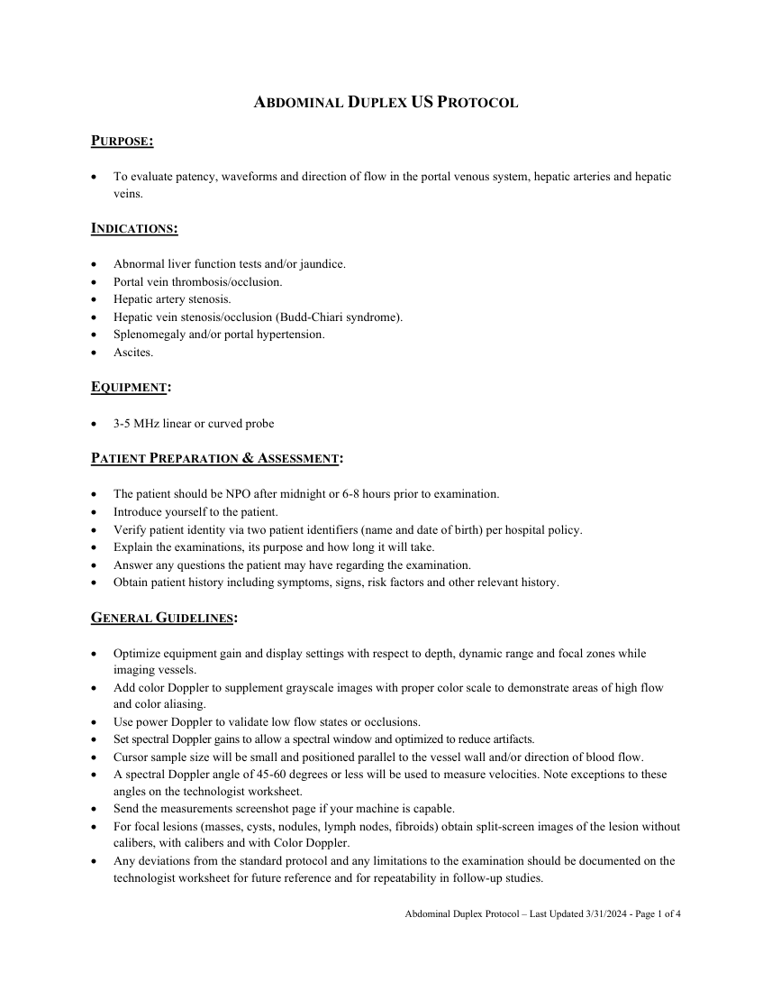
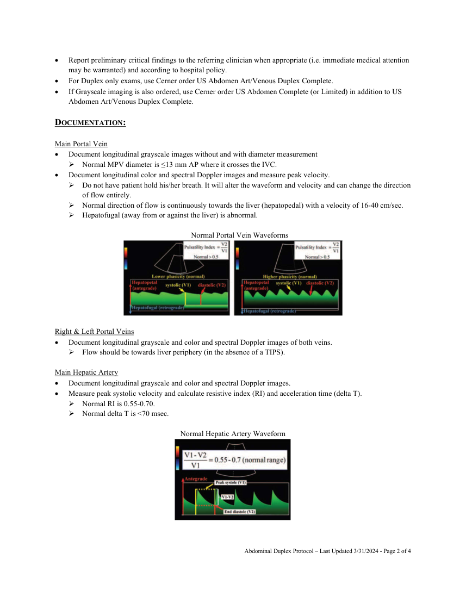
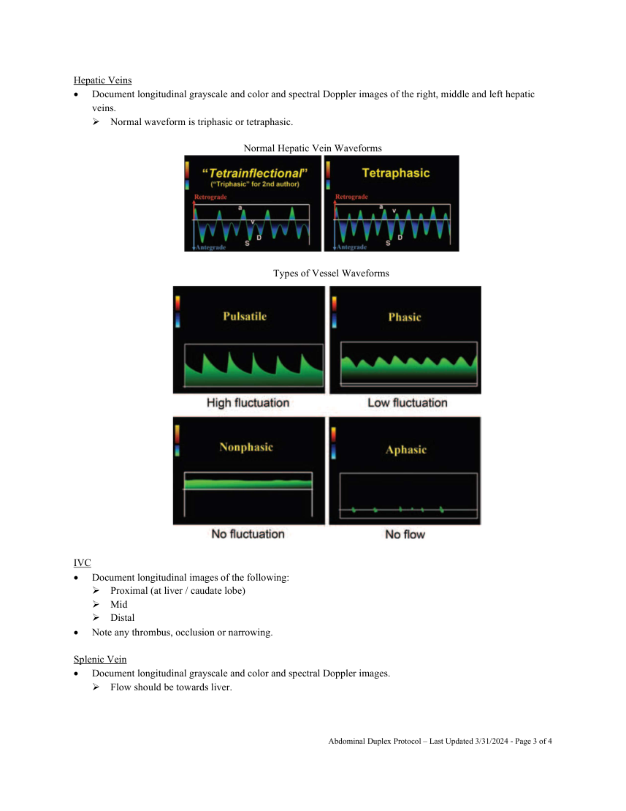
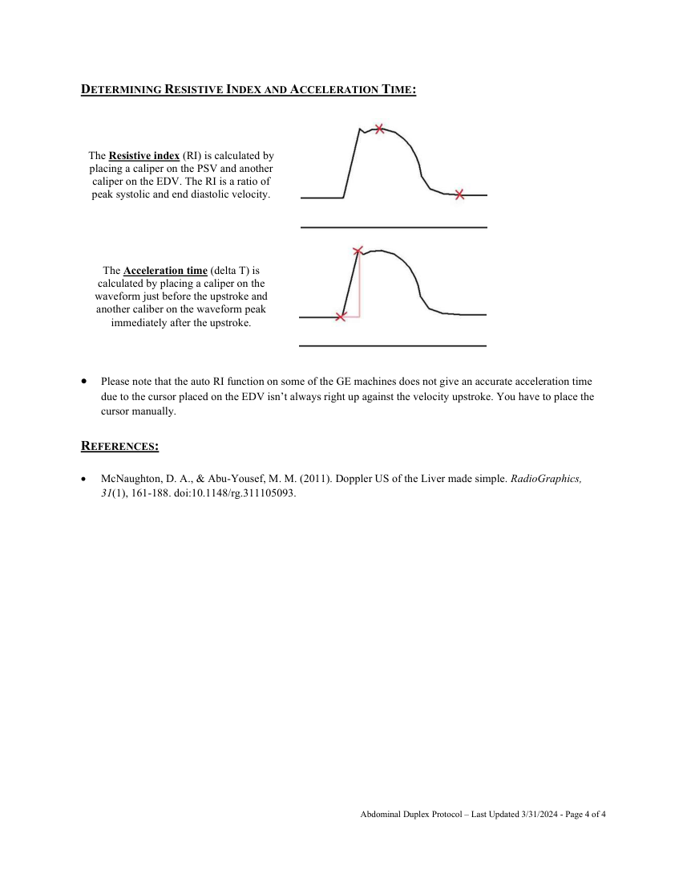

# Ecografie — Duplex abdominal (MCB)

## Documentul original MCB — Duplex abdominal

**Protocol · 4 pagini · consultat la 2026-09-27.**

[Descarcă PDF-ul integral](../../assets/mcb-modalities/eco-duplex-abdominal-mcb/document.pdf) · [Sursa MCB](https://ref.mcbradiology.com/Protocols,%20Policies,%20Worksheets%20&%20Forms/US/Protocols/Abdomen%20Duplex.pdf) · [Catalogul MCB pentru această modalitate](../mcb/index.md)

Instrucțiunile, valorile și ilustrațiile din documentul original sunt păstrate în **engleză**. Titlul și navigarea sunt în română.

### Pagina 1

{ loading=lazy }

### Pagina 2

{ loading=lazy }

### Pagina 3

{ loading=lazy }

### Pagina 4

{ loading=lazy }

## Textul documentului original

??? abstract "Pagina 1 — text în engleză"

    
ABDOMINAL DUPLEX US PROTOCOL 
     
    PURPOSE: 
      
     
    To evaluate patency, waveforms and direction of flow in the portal venous system, hepatic arteries and hepatic 
    veins. 
     
    INDICATIONS: 
     
     
    Abnormal liver function tests and/or jaundice. 
     
    Portal vein thrombosis/occlusion. 
     
    Hepatic artery stenosis. 
     
    Hepatic vein stenosis/occlusion (Budd-Chiari syndrome). 
     
    Splenomegaly and/or portal hypertension. 
     
    Ascites. 
     
    EQUIPMENT: 
     
     
    3-5 MHz linear or curved probe 
     
    PATIENT PREPARATION &amp; ASSESSMENT: 
     
     
    The patient should be NPO after midnight or 6-8 hours prior to examination. 
     
    Introduce yourself to the patient.  
     
    Verify patient identity via two patient identifiers (name and date of birth) per hospital policy. 
     
    Explain the examinations, its purpose and how long it will take. 
     
    Answer any questions the patient may have regarding the examination. 
     
    Obtain patient history including symptoms, signs, risk factors and other relevant history. 
     
    GENERAL GUIDELINES: 
     
     
    Optimize equipment gain and display settings with respect to depth, dynamic range and focal zones while 
    imaging vessels. 
     
    Add color Doppler to supplement grayscale images with proper color scale to demonstrate areas of high flow 
    and color aliasing. 
     
    Use power Doppler to validate low flow states or occlusions. 
     
    Set spectral Doppler gains to allow a spectral window and optimized to reduce artifacts. 
     
    Cursor sample size will be small and positioned parallel to the vessel wall and/or direction of blood flow. 
     
    A spectral Doppler angle of 45-60 degrees or less will be used to measure velocities. Note exceptions to these 
    angles on the technologist worksheet. 
     
    Send the measurements screenshot page if your machine is capable. 
     
    For focal lesions (masses, cysts, nodules, lymph nodes, fibroids) obtain split-screen images of the lesion without 
    calibers, with calibers and with Color Doppler.  
     
    Any deviations from the standard protocol and any limitations to the examination should be documented on the 
    technologist worksheet for future reference and for repeatability in follow-up studies. 
     
     
    Abdominal Duplex Protocol – Last Updated 3/31/2024 - Page 1 of 4 
     
     
    

??? abstract "Pagina 2 — text în engleză"

    
 
    Report preliminary critical findings to the referring clinician when appropriate (i.e. immediate medical attention 
    may be warranted) and according to hospital policy. 
     
    For Duplex only exams, use Cerner order US Abdomen Art/Venous Duplex Complete. 
     
    If Grayscale imaging is also ordered, use Cerner order US Abdomen Complete (or Limited) in addition to US 
    Abdomen Art/Venous Duplex Complete. 
     
    DOCUMENTATION: 
     
    Main Portal Vein 
     
    Document longitudinal grayscale images without and with diameter measurement 
     Normal MPV diameter is ≤13 mm AP where it crosses the IVC. 
     
    Document longitudinal color and spectral Doppler images and measure peak velocity.  
     Do not have patient hold his/her breath. It will alter the waveform and velocity and can change the direction 
    of flow entirely. 
     Normal direction of flow is continuously towards the liver (hepatopedal) with a velocity of 16-40 cm/sec. 
     Hepatofugal (away from or against the liver) is abnormal. 
     
    Normal Portal Vein Waveforms 
     
     
    Right &amp; Left Portal Veins 
     
    Document longitudinal grayscale and color and spectral Doppler images of both veins. 
     Flow should be towards liver periphery (in the absence of a TIPS). 
     
    Main Hepatic Artery 
     
    Document longitudinal grayscale and color and spectral Doppler images. 
     
    Measure peak systolic velocity and calculate resistive index (RI) and acceleration time (delta T). 
     Normal RI is 0.55-0.70. 
     Normal delta T is &lt;70 msec. 
     
    Normal Hepatic Artery Waveform 
     
     
     
     
    Abdominal Duplex Protocol – Last Updated 3/31/2024 - Page 2 of 4 
     
     
    

??? abstract "Pagina 3 — text în engleză"

    
Hepatic Veins 
     
    Document longitudinal grayscale and color and spectral Doppler images of the right, middle and left hepatic 
    veins. 
     Normal waveform is triphasic or tetraphasic. 
     
    Normal Hepatic Vein Waveforms 
     
     
    Types of Vessel Waveforms 
     
    IVC 
     
    Document longitudinal images of the following: 
     Proximal (at liver / caudate lobe) 
     Mid 
     Distal 
     
    Note any thrombus, occlusion or narrowing. 
     
    Splenic Vein 
     
    Document longitudinal grayscale and color and spectral Doppler images. 
     Flow should be towards liver. 
     
     
     
    Abdominal Duplex Protocol – Last Updated 3/31/2024 - Page 3 of 4 
     
     
    

??? abstract "Pagina 4 — text în engleză"

    
DETERMINING RESISTIVE INDEX AND ACCELERATION TIME: 
     
     
     
    The Resistive index (RI) is calculated by 
     
    placing a caliper on the PSV and another 
    caliper on the EDV. The RI is a ratio of 
    peak systolic and end diastolic velocity. 
     
     
    The Acceleration time (delta T) is 
     
    calculated by placing a caliper on the 
    waveform just before the upstroke and 
    another caliber on the waveform peak 
    immediately after the upstroke. 
     
     
    Please note that the auto RI function on some of the GE machines does not give an accurate acceleration time 
    due to the cursor placed on the EDV isn’t always right up against the velocity upstroke. You have to place the 
    cursor manually. 
     
    REFERENCES: 
     
    McNaughton, D. A., &amp; Abu-Yousef, M. M. (2011). Doppler US of the Liver made simple. RadioGraphics, 
    31(1), 161-188. doi:10.1148/rg.311105093. 
     
     
    Abdominal Duplex Protocol – Last Updated 3/31/2024 - Page 4 of 4 
     
     
    

