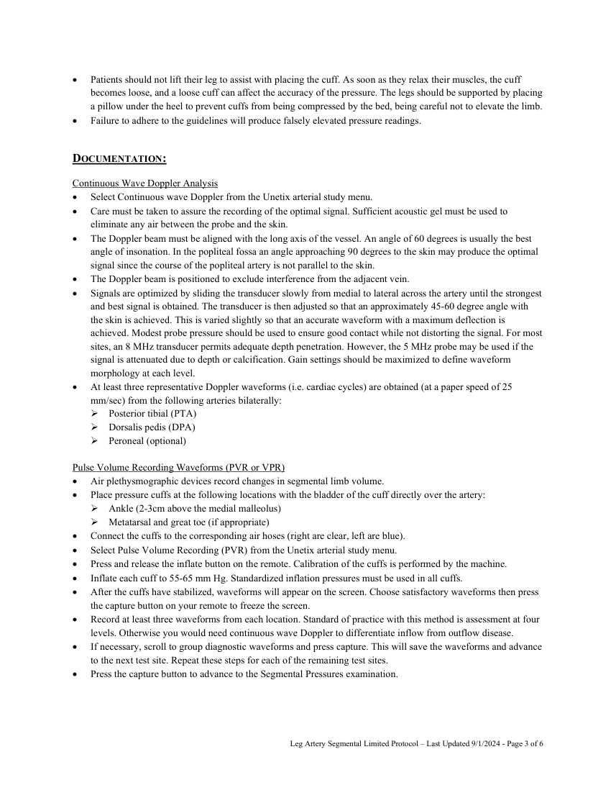
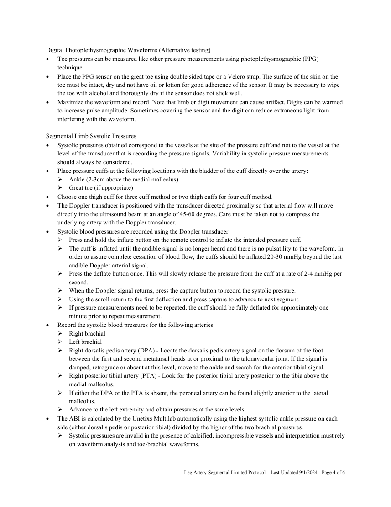
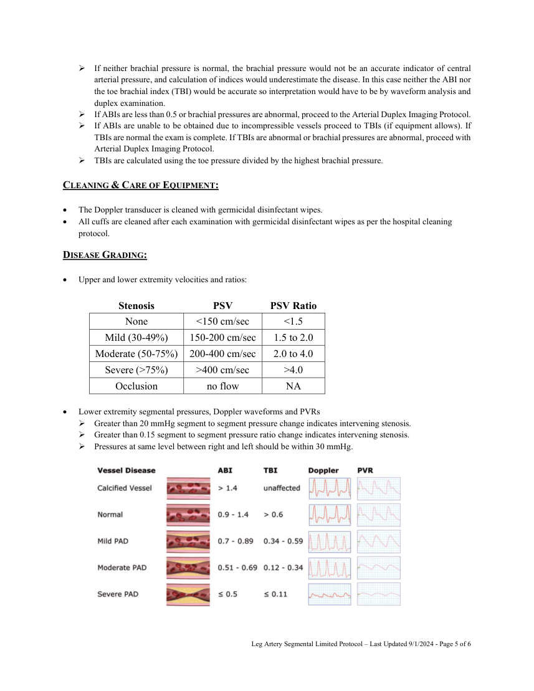

# Ecografie — Presiuni segmentare limitate: membru inferior (MCB)

## Documentul original MCB — Presiuni segmentare limitate: membru inferior

**Protocol · 6 pagini · consultat la 2026-09-27.**

[Descarcă PDF-ul integral](../../assets/mcb-modalities/eco-presiuni-segmentare-limitate-membru-inferior-mcb/document.pdf) · [Sursa MCB](https://ref.mcbradiology.com/Protocols,%20Policies,%20Worksheets%20&%20Forms/US/Protocols/Leg%20Sementals%20%28Limited%29.pdf) · [Catalogul MCB pentru această modalitate](../mcb/index.md)

Instrucțiunile, valorile și ilustrațiile din documentul original sunt păstrate în **engleză**. Titlul și navigarea sunt în română.

### Pagina 1

{ loading=lazy }

### Pagina 2

{ loading=lazy }

### Pagina 3

{ loading=lazy }

### Pagina 4

{ loading=lazy }

### Pagina 5

{ loading=lazy }

### Pagina 6

{ loading=lazy }

## Textul documentului original

??? abstract "Pagina 1 — text în engleză"

    
LEG ARTERY SEGMENTAL LIMITED US PROTOCOL 
     
    PURPOSE: 
     
     
    To detect the presence of peripheral arterial disease and categorize the overall severity and general location 
    using indirect testing modalities. 
     
    INDICATIONS: 
     
     
    Peripheral vascular disease. 
     
    Claudication (pain with exertion). 
     
    Rest pain. 
     
    Foot or toe ulceration or gangrene. 
     
    Absent palpable pulses. 
     
    Suspected acute limb ischemia. 
     
    Follow-up of decreased ankle-brachial index (ABI) from a previous examination. 
     
    Post-operative evaluation or follow-up.- 
     
    CONTRAINDICATIONS: 
     
     
    Patients with suspected or known acute deep venous thrombosis (DVT) may need an examination limited to 
    waveform analysis and use of a toe-brachial index (TBI). 
     
    Any site of recent surgery, trauma, ulceration, casts or dressings that cannot or should not be compressed by 
    pressure cuffs. 
     
    Patients with incompressible arteries due to medial calcification (TBI may be used). 
     
    Morbidly obese patients in whom a high-thigh pressure may be not obtainable due to increased limb girth. 
     
    Patients who have significant tremors or involuntary movement may render waveform collection suboptimal or 
    unreliable. 
     
    EQUIPMENT/SUPPLIES: 
     
     
    Unetixs System 
     
    3.5-10 MHz linear probe 
     
    Automatic inflation device 
     
    Blood pressure cuffs of varying widths and lengths 
     
    PATIENT PREPARATION &amp; ASSESSMENT: 
     
     
    Introduce yourself to the patient. 
     
    Verify patient identity via two patient identifiers (name and date of birth) per hospital policy. 
     
    Explain the examination, its purpose and how long it will take. 
     
    Answer any questions the patient may have regarding the examination. 
     
    Obtain patient history including symptoms, signs, risk factors and other relevant history. 
     
    Verify that the requested examination is appropriate based on the patient’s clinical presentation and history. 
     
    Using Query button select patient from work list. Press the studies button on the touch-screen. The study menu 
    will appear. Press the lower arterial history page. 
    Leg Artery Segmental Limited Protocol – Last Updated 9/1/2024 - Page 1 of 6 
     
    

??? abstract "Pagina 2 — text în engleză"

    
 
    Enter the operator’s name either using the computer keyboard or touch screen keyboard. 
     
    Enter patient’s information into the Unetix System using the data fields provided for the lower arterial history 
    page. 
     
    Document signs and symptoms of peripheral vascular disease including bruits, hypertension, claudication, rest 
    pain, ulceration, gangrene, ischemia, hair loss, coolness, pallor, dependent rubor and any prior revascularization 
    procedures. 
     
    The patient should rest in a supine position for 10-15 minutes before beginning to collect waveforms or 
    pressures. This resting period ensures that peripheral blood flow will be at a resting level and not increased due 
    to walking in to the facility. 
     
    The patient should be supine with the extremities at the same level as the heart, since artifacts can occur from 
    the effect of hydrostatic pressure when the point of measurement is not at the same level as the heart. The head 
    of the bed should be flat with the patient’s head on a pillow. If the patient is unable to lie in this position, 
    document on the record that pressures were taken with the head of the bed elevated. 
     
    Efforts should be made to keep the patient’s limbs covered and warm during the study to prevent 
    vasoconstriction. 
     
    GENERAL GUIDELINES: 
     
     
    A limited examination for recurring indications may be performed as indicated. 
     
    Any deviations from the standard protocol and any limitations to the examination should be documented on the 
    technologist worksheet for future reference and for repeatability in follow-up studies. 
     
    Report preliminary critical findings to the referring clinician when appropriate (i.e. immediate medical attention 
    may be warranted) and according to hospital policy. 
     
    PROPER BLOOD PRESSURE CUFF PLACEMENT: 
     
    Blood pressure cuff sizes should be based on limb circumference: 
     Arm = 12 x 44.5 cm or 10 x 44.5 cm 
     Forearm = 12 x 44.5 cm or 10 x 44.5 cm 
     Thigh = 12 x 44.5 cm 
     Thigh (long) = 12 x 85 cm 
     Calf = 12 x 44.5 cm or 10 x 44.5 cm 
     Ankle = 12 x 44.5 cm or 10 x 44.5 cm 
     Metatarsal = 7 x 40 cm 
     Index Finger or Great Toe = 2.5 x 9 cm 
     
    The most important technical consideration for accurate results is to make sure that the cuff is appropriately 
    sized, tightly wrapped and in close contact with the extremity. 
     
    The recommended cuff size is 20% wider than the diameter of the limb where the cuff is placed. The length of 
    the cuff bladder should be twice its width. If the cuff is too small, it will result in erroneously high pressures. If 
    it is too wide, the measurement will be erroneously too low. For instance, in small women and in children, it 
    may be more appropriate to use the 10 cm cuff or even an 8 mm cuff to measure arm pressure. 
     
    Accurate pressure measurements can be obtained only when the head of pressure generated by the cuff bladder 
    can reach the artery being examined. When the bladder fails to encircle the limb, the bladder must be placed 
    over the artery. The bladder should be placed on the posterior–medial aspect of the limb, bringing the cuff one 
    full wrap. Then pull upward and across to tighten. In addition, the bladder must compress soft tissue not bony 
    structures. Therefore, the below-knee cuff should be placed just distal to the tibial tubercle.  
     
    Cuffs should be placed straight rather than angled, even though the latter may better conform to the limb.  
    Leg Artery Segmental Limited Protocol – Last Updated 9/1/2024 - Page 2 of 6 
     
    

??? abstract "Pagina 3 — text în engleză"

    
 
    Patients should not lift their leg to assist with placing the cuff. As soon as they relax their muscles, the cuff 
    becomes loose, and a loose cuff can affect the accuracy of the pressure. The legs should be supported by placing 
    a pillow under the heel to prevent cuffs from being compressed by the bed, being careful not to elevate the limb. 
     
    Failure to adhere to the guidelines will produce falsely elevated pressure readings. 
     
    DOCUMENTATION: 
    Continuous Wave Doppler Analysis  
     
    Select Continuous wave Doppler from the Unetix arterial study menu. 
     
    Care must be taken to assure the recording of the optimal signal. Sufficient acoustic gel must be used to 
    eliminate any air between the probe and the skin.  
     
    The Doppler beam must be aligned with the long axis of the vessel. An angle of 60 degrees is usually the best 
    angle of insonation. In the popliteal fossa an angle approaching 90 degrees to the skin may produce the optimal 
    signal since the course of the popliteal artery is not parallel to the skin. 
     
    The Doppler beam is positioned to exclude interference from the adjacent vein. 
     
    Signals are optimized by sliding the transducer slowly from medial to lateral across the artery until the strongest 
    and best signal is obtained. The transducer is then adjusted so that an approximately 45-60 degree angle with 
    the skin is achieved. This is varied slightly so that an accurate waveform with a maximum deflection is 
    achieved. Modest probe pressure should be used to ensure good contact while not distorting the signal. For most 
    sites, an 8 MHz transducer permits adequate depth penetration. However, the 5 MHz probe may be used if the 
    signal is attenuated due to depth or calcification. Gain settings should be maximized to define waveform 
    morphology at each level.  
     
    At least three representative Doppler waveforms (i.e. cardiac cycles) are obtained (at a paper speed of 25 
    mm/sec) from the following arteries bilaterally:  
     Posterior tibial (PTA) 
     Dorsalis pedis (DPA) 
     Peroneal (optional) 
     
    Pulse Volume Recording Waveforms (PVR or VPR) 
     
    Air plethysmographic devices record changes in segmental limb volume.  
     
    Place pressure cuffs at the following locations with the bladder of the cuff directly over the artery:  
     Ankle (2-3cm above the medial malleolus) 
     Metatarsal and great toe (if appropriate) 
     
    Connect the cuffs to the corresponding air hoses (right are clear, left are blue). 
     
    Select Pulse Volume Recording (PVR) from the Unetix arterial study menu. 
     
    Press and release the inflate button on the remote. Calibration of the cuffs is performed by the machine. 
     
    Inflate each cuff to 55-65 mm Hg. Standardized inflation pressures must be used in all cuffs.  
     
    After the cuffs have stabilized, waveforms will appear on the screen. Choose satisfactory waveforms then press 
    the capture button on your remote to freeze the screen.  
     
    Record at least three waveforms from each location. Standard of practice with this method is assessment at four 
    levels. Otherwise you would need continuous wave Doppler to differentiate inflow from outflow disease.  
     
    If necessary, scroll to group diagnostic waveforms and press capture. This will save the waveforms and advance 
    to the next test site. Repeat these steps for each of the remaining test sites. 
     
    Press the capture button to advance to the Segmental Pressures examination. 
     
     
     
    Leg Artery Segmental Limited Protocol – Last Updated 9/1/2024 - Page 3 of 6 
     
    

??? abstract "Pagina 4 — text în engleză"

    
Digital Photoplethysmographic Waveforms (Alternative testing) 
     
    Toe pressures can be measured like other pressure measurements using photoplethysmographic (PPG) 
    technique. 
     
    Place the PPG sensor on the great toe using double sided tape or a Velcro strap. The surface of the skin on the 
    toe must be intact, dry and not have oil or lotion for good adherence of the sensor. It may be necessary to wipe 
    the toe with alcohol and thoroughly dry if the sensor does not stick well. 
     
    Maximize the waveform and record. Note that limb or digit movement can cause artifact. Digits can be warmed 
    to increase pulse amplitude. Sometimes covering the sensor and the digit can reduce extraneous light from 
    interfering with the waveform. 
     
    Segmental Limb Systolic Pressures  
     
    Systolic pressures obtained correspond to the vessels at the site of the pressure cuff and not to the vessel at the 
    level of the transducer that is recording the pressure signals. Variability in systolic pressure measurements 
    should always be considered.  
     
    Place pressure cuffs at the following locations with the bladder of the cuff directly over the artery:  
     Ankle (2-3cm above the medial malleolus) 
     Great toe (if appropriate) 
     
    Choose one thigh cuff for three cuff method or two thigh cuffs for four cuff method.  
     
    The Doppler transducer is positioned with the transducer directed proximally so that arterial flow will move 
    directly into the ultrasound beam at an angle of 45-60 degrees. Care must be taken not to compress the 
    underlying artery with the Doppler transducer. 
     
    Systolic blood pressures are recorded using the Doppler transducer. 
     Press and hold the inflate button on the remote control to inflate the intended pressure cuff. 
     The cuff is inflated until the audible signal is no longer heard and there is no pulsatility to the waveform. In 
    order to assure complete cessation of blood flow, the cuffs should be inflated 20-30 mmHg beyond the last 
    audible Doppler arterial signal.  
     Press the deflate button once. This will slowly release the pressure from the cuff at a rate of 2-4 mmHg per 
    second.  
     When the Doppler signal returns, press the capture button to record the systolic pressure.   
     Using the scroll return to the first deflection and press capture to advance to next segment. 
     If pressure measurements need to be repeated, the cuff should be fully deflated for approximately one 
    minute prior to repeat measurement. 
     
    Record the systolic blood pressures for the following arteries: 
     Right brachial 
     Left brachial  
     Right dorsalis pedis artery (DPA) - Locate the dorsalis pedis artery signal on the dorsum of the foot 
    between the first and second metatarsal heads at or proximal to the talonavicular joint. If the signal is 
    damped, retrograde or absent at this level, move to the ankle and search for the anterior tibial signal. 
     Right posterior tibial artery (PTA) - Look for the posterior tibial artery posterior to the tibia above the 
    medial malleolus.  
     If either the DPA or the PTA is absent, the peroneal artery can be found slightly anterior to the lateral 
    malleolus. 
     Advance to the left extremity and obtain pressures at the same levels. 
     
    The ABI is calculated by the Unetixs Multilab automatically using the highest systolic ankle pressure on each 
    side (either dorsalis pedis or posterior tibial) divided by the higher of the two brachial pressures.  
     Systolic pressures are invalid in the presence of calcified, incompressible vessels and interpretation must rely 
    on waveform analysis and toe-brachial waveforms. 
    Leg Artery Segmental Limited Protocol – Last Updated 9/1/2024 - Page 4 of 6 
     
    

??? abstract "Pagina 5 — text în engleză"

    
 If neither brachial pressure is normal, the brachial pressure would not be an accurate indicator of central 
    arterial pressure, and calculation of indices would underestimate the disease. In this case neither the ABI nor 
    the toe brachial index (TBI) would be accurate so interpretation would have to be by waveform analysis and 
    duplex examination. 
     If ABIs are less than 0.5 or brachial pressures are abnormal, proceed to the Arterial Duplex Imaging Protocol.  
     If ABIs are unable to be obtained due to incompressible vessels proceed to TBIs (if equipment allows). If 
    TBIs are normal the exam is complete. If TBIs are abnormal or brachial pressures are abnormal, proceed with 
    Arterial Duplex Imaging Protocol. 
     TBIs are calculated using the toe pressure divided by the highest brachial pressure.  
     
    CLEANING &amp; CARE OF EQUIPMENT: 
     
     
    The Doppler transducer is cleaned with germicidal disinfectant wipes. 
     
    All cuffs are cleaned after each examination with germicidal disinfectant wipes as per the hospital cleaning 
    protocol. 
    DISEASE GRADING: 
     
     
    Upper and lower extremity velocities and ratios: 
     
    Stenosis 
    PSV 
    PSV Ratio 
    None 
    &lt;150 cm/sec 
    &lt;1.5 
    Mild (30-49%) 
    150-200 cm/sec 
    1.5 to 2.0 
    Moderate (50-75%) 
    200-400 cm/sec 
    2.0 to 4.0 
    Severe (&gt;75%) 
    &gt;400 cm/sec 
    &gt;4.0 
    Occlusion 
    no flow 
    NA 
     
     
    Lower extremity segmental pressures, Doppler waveforms and PVRs 
     Greater than 20 mmHg segment to segment pressure change indicates intervening stenosis. 
     Greater than 0.15 segment to segment pressure ratio change indicates intervening stenosis. 
     Pressures at same level between right and left should be within 30 mmHg. 
     
     
     
    Leg Artery Segmental Limited Protocol – Last Updated 9/1/2024 - Page 5 of 6 
     
    

??? abstract "Pagina 6 — text în engleză"

    
REFERENCES: 
     
    Altawan, A., Golchian, D., Iljas, J., Patel, B., &amp; Bazzi, M. (2017). Upper extremity arterial testing: The 
    diagnostic criteria for the physiologic examination. Journal for Vascular Ultrasound, 41(2), 71-73. 
    doi:10.1177/154431671704100203. 
     Crossman, David V., et al. “Comparison of Contrast Arteriography to Arterial Mapping with 
    Color-Flow Duplex Imaging in the Lower Extremities.” Journal of Vascular Surgery, vol. 
    10, no. 5, 1989, pp. 0522–0529., doi:10.1067/mva.1989.14963.  
     Scissons, RP. Physiologic Testing techniques and Interpretation. Rhode Island, Unetix 
    Educational Publishing, 2003, pp. 25-42. 
     Sibley, Robert C., et al. “Noninvasive Physiologic Vascular Studies: A Guide to Diagnosing 
    Peripheral Arterial Disease.” RadioGraphics, vol. 37, no. 1, 2017, pp. 346–357., 
    doi:10.1148/rg.2017160044.  
    “SVU Professional Performance Guidelines.” SVU Professional Performance Guidelines - 
    Society for Vascular Ultrasound, 
    www.svunet.org/practicemanagementmain/professionalperformanceguidelines. 
    Leg Artery Segmental Limited Protocol – Last Updated 9/1/2024 - Page 6 of 6 
     
    

