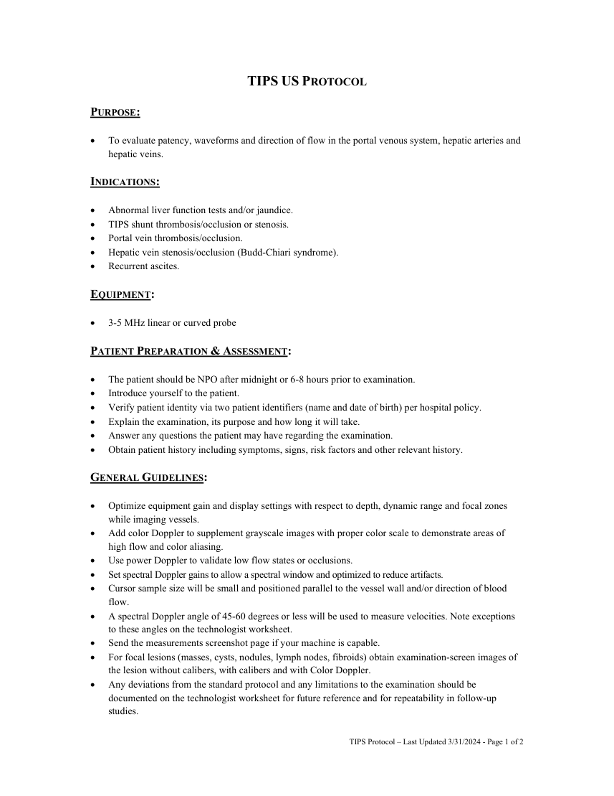
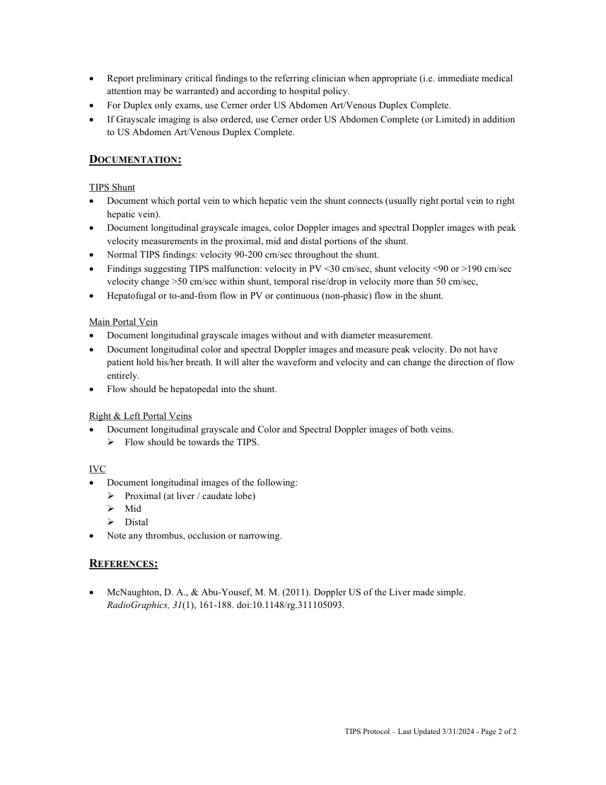

# Ecografie — Șunt TIPS (MCB)

## Documentul original MCB — Șunt TIPS

**Protocol · 2 pagini · consultat la 2026-09-27.**

[Descarcă PDF-ul integral](../../assets/mcb-modalities/eco-sunt-tips-mcb/document.pdf) · [Sursa MCB](https://ref.mcbradiology.com/Protocols,%20Policies,%20Worksheets%20&%20Forms/US/Protocols/TIPS.pdf) · [Catalogul MCB pentru această modalitate](../mcb/index.md)

Instrucțiunile, valorile și ilustrațiile din documentul original sunt păstrate în **engleză**. Titlul și navigarea sunt în română.

### Pagina 1

{ loading=lazy }

### Pagina 2

{ loading=lazy }

## Textul documentului original

??? abstract "Pagina 1 — text în engleză"

    
TIPS US PROTOCOL 
     
    PURPOSE:  
     
     
    To evaluate patency, waveforms and direction of flow in the portal venous system, hepatic arteries and 
    hepatic veins. 
     
    INDICATIONS: 
     
     
    Abnormal liver function tests and/or jaundice. 
     
    TIPS shunt thrombosis/occlusion or stenosis. 
     
    Portal vein thrombosis/occlusion. 
     
    Hepatic vein stenosis/occlusion (Budd-Chiari syndrome). 
     
    Recurrent ascites. 
     
    EQUIPMENT: 
     
     
    3-5 MHz linear or curved probe 
     
    PATIENT PREPARATION &amp; ASSESSMENT: 
     
     
    The patient should be NPO after midnight or 6-8 hours prior to examination. 
     
    Introduce yourself to the patient.  
     
    Verify patient identity via two patient identifiers (name and date of birth) per hospital policy. 
     
    Explain the examination, its purpose and how long it will take. 
     
    Answer any questions the patient may have regarding the examination. 
     
    Obtain patient history including symptoms, signs, risk factors and other relevant history. 
     
    GENERAL GUIDELINES: 
     
     
    Optimize equipment gain and display settings with respect to depth, dynamic range and focal zones 
    while imaging vessels. 
     
    Add color Doppler to supplement grayscale images with proper color scale to demonstrate areas of 
    high flow and color aliasing. 
     
    Use power Doppler to validate low flow states or occlusions. 
     
    Set spectral Doppler gains to allow a spectral window and optimized to reduce artifacts. 
     
    Cursor sample size will be small and positioned parallel to the vessel wall and/or direction of blood 
    flow. 
     
    A spectral Doppler angle of 45-60 degrees or less will be used to measure velocities. Note exceptions 
    to these angles on the technologist worksheet. 
     
    Send the measurements screenshot page if your machine is capable. 
     
    For focal lesions (masses, cysts, nodules, lymph nodes, fibroids) obtain examination-screen images of 
    the lesion without calibers, with calibers and with Color Doppler.  
     
    Any deviations from the standard protocol and any limitations to the examination should be 
    documented on the technologist worksheet for future reference and for repeatability in follow-up 
    studies. 
     
     
    TIPS Protocol – Last Updated 3/31/2024 - Page 1 of 2 
     
    

??? abstract "Pagina 2 — text în engleză"

    
 
    Report preliminary critical findings to the referring clinician when appropriate (i.e. immediate medical 
    attention may be warranted) and according to hospital policy. 
     
    For Duplex only exams, use Cerner order US Abdomen Art/Venous Duplex Complete. 
     
    If Grayscale imaging is also ordered, use Cerner order US Abdomen Complete (or Limited) in addition 
    to US Abdomen Art/Venous Duplex Complete. 
     
    DOCUMENTATION: 
     
    TIPS Shunt 
     
    Document which portal vein to which hepatic vein the shunt connects (usually right portal vein to right 
    hepatic vein). 
     
    Document longitudinal grayscale images, color Doppler images and spectral Doppler images with peak 
    velocity measurements in the proximal, mid and distal portions of the shunt. 
     
    Normal TIPS findings: velocity 90-200 cm/sec throughout the shunt. 
     
    Findings suggesting TIPS malfunction: velocity in PV &lt;30 cm/sec, shunt velocity &lt;90 or &gt;190 cm/sec 
    velocity change &gt;50 cm/sec within shunt, temporal rise/drop in velocity more than 50 cm/sec, 
     
    Hepatofugal or to-and-from flow in PV or continuous (non-phasic) flow in the shunt. 
     
    Main Portal Vein 
     
    Document longitudinal grayscale images without and with diameter measurement.  
     
    Document longitudinal color and spectral Doppler images and measure peak velocity. Do not have 
    patient hold his/her breath. It will alter the waveform and velocity and can change the direction of flow 
    entirely. 
     
    Flow should be hepatopedal into the shunt. 
     
    Right &amp; Left Portal Veins 
     
    Document longitudinal grayscale and Color and Spectral Doppler images of both veins. 
     Flow should be towards the TIPS. 
     
    IVC 
     
    Document longitudinal images of the following: 
     Proximal (at liver / caudate lobe) 
     Mid 
     Distal 
     
    Note any thrombus, occlusion or narrowing. 
     
    REFERENCES: 
     
    McNaughton, D. A., &amp; Abu-Yousef, M. M. (2011). Doppler US of the Liver made simple. 
    RadioGraphics, 31(1), 161-188. doi:10.1148/rg.311105093. 
     
     
     
     
    TIPS Protocol – Last Updated 3/31/2024 - Page 2 of 2 
     
    

