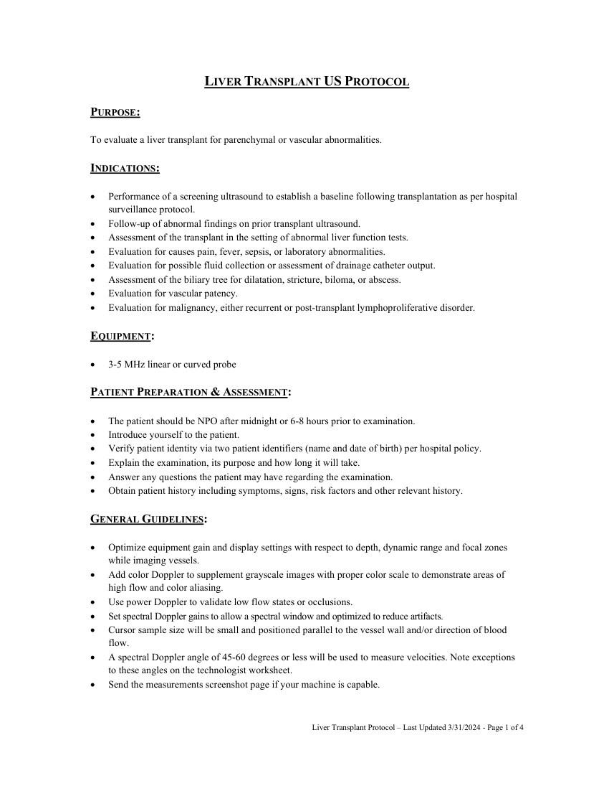
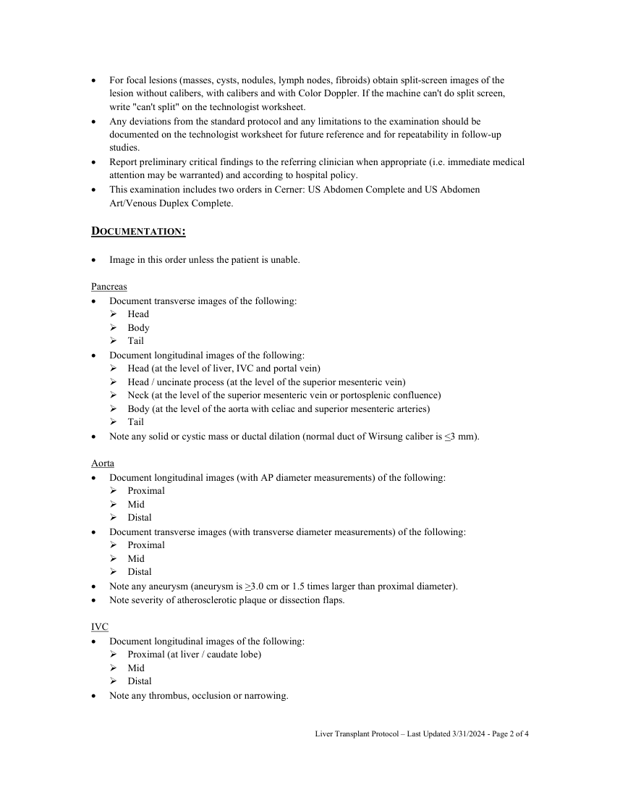
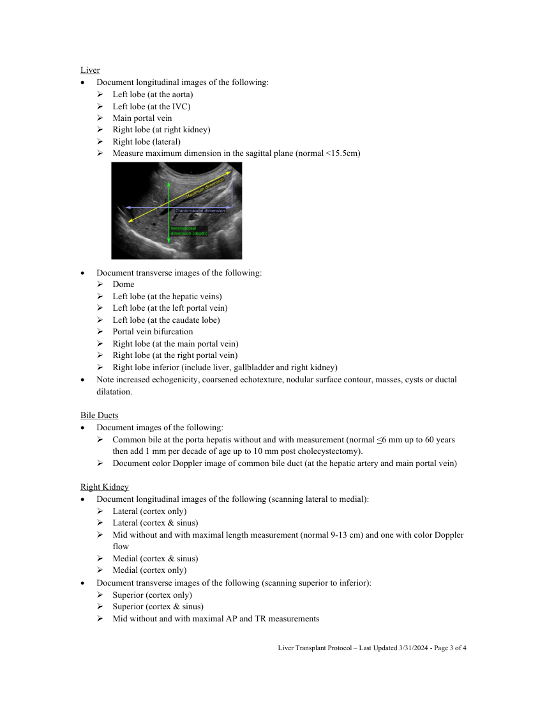
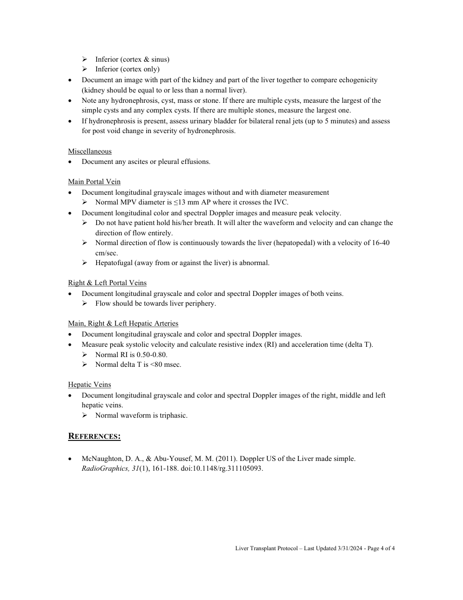

# Ecografie — Transplant hepatic (MCB)

## Documentul original MCB — Transplant hepatic

**Protocol · 4 pagini · consultat la 2026-09-27.**

[Descarcă PDF-ul integral](../../assets/mcb-modalities/eco-transplant-hepatic-mcb/document.pdf) · [Sursa MCB](https://ref.mcbradiology.com/Protocols,%20Policies,%20Worksheets%20&%20Forms/US/Protocols/Liver%20Transplant.pdf) · [Catalogul MCB pentru această modalitate](../mcb/index.md)

Instrucțiunile, valorile și ilustrațiile din documentul original sunt păstrate în **engleză**. Titlul și navigarea sunt în română.

### Pagina 1

{ loading=lazy }

### Pagina 2

{ loading=lazy }

### Pagina 3

{ loading=lazy }

### Pagina 4

{ loading=lazy }

## Textul documentului original

??? abstract "Pagina 1 — text în engleză"

    
LIVER TRANSPLANT US PROTOCOL 
     
    PURPOSE:  
     
    To evaluate a liver transplant for parenchymal or vascular abnormalities. 
     
    INDICATIONS: 
     
     
    Performance of a screening ultrasound to establish a baseline following transplantation as per hospital 
    surveillance protocol. 
     
    Follow-up of abnormal findings on prior transplant ultrasound. 
     
    Assessment of the transplant in the setting of abnormal liver function tests. 
     
    Evaluation for causes pain, fever, sepsis, or laboratory abnormalities. 
     
    Evaluation for possible fluid collection or assessment of drainage catheter output. 
     
    Assessment of the biliary tree for dilatation, stricture, biloma, or abscess. 
     
    Evaluation for vascular patency. 
     
    Evaluation for malignancy, either recurrent or post-transplant lymphoproliferative disorder. 
     
    EQUIPMENT: 
     
     
    3-5 MHz linear or curved probe 
     
    PATIENT PREPARATION &amp; ASSESSMENT: 
     
     
    The patient should be NPO after midnight or 6-8 hours prior to examination. 
     
    Introduce yourself to the patient.  
     
    Verify patient identity via two patient identifiers (name and date of birth) per hospital policy. 
     
    Explain the examination, its purpose and how long it will take. 
     
    Answer any questions the patient may have regarding the examination. 
     
    Obtain patient history including symptoms, signs, risk factors and other relevant history. 
     
    GENERAL GUIDELINES: 
     
     
    Optimize equipment gain and display settings with respect to depth, dynamic range and focal zones 
    while imaging vessels. 
     
    Add color Doppler to supplement grayscale images with proper color scale to demonstrate areas of 
    high flow and color aliasing. 
     
    Use power Doppler to validate low flow states or occlusions. 
     
    Set spectral Doppler gains to allow a spectral window and optimized to reduce artifacts. 
     
    Cursor sample size will be small and positioned parallel to the vessel wall and/or direction of blood 
    flow. 
     
    A spectral Doppler angle of 45-60 degrees or less will be used to measure velocities. Note exceptions 
    to these angles on the technologist worksheet. 
     
    Send the measurements screenshot page if your machine is capable. 
     
     
    Liver Transplant Protocol – Last Updated 3/31/2024 - Page 1 of 4 
     
     
    

??? abstract "Pagina 2 — text în engleză"

    
 
    For focal lesions (masses, cysts, nodules, lymph nodes, fibroids) obtain split-screen images of the 
    lesion without calibers, with calibers and with Color Doppler. If the machine can&#x27;t do split screen, 
    write &quot;can&#x27;t split&quot; on the technologist worksheet. 
     
    Any deviations from the standard protocol and any limitations to the examination should be 
    documented on the technologist worksheet for future reference and for repeatability in follow-up 
    studies. 
     
    Report preliminary critical findings to the referring clinician when appropriate (i.e. immediate medical 
    attention may be warranted) and according to hospital policy. 
     
    This examination includes two orders in Cerner: US Abdomen Complete and US Abdomen 
    Art/Venous Duplex Complete. 
     
    DOCUMENTATION: 
     
     
    Image in this order unless the patient is unable. 
     
    Pancreas 
     
    Document transverse images of the following: 
     Head 
     Body 
     Tail 
     
    Document longitudinal images of the following: 
     Head (at the level of liver, IVC and portal vein) 
     Head / uncinate process (at the level of the superior mesenteric vein) 
     Neck (at the level of the superior mesenteric vein or portosplenic confluence) 
     Body (at the level of the aorta with celiac and superior mesenteric arteries) 
     Tail 
     
    Note any solid or cystic mass or ductal dilation (normal duct of Wirsung caliber is &lt;3 mm). 
     
    Aorta 
     
    Document longitudinal images (with AP diameter measurements) of the following: 
     Proximal  
     Mid  
     Distal 
     
    Document transverse images (with transverse diameter measurements) of the following: 
     Proximal 
     Mid  
     Distal 
     
    Note any aneurysm (aneurysm is &gt;3.0 cm or 1.5 times larger than proximal diameter).  
     
    Note severity of atherosclerotic plaque or dissection flaps. 
     
    IVC 
     
    Document longitudinal images of the following: 
     Proximal (at liver / caudate lobe) 
     Mid 
     Distal 
     
    Note any thrombus, occlusion or narrowing. 
     
     
    Liver Transplant Protocol – Last Updated 3/31/2024 - Page 2 of 4 
     
     
    

??? abstract "Pagina 3 — text în engleză"

    
Liver 
     
    Document longitudinal images of the following: 
     Left lobe (at the aorta) 
     Left lobe (at the IVC) 
     Main portal vein 
     Right lobe (at right kidney) 
     Right lobe (lateral) 
     Measure maximum dimension in the sagittal plane (normal &lt;15.5cm) 
     
     
     
     
     
     
     
     
     
     
    Document transverse images of the following: 
     Dome 
     Left lobe (at the hepatic veins) 
     Left lobe (at the left portal vein) 
     Left lobe (at the caudate lobe) 
     Portal vein bifurcation 
     Right lobe (at the main portal vein) 
     Right lobe (at the right portal vein) 
     Right lobe inferior (include liver, gallbladder and right kidney) 
     
    Note increased echogenicity, coarsened echotexture, nodular surface contour, masses, cysts or ductal 
    dilatation. 
     
    Bile Ducts 
     
    Document images of the following: 
     Common bile at the porta hepatis without and with measurement (normal &lt;6 mm up to 60 years 
    then add 1 mm per decade of age up to 10 mm post cholecystectomy). 
     Document color Doppler image of common bile duct (at the hepatic artery and main portal vein) 
     
    Right Kidney 
     
    Document longitudinal images of the following (scanning lateral to medial): 
     Lateral (cortex only) 
     Lateral (cortex &amp; sinus) 
     Mid without and with maximal length measurement (normal 9-13 cm) and one with color Doppler 
    flow 
     Medial (cortex &amp; sinus) 
     Medial (cortex only) 
     
    Document transverse images of the following (scanning superior to inferior): 
     Superior (cortex only) 
     Superior (cortex &amp; sinus) 
     Mid without and with maximal AP and TR measurements 
     
     
    Liver Transplant Protocol – Last Updated 3/31/2024 - Page 3 of 4 
     
     
    

??? abstract "Pagina 4 — text în engleză"

    
 Inferior (cortex &amp; sinus) 
     Inferior (cortex only) 
     
    Document an image with part of the kidney and part of the liver together to compare echogenicity 
    (kidney should be equal to or less than a normal liver). 
     
    Note any hydronephrosis, cyst, mass or stone. If there are multiple cysts, measure the largest of the 
    simple cysts and any complex cysts. If there are multiple stones, measure the largest one. 
     
    If hydronephrosis is present, assess urinary bladder for bilateral renal jets (up to 5 minutes) and assess 
    for post void change in severity of hydronephrosis. 
     
    Miscellaneous 
     
    Document any ascites or pleural effusions.  
     
    Main Portal Vein 
     
    Document longitudinal grayscale images without and with diameter measurement 
     Normal MPV diameter is ≤13 mm AP where it crosses the IVC. 
     
    Document longitudinal color and spectral Doppler images and measure peak velocity.  
     Do not have patient hold his/her breath. It will alter the waveform and velocity and can change the 
    direction of flow entirely. 
     Normal direction of flow is continuously towards the liver (hepatopedal) with a velocity of 16-40 
    cm/sec. 
     Hepatofugal (away from or against the liver) is abnormal. 
     
    Right &amp; Left Portal Veins 
     
    Document longitudinal grayscale and color and spectral Doppler images of both veins. 
     Flow should be towards liver periphery. 
     
    Main, Right &amp; Left Hepatic Arteries 
     
    Document longitudinal grayscale and color and spectral Doppler images. 
     
    Measure peak systolic velocity and calculate resistive index (RI) and acceleration time (delta T). 
     Normal RI is 0.50-0.80. 
     Normal delta T is &lt;80 msec. 
     
    Hepatic Veins 
     
    Document longitudinal grayscale and color and spectral Doppler images of the right, middle and left 
    hepatic veins. 
     Normal waveform is triphasic. 
     
    REFERENCES: 
     
    McNaughton, D. A., &amp; Abu-Yousef, M. M. (2011). Doppler US of the Liver made simple. 
    RadioGraphics, 31(1), 161-188. doi:10.1148/rg.311105093. 
     
     
     
    Liver Transplant Protocol – Last Updated 3/31/2024 - Page 4 of 4 
     
     
    

