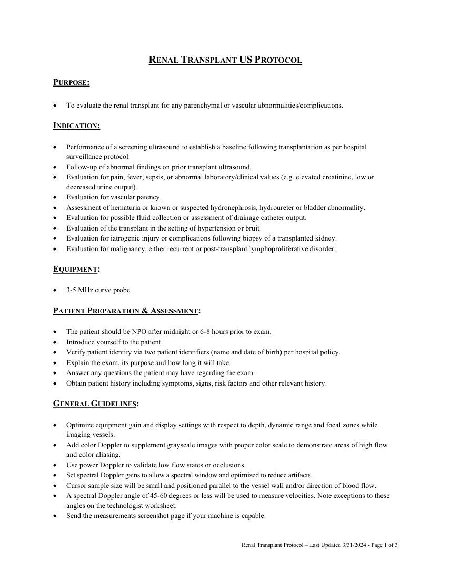
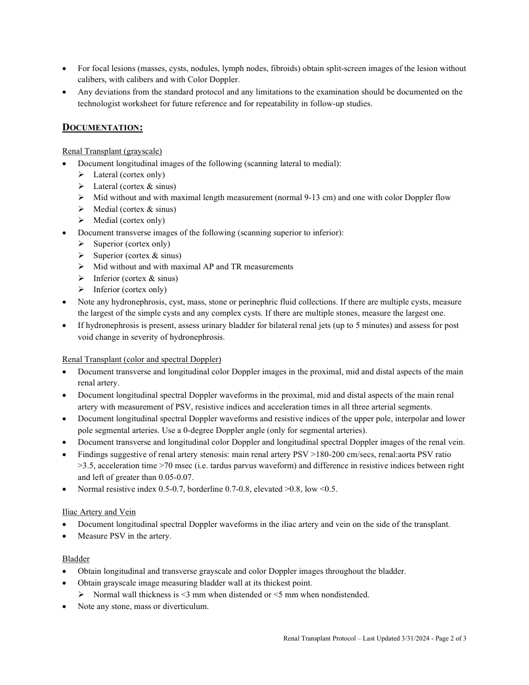
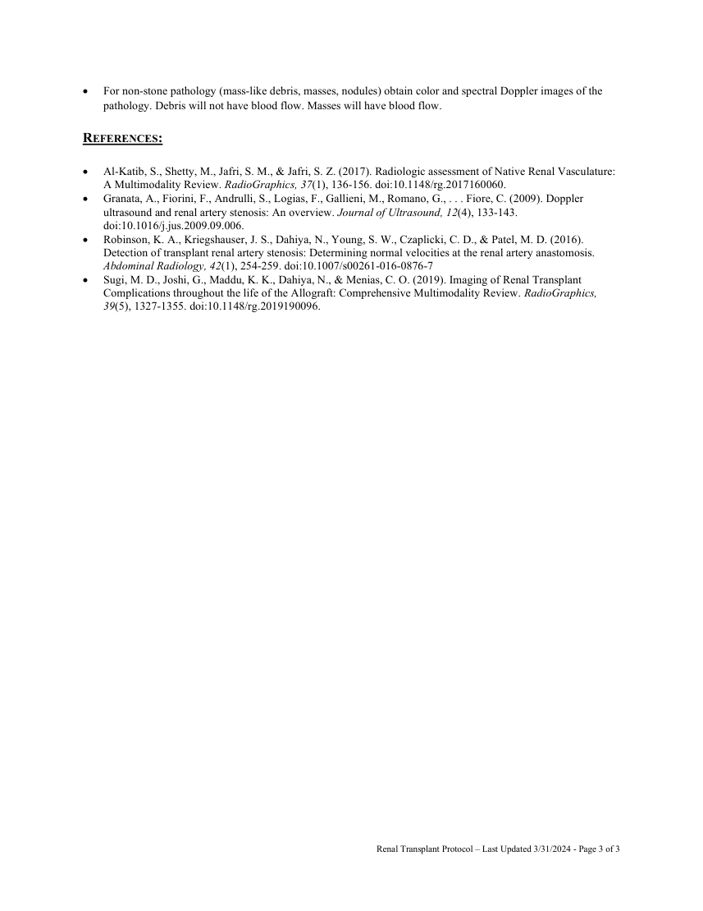

# Ecografie — Transplant renal (MCB)

## Documentul original MCB — Transplant renal

**Protocol · 3 pagini · consultat la 2026-09-27.**

[Descarcă PDF-ul integral](../../assets/mcb-modalities/eco-transplant-renal-mcb/document.pdf) · [Sursa MCB](https://ref.mcbradiology.com/Protocols,%20Policies,%20Worksheets%20&%20Forms/US/Protocols/Renal%20Transplant.pdf) · [Catalogul MCB pentru această modalitate](../mcb/index.md)

Instrucțiunile, valorile și ilustrațiile din documentul original sunt păstrate în **engleză**. Titlul și navigarea sunt în română.

### Pagina 1

{ loading=lazy }

### Pagina 2

{ loading=lazy }

### Pagina 3

{ loading=lazy }

## Textul documentului original

??? abstract "Pagina 1 — text în engleză"

    
RENAL TRANSPLANT US PROTOCOL  
     
    PURPOSE: 
     
     
    To evaluate the renal transplant for any parenchymal or vascular abnormalities/complications. 
     
    INDICATION: 
     
     
    Performance of a screening ultrasound to establish a baseline following transplantation as per hospital 
    surveillance protocol. 
     
    Follow-up of abnormal findings on prior transplant ultrasound. 
     
    Evaluation for pain, fever, sepsis, or abnormal laboratory/clinical values (e.g. elevated creatinine, low or 
    decreased urine output). 
     
    Evaluation for vascular patency. 
     
    Assessment of hematuria or known or suspected hydronephrosis, hydroureter or bladder abnormality. 
     
    Evaluation for possible fluid collection or assessment of drainage catheter output. 
     
    Evaluation of the transplant in the setting of hypertension or bruit. 
     
    Evaluation for iatrogenic injury or complications following biopsy of a transplanted kidney. 
     
    Evaluation for malignancy, either recurrent or post-transplant lymphoproliferative disorder. 
     
    EQUIPMENT: 
     
     
    3-5 MHz curve probe 
     
    PATIENT PREPARATION &amp; ASSESSMENT: 
     
     
    The patient should be NPO after midnight or 6-8 hours prior to exam. 
     
    Introduce yourself to the patient.  
     
    Verify patient identity via two patient identifiers (name and date of birth) per hospital policy. 
     
    Explain the exam, its purpose and how long it will take. 
     
    Answer any questions the patient may have regarding the exam. 
     
    Obtain patient history including symptoms, signs, risk factors and other relevant history. 
     
    GENERAL GUIDELINES: 
     
     
    Optimize equipment gain and display settings with respect to depth, dynamic range and focal zones while 
    imaging vessels. 
     
    Add color Doppler to supplement grayscale images with proper color scale to demonstrate areas of high flow 
    and color aliasing. 
     
    Use power Doppler to validate low flow states or occlusions. 
     
    Set spectral Doppler gains to allow a spectral window and optimized to reduce artifacts. 
     
    Cursor sample size will be small and positioned parallel to the vessel wall and/or direction of blood flow. 
     
    A spectral Doppler angle of 45-60 degrees or less will be used to measure velocities. Note exceptions to these 
    angles on the technologist worksheet. 
     
    Send the measurements screenshot page if your machine is capable. 
     
     
    Renal Transplant Protocol – Last Updated 3/31/2024 - Page 1 of 3 
     
    

??? abstract "Pagina 2 — text în engleză"

    
 
    For focal lesions (masses, cysts, nodules, lymph nodes, fibroids) obtain split-screen images of the lesion without 
    calibers, with calibers and with Color Doppler. 
     
    Any deviations from the standard protocol and any limitations to the examination should be documented on the 
    technologist worksheet for future reference and for repeatability in follow-up studies. 
     
    DOCUMENTATION:  
     
    Renal Transplant (grayscale) 
     
    Document longitudinal images of the following (scanning lateral to medial): 
     Lateral (cortex only) 
     Lateral (cortex &amp; sinus) 
     Mid without and with maximal length measurement (normal 9-13 cm) and one with color Doppler flow 
     Medial (cortex &amp; sinus) 
     Medial (cortex only) 
     
    Document transverse images of the following (scanning superior to inferior): 
     Superior (cortex only) 
     Superior (cortex &amp; sinus) 
     Mid without and with maximal AP and TR measurements 
     Inferior (cortex &amp; sinus) 
     Inferior (cortex only) 
     
    Note any hydronephrosis, cyst, mass, stone or perinephric fluid collections. If there are multiple cysts, measure 
    the largest of the simple cysts and any complex cysts. If there are multiple stones, measure the largest one. 
     
    If hydronephrosis is present, assess urinary bladder for bilateral renal jets (up to 5 minutes) and assess for post 
    void change in severity of hydronephrosis. 
     
    Renal Transplant (color and spectral Doppler) 
     
    Document transverse and longitudinal color Doppler images in the proximal, mid and distal aspects of the main 
    renal artery. 
     
    Document longitudinal spectral Doppler waveforms in the proximal, mid and distal aspects of the main renal 
    artery with measurement of PSV, resistive indices and acceleration times in all three arterial segments. 
     
    Document longitudinal spectral Doppler waveforms and resistive indices of the upper pole, interpolar and lower 
    pole segmental arteries. Use a 0-degree Doppler angle (only for segmental arteries). 
     
    Document transverse and longitudinal color Doppler and longitudinal spectral Doppler images of the renal vein. 
     
    Findings suggestive of renal artery stenosis: main renal artery PSV &gt;180-200 cm/secs, renal:aorta PSV ratio 
    &gt;3.5, acceleration time &gt;70 msec (i.e. tardus parvus waveform) and difference in resistive indices between right 
    and left of greater than 0.05-0.07. 
     
    Normal resistive index 0.5-0.7, borderline 0.7-0.8, elevated &gt;0.8, low &lt;0.5. 
     
    Iliac Artery and Vein 
     
    Document longitudinal spectral Doppler waveforms in the iliac artery and vein on the side of the transplant. 
     
    Measure PSV in the artery. 
     
    Bladder 
     
    Obtain longitudinal and transverse grayscale and color Doppler images throughout the bladder. 
     
    Obtain grayscale image measuring bladder wall at its thickest point. 
     Normal wall thickness is &lt;3 mm when distended or &lt;5 mm when nondistended. 
     
    Note any stone, mass or diverticulum. 
     
     
    Renal Transplant Protocol – Last Updated 3/31/2024 - Page 2 of 3 
     
    

??? abstract "Pagina 3 — text în engleză"

    
 
    For non-stone pathology (mass-like debris, masses, nodules) obtain color and spectral Doppler images of the 
    pathology. Debris will not have blood flow. Masses will have blood flow. 
     
    REFERENCES: 
     
    Al-Katib, S., Shetty, M., Jafri, S. M., &amp; Jafri, S. Z. (2017). Radiologic assessment of Native Renal Vasculature: 
    A Multimodality Review. RadioGraphics, 37(1), 136-156. doi:10.1148/rg.2017160060. 
     
    Granata, A., Fiorini, F., Andrulli, S., Logias, F., Gallieni, M., Romano, G., . . . Fiore, C. (2009). Doppler 
    ultrasound and renal artery stenosis: An overview. Journal of Ultrasound, 12(4), 133-143. 
    doi:10.1016/j.jus.2009.09.006. 
     
    Robinson, K. A., Kriegshauser, J. S., Dahiya, N., Young, S. W., Czaplicki, C. D., &amp; Patel, M. D. (2016). 
    Detection of transplant renal artery stenosis: Determining normal velocities at the renal artery anastomosis. 
    Abdominal Radiology, 42(1), 254-259. doi:10.1007/s00261-016-0876-7 
     
    Sugi, M. D., Joshi, G., Maddu, K. K., Dahiya, N., &amp; Menias, C. O. (2019). Imaging of Renal Transplant 
    Complications throughout the life of the Allograft: Comprehensive Multimodality Review. RadioGraphics, 
    39(5), 1327-1355. doi:10.1148/rg.2019190096. 
     
     
     
    Renal Transplant Protocol – Last Updated 3/31/2024 - Page 3 of 3 
     
    

