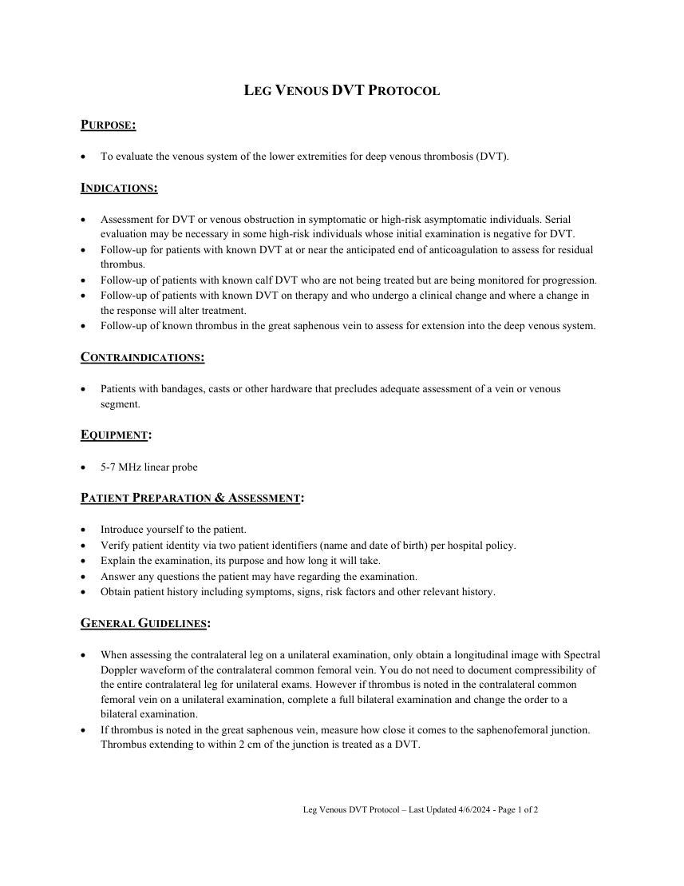
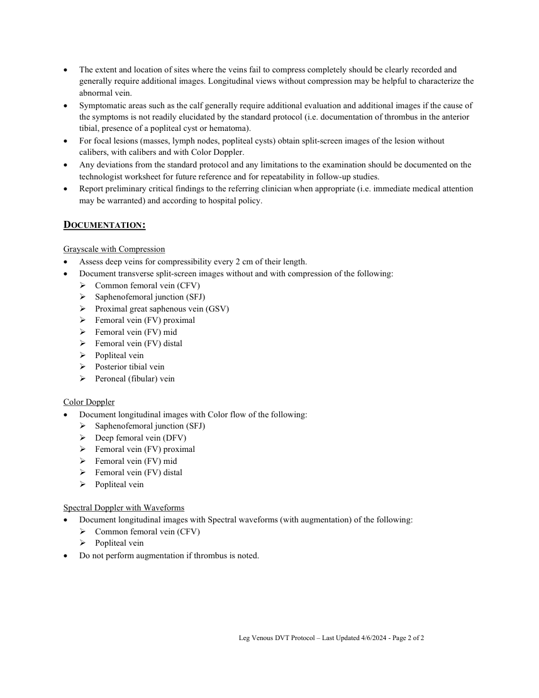

# Ecografie — Tromboză venoasă profundă: membru inferior (MCB)

## Documentul original MCB — Tromboză venoasă profundă: membru inferior

**Protocol · 2 pagini · consultat la 2026-09-27.**

[Descarcă PDF-ul integral](../../assets/mcb-modalities/eco-tromboza-venoasa-profunda-membru-inferior-mcb/document.pdf) · [Sursa MCB](https://ref.mcbradiology.com/Protocols,%20Policies,%20Worksheets%20&%20Forms/US/Protocols/Leg%20DVT.pdf) · [Catalogul MCB pentru această modalitate](../mcb/index.md)

Instrucțiunile, valorile și ilustrațiile din documentul original sunt păstrate în **engleză**. Titlul și navigarea sunt în română.

### Pagina 1

{ loading=lazy }

### Pagina 2

{ loading=lazy }

## Textul documentului original

??? abstract "Pagina 1 — text în engleză"

    
LEG VENOUS DVT PROTOCOL 
     
    PURPOSE: 
     
     
    To evaluate the venous system of the lower extremities for deep venous thrombosis (DVT). 
     
    INDICATIONS: 
     
     
    Assessment for DVT or venous obstruction in symptomatic or high-risk asymptomatic individuals. Serial 
    evaluation may be necessary in some high-risk individuals whose initial examination is negative for DVT. 
     
    Follow-up for patients with known DVT at or near the anticipated end of anticoagulation to assess for residual 
    thrombus. 
     
    Follow-up of patients with known calf DVT who are not being treated but are being monitored for progression. 
     
    Follow-up of patients with known DVT on therapy and who undergo a clinical change and where a change in 
    the response will alter treatment. 
     
    Follow-up of known thrombus in the great saphenous vein to assess for extension into the deep venous system. 
     
    CONTRAINDICATIONS:  
     
     
    Patients with bandages, casts or other hardware that precludes adequate assessment of a vein or venous 
    segment. 
     
    EQUIPMENT: 
     
     
    5-7 MHz linear probe 
     
    PATIENT PREPARATION &amp; ASSESSMENT: 
     
     
    Introduce yourself to the patient.  
     
    Verify patient identity via two patient identifiers (name and date of birth) per hospital policy. 
     
    Explain the examination, its purpose and how long it will take. 
     
    Answer any questions the patient may have regarding the examination. 
     
    Obtain patient history including symptoms, signs, risk factors and other relevant history. 
     
    GENERAL GUIDELINES: 
     
     
    When assessing the contralateral leg on a unilateral examination, only obtain a longitudinal image with Spectral 
    Doppler waveform of the contralateral common femoral vein. You do not need to document compressibility of 
    the entire contralateral leg for unilateral exams. However if thrombus is noted in the contralateral common 
    femoral vein on a unilateral examination, complete a full bilateral examination and change the order to a 
    bilateral examination. 
     
    If thrombus is noted in the great saphenous vein, measure how close it comes to the saphenofemoral junction. 
    Thrombus extending to within 2 cm of the junction is treated as a DVT. 
     
     
     
    Leg Venous DVT Protocol – Last Updated 4/6/2024 - Page 1 of 2 
     
     
    

??? abstract "Pagina 2 — text în engleză"

    
 
    The extent and location of sites where the veins fail to compress completely should be clearly recorded and 
    generally require additional images. Longitudinal views without compression may be helpful to characterize the 
    abnormal vein. 
     
    Symptomatic areas such as the calf generally require additional evaluation and additional images if the cause of 
    the symptoms is not readily elucidated by the standard protocol (i.e. documentation of thrombus in the anterior 
    tibial, presence of a popliteal cyst or hematoma). 
     
    For focal lesions (masses, lymph nodes, popliteal cysts) obtain split-screen images of the lesion without 
    calibers, with calibers and with Color Doppler.  
     
    Any deviations from the standard protocol and any limitations to the examination should be documented on the 
    technologist worksheet for future reference and for repeatability in follow-up studies. 
     
    Report preliminary critical findings to the referring clinician when appropriate (i.e. immediate medical attention 
    may be warranted) and according to hospital policy. 
     
    DOCUMENTATION: 
     
    Grayscale with Compression 
     
    Assess deep veins for compressibility every 2 cm of their length.  
     
    Document transverse split-screen images without and with compression of the following: 
     Common femoral vein (CFV) 
     Saphenofemoral junction (SFJ) 
     Proximal great saphenous vein (GSV) 
     Femoral vein (FV) proximal 
     Femoral vein (FV) mid 
     Femoral vein (FV) distal 
     Popliteal vein 
     Posterior tibial vein 
     Peroneal (fibular) vein 
     
    Color Doppler 
     
    Document longitudinal images with Color flow of the following: 
     Saphenofemoral junction (SFJ) 
     Deep femoral vein (DFV) 
     Femoral vein (FV) proximal 
     Femoral vein (FV) mid 
     Femoral vein (FV) distal 
     Popliteal vein 
     
    Spectral Doppler with Waveforms 
     
    Document longitudinal images with Spectral waveforms (with augmentation) of the following: 
     Common femoral vein (CFV) 
     Popliteal vein 
     
    Do not perform augmentation if thrombus is noted. 
     
     
     
    Leg Venous DVT Protocol – Last Updated 4/6/2024 - Page 2 of 2 
     
     
    

