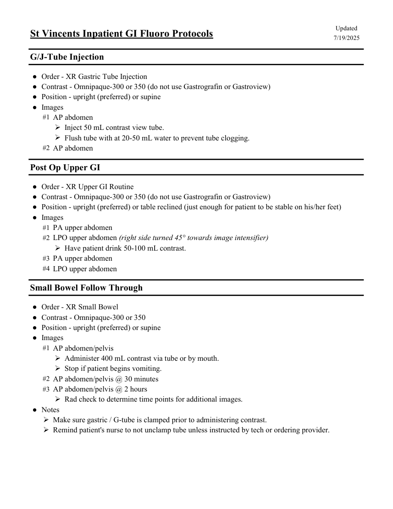

# Fluoroscopie — Fluoroscopie digestivă la pacienți internați (MCB)

## Documentul original MCB — Fluoroscopie digestivă la pacienți internați

**Protocol · 1 pagini · consultat la 2026-09-27.**

[Descarcă PDF-ul integral](../../assets/mcb-modalities/fluoro-fluoroscopie-digestiva-la-pacienti-internati-mcb/document.pdf) · [Sursa MCB](https://ref.mcbradiology.com/Protocols,%20Policies,%20Worksheets%20&%20Forms/Xray/GI%20&%20Other%20Exams/Inpatient%20GI%20Fluoro%20Protocols.pdf) · [Catalogul MCB pentru această modalitate](../mcb/index.md)

Instrucțiunile, valorile și ilustrațiile din documentul original sunt păstrate în **engleză**. Titlul și navigarea sunt în română.

### Pagina 1

{ loading=lazy }

## Textul documentului original

??? abstract "Pagina 1 — text în engleză"

    
Updated
    St Vincents Inpatient GI Fluoro Protocols
    7/19/2025
    G/J-Tube Injection
    ●Order - XR Gastric Tube Injection
    ●Contrast - Omnipaque-300 or 350 (do not use Gastrografin or Gastroview)
    ●Position - upright (preferred) or supine
    ●Images
    #1 AP abdomen
    Inject 50 mL contrast view tube.
    Flush tube with at 20-50 mL water to prevent tube clogging.
    #2 AP abdomen
    Post Op Upper GI
    ●Order - XR Upper GI Routine
    ●Contrast - Omnipaque-300 or 350 (do not use Gastrografin or Gastroview)
    ●Position - upright (preferred) or table reclined (just enough for patient to be stable on his/her feet)
    ●Images
    #1 PA upper abdomen
    #2 LPO upper abdomen (right side turned 45° towards image intensifier)
    Have patient drink 50-100 mL contrast.
    #3 PA upper abdomen
    #4 LPO upper abdomen
    Small Bowel Follow Through
    ●Order - XR Small Bowel
    ●Contrast - Omnipaque-300 or 350
    ●Position - upright (preferred) or supine
    ●Images
    #1 AP abdomen/pelvis
    Administer 400 mL contrast via tube or by mouth.
    Stop if patient begins vomiting.
    #2 AP abdomen/pelvis @ 30 minutes
    #3 AP abdomen/pelvis @ 2 hours
    Rad check to determine time points for additional images.
    ●Notes
    Make sure gastric / G-tube is clamped prior to administering contrast.
    Remind patient&#x27;s nurse to not unclamp tube unless instructed by tech or ordering provider.
    

