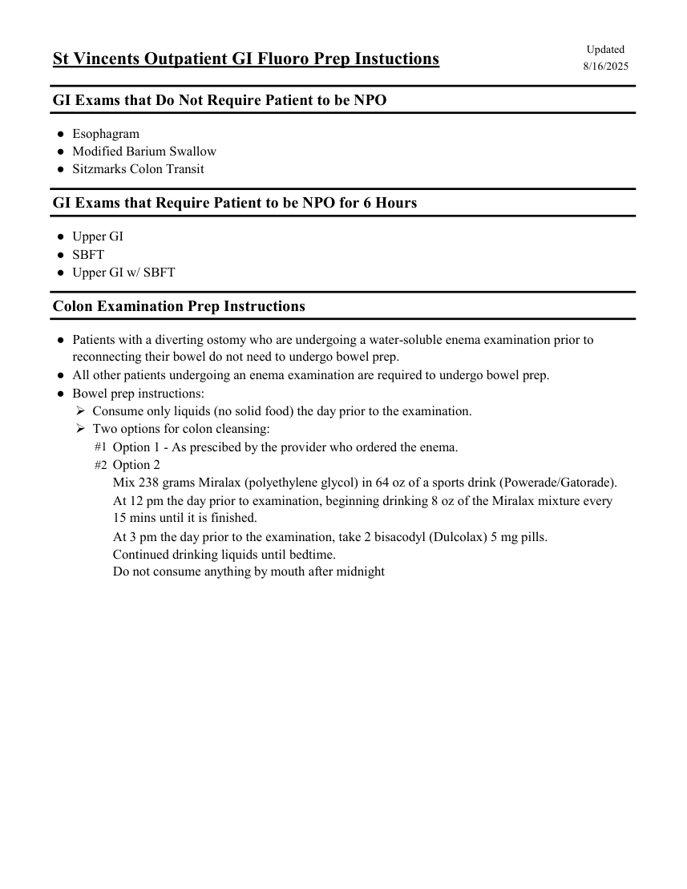

# Fluoroscopie — Pregătire pentru examinări digestive în ambulatoriu (MCB)

## Documentul original MCB — Pregătire pentru examinări digestive în ambulatoriu

**Protocol · 1 pagini · consultat la 2026-09-27.**

[Descarcă PDF-ul integral](../../assets/mcb-modalities/fluoro-pregatire-pentru-examinari-digestive-in-ambulatoriu-mcb/document.pdf) · [Sursa MCB](https://ref.mcbradiology.com/Protocols,%20Policies,%20Worksheets%20&%20Forms/Xray/GI%20&%20Other%20Exams/Outpatient%20GI%20Prep.pdf) · [Catalogul MCB pentru această modalitate](../mcb/index.md)

Instrucțiunile, valorile și ilustrațiile din documentul original sunt păstrate în **engleză**. Titlul și navigarea sunt în română.

### Pagina 1

{ loading=lazy }

## Textul documentului original

??? abstract "Pagina 1 — text în engleză"

    
Updated
    St Vincents Outpatient GI Fluoro Prep Instuctions
    8/16/2025
    GI Exams that Do Not Require Patient to be NPO
    ●Esophagram
    ●Modified Barium Swallow
    ●Sitzmarks Colon Transit
    GI Exams that Require Patient to be NPO for 6 Hours
    ●Upper GI
    ●SBFT
    ●Upper GI w/ SBFT
    Colon Examination Prep Instructions
    ●
    Patients with a diverting ostomy who are undergoing a water-soluble enema examination prior to 
    reconnecting their bowel do not need to undergo bowel prep.
    ●All other patients undergoing an enema examination are required to undergo bowel prep.
    ●Bowel prep instructions:
    Consume only liquids (no solid food) the day prior to the examination.
    Two options for colon cleansing:
    #1 Option 1 - As prescibed by the provider who ordered the enema.
    #2 Option 2
    Mix 238 grams Miralax (polyethylene glycol) in 64 oz of a sports drink (Powerade/Gatorade).
    At 12 pm the day prior to examination, beginning drinking 8 oz of the Miralax mixture every                       
    15 mins until it is finished.
    At 3 pm the day prior to the examination, take 2 bisacodyl (Dulcolax) 5 mg pills.
    Continued drinking liquids until bedtime.
    Do not consume anything by mouth after midnight
    

