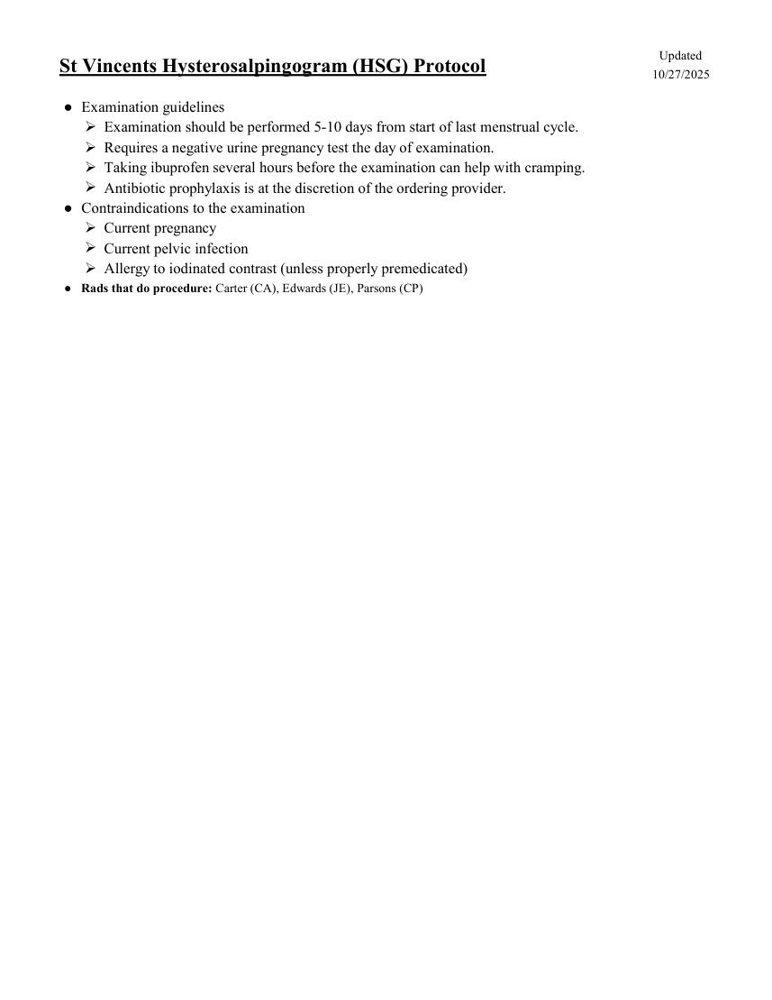

# Fluoroscopie — Histerosalpingografie (HSG) (MCB)

## Documentul original MCB — Histerosalpingografie (HSG)

**Protocol · 1 pagini · consultat la 2026-09-27.**

[Descarcă PDF-ul integral](../../assets/mcb-modalities/fluoro-histerosalpingografie-hsg-mcb/document.pdf) · [Sursa MCB](https://ref.mcbradiology.com/Protocols,%20Policies,%20Worksheets%20&%20Forms/Xray/GI%20&%20Other%20Exams/HSG.pdf) · [Catalogul MCB pentru această modalitate](../mcb/index.md)

Instrucțiunile, valorile și ilustrațiile din documentul original sunt păstrate în **engleză**. Titlul și navigarea sunt în română.

### Pagina 1

{ loading=lazy }

## Textul documentului original

??? abstract "Pagina 1 — text în engleză"

    
Updated
    St Vincents Hysterosalpingogram (HSG) Protocol
    10/27/2025
    ●Examination guidelines
    Examination should be performed 5-10 days from start of last menstrual cycle.
    Requires a negative urine pregnancy test the day of examination.
    Taking ibuprofen several hours before the examination can help with cramping.
    Antibiotic prophylaxis is at the discretion of the ordering provider.
    ●Contraindications to the examination
    Current pregnancy
    Current pelvic infection
    Allergy to iodinated contrast (unless properly premedicated)
    Rads that do procedure: Carter (CA), Edwards (JE), Parsons (CP)
    ●
    

