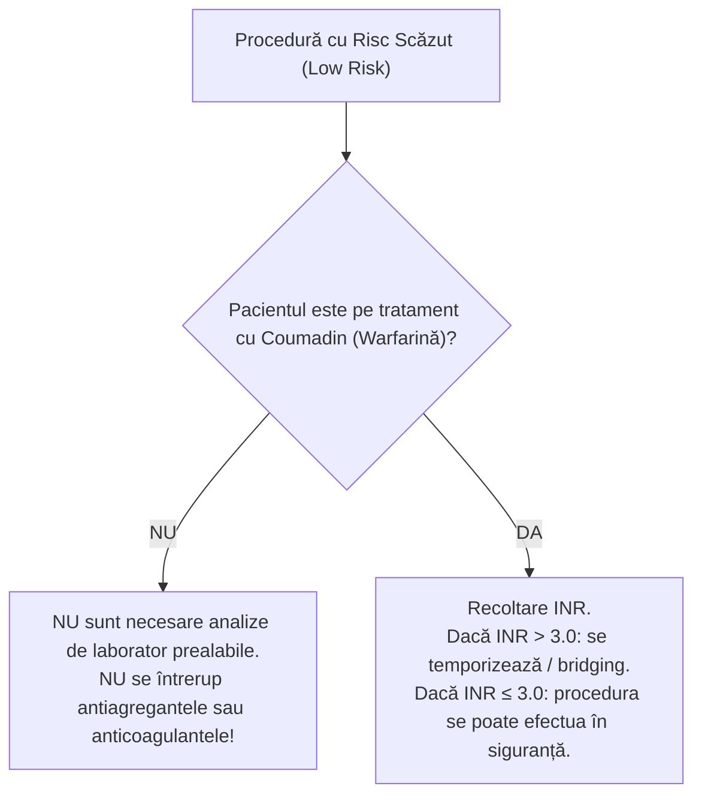
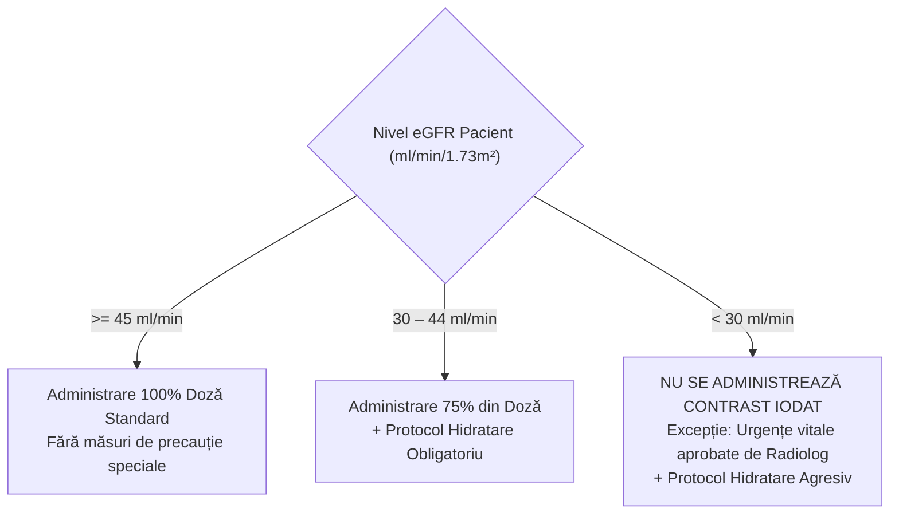
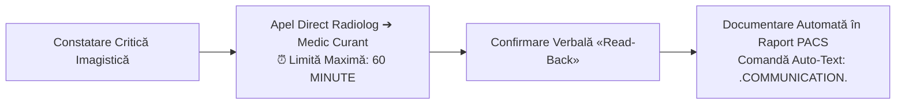
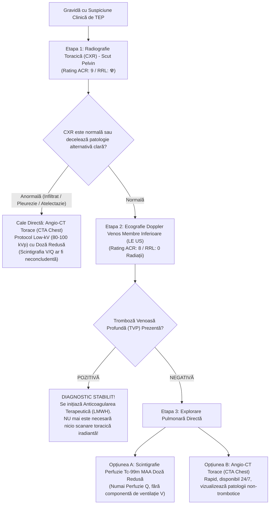

# Protocoale Clinice, Politici Procedurale & Standarde Tehnice Medford Radiology Group (MRG)

Ghid instituțional sinoptic al protocoalelor clinice, politicilor procedurale și standardelor tehnice de diagnostic și intervenție elaborate și aplicate în cadrul rețelei **Medford Radiology Group (MRG)** (Oregon, SUA), acoperind asistența imagistică de înaltă performanță pentru spitalele regionale afiliate (Providence Medford Medical Center, Asante Rogue Regional Medical Center, Siskiyou Imaging și centrele ambulatorii din Oregonul de Sud).

  

    🏥 PROTOCOALE INSTITUȚIONALE THE MEDFORD RADIOLOGICAL GROUP (OREGON / SUA)
  

  

    Sistemul <em>MRG Imaging Support Documents</em> reunește peste 395 de ghiduri clinice, proceduri de radiologie intervențională (IR), politici de siguranță la substanțe de contrast iodate și gadoliniate, protocoale avansate de premedicație, algoritmul stratificat de management al anticoagulării peri-procedurale (ACG 2023), ghidul de conduită în suspiciunea de embolie pulmonară în sarcină, checklist-ul de calitate pentru IRM multiparametric de prostată (mpMRI) și documentele standardizate pentru camera de interpretare (Reading Room Incidentaloma White Papers).
  

  <a href="https://medfordradiology.com/imaging-support-documents-17/" target="_blank" rel="noopener" style="font-weight: 600; color: #7dd3fc; text-decoration: none;">
    Accesează portalul oficial online MRG Imaging Support Documents ➔
  </a>

---

## 1. Sinteza Secțiunilor & Modalităților Imagistice MRG

| Secțiune / Modalitate | Documente Cheie MRG | Particularități Clinice & Tehnice Semnificative | Aplicabilitate & Standarde |
|:---|:---|:---|:---|
| **Ghiduri Clinice & Siguranță Contrast** | [Clinical Guidelines](https://medfordradiology.com/clinical-guidelines/) | Managementul anticoagulării (MRG 2023), Administrare contrast CT & IRM, Premedicație alergii, Rezultate critice (<60 min) | ACR Contrast Manual, SIR/ACG 2023, siguranță dializă & sarcină |
| **Ghiduri Cameră de Citire (Reading Room)** | [Reading Room Docs](https://medfordradiology.com/reading-room-documents/) | Algoritm TEP în sarcină, Caracterizare masă suprarenaliană CT, Chiști pancreatici incidentali (ACR White Paper), TI-RADS / ATA, Bosniak 2019 | Protocoale rapide de decizie clinică și standardizare dictare |
| **Radiologie Intervențională (IR)** | [Interventional Radiology](https://medfordradiology.com/interventional-radiology/) | 44+ proceduri vasculare și non-vasculare (TACE/TARE, TIPS, biopsii profunde, nefrostomii, drenaje abcese, infiltrații, vertebroplastie) | Fișe de programare, tăvițe sterile și instrucțiuni de externare |
| **Tomografie Computerizată (CT)** | [CT Support Documents](https://medfordradiology.com/ct/) | Protocol CT Nativ + Angio-CT Craniu (CTA Head), Reconstrucții extremități MSK (mână, cot, umăr, picior), 4D-CT Paratiroidă, LDCT Screening | Ghiduri ACR Appropriateness Criteria și poziționare ortogonală |
| **Rezonanță Magnetică (IRM)** | [MRI Support Documents](https://medfordradiology.com/mri/) | mpMRI Prostată (Checklist de calitate >6 săpt post-biopsie, clismă, 3T vs 1.5T MAR, b=1400), Pregătire MRCP/Entero-IRM/Uro-IRM, Artrografie | Politici de urgență ED/AACH, timpi NPO și eliminare artefacte |
| **Ultrasonografie & Ecografie (US)** | [Ultrasound](https://medfordradiology.com/ultrasound/) | Ghid standardizat de măsurare hepatică (18 cm cutoff), Criterii Doppler pentru stenoze carotidiene/renale, US DVT, Foaie de lucru tiroidă/sân | Reducerea variabilității inter-observator în măsurătorile biometrice |
| **Senologie & Mamografie (MAM)** | [Mammography](https://medfordradiology.com/mammography/) | Screening bilateral de rutină, Proteze mamare, Durere mamară diagnostică, Post-lumpectomie cu istoric neoplazic, Imagistică la pacienți transgender | Conformitate deplină MQSA, ghid densitate mamară și BI-RADS |
| **Fluoroscopie (FL)** | [Fluoroscopy](https://medfordradiology.com/fluoroscopy/) | Tranzit esofagian, Tranzit eso-gastro-duodenal (UGI), Tranzit intestin subțire (SBFT), Histerosalpingografie (HSG), Infiltrații articulare | Carduri procedurale dedicate pe medici radiologi și tăvițe sterile |
| **Osteodensitometrie (DEXA)** | [DEXA](https://medfordradiology.com/dexa/) | Ghid raportare DEXA, Chestionar de screening, Protocol DEXA pediatrie, Protocol DEXA hipertiroidism | Calcul T-score, Z-score și evaluare risc fractură FRAX |

---

## 2. Managementul Anticoagulării în Procedurile Intervenționale (Ghidul MRG 2023)

Conform politicii instituționale oficiale *MRG 2023 Anticoagulation Management for Procedures*, toate procedurile imagistice ghidate sunt clasificate riguros în funcție de riscul hemoragic în două categorii:

### 2.1. Proceduri cu Risc Hemoragic Scăzut (Low-Risk Procedures)

- **Proceduri clasificate ca Low-Risk:**
    - **Vasculare:** Retragerea cateterelor venoase centrale tunelizate și a accesului de dializă; plasarea/retragerea filtrelor de venă cavă inferioară (IVC); arteriografie diagnostică periferică; flebografie pelvină/extremități; intervenții pe fistle de dializă; biopsie hepatică transjugulară.
    - **Non-vasculare:** Schimbarea, conversia sau retragerea tuburilor de gastrostomie (G/GJ/J), nefrostomie (PCN), tuburi suprapubiene, biliare sau de drenaj al abceselor; plasarea tuburilor de dren pentru abcese superficiale; plasarea tuburilor de dren toracic non-tunelizate; paracenteză, pericardiocenteză.
    - **Puncții superficiale (aspirație sau biopsie core needle):** Sân, extremități/mușchi, ganglioni limfatici superficiali, tiroidă, mase de părți moi superficiale, măduvă osoasă.
    - **Coloană / MSK:** Infiltrații articulare periferice, blocaje nervoase periferice/ablații, puncte trigger, articulație sacroiliacă, fațete articulare toracice și lombare.
- **Conduită Anticoagulantă:**
    - **Aspirină (orice doză):** **NU se întrerupe**.
    - **Clopidogrel (Plavix), Prasugrel (Effient), Ticagrelor (Brilinta):** **NU se întrerup**.
    - **Enoxaparină (Lovenox), Dalteparină, Heparină subcutanată/IV:** **NU se întrerup**.
    - **NOAC / DOAC (Apixaban/Eliquis, Rivaroxaban/Xarelto, Dabigatran/Pradaxa, Edoxaban/Savaysa):** **NU se întrerup**.
    - **Warfarină (Coumadin):** Se verifică INR; se continuă dacă INR ≤ 3.0.

### 2.2. Proceduri cu Risc Hemoragic Crescut (High-Risk Procedures)

- **Analize de laborator obligatorii:** Hemoleucogramă (CBC), Ionogramă & funcție renală (BMP), Coagulogramă (PT/INR, PTT).
- **Valabilitate analize:** Maxim **72 ore** pentru pacienți spitalizați (inpatients); maxim **30 zile** pentru pacienți ambulatori.
- **Particularitate cirotici:** La pacienții cu ciroză hepatică având INR > 1.8, este obligatorie determinarea nivelului de **fibrinogen**.
- **Proceduri clasificate ca High-Risk:**
    - **Vasculare:** Intervenții arteriale intratoracice, SNC, mezenterice, aortice; TACE / TARE (radioembolizare Y90) și cartografiere vasculară; retrageri complexe de filtru IVC; șunt portosistemic transjugular (TIPS/DIPS, BRTO); montare/retragere catetere tunelizate Hickman/port-a-cath; tromboliză/trombectomie ghidată prin cateter pentru TEP sau TVP profundă; embolizare artere uterine (UAE/UFE) sau prostatice (PAE).
    - **Non-vasculare & Drenaje profunde:** Intervenții biliare percutanate (PTBD, montare stent, colecistostomie percutanată PCT); plasare nouă de tub G/GJ/J; nefrostomie nouă percutanată (PCN) sau montare de stent ureteral JJ; recanalizare tubară.
    - **Ablații & Biopsii profunde:** Ablații termice (radiofrecvență, microunde, crioablație) pe ficat, rinichi, plămân, os; biopsii core profunde de ficat, rinichi, plămân, retroperitoneu, coloană vertebrală; drenajul abceselor profunde intraabdominale/pelvine.
- **Protocoale de Întrerupere și Reluare pentru Proceduri cu Risc Crescut:**

| Clasă Medicament | Substanță Activă / Nume Comercial | Timp Întrerupere Pre-Procedură | Timp Reluare Post-Procedură | Observații / Monitorizare |
|:---|:---|:---|:---|:---|
| **Antiagregante Plachetare** | Aspirină (Aspirin) | 4 – 5 Zile | 24 Ore post-procedural | În proceduri cu risc extrem se discută cu medicul cardiolog |
| | Clopidogrel (Plavix) | 5 Zile | 24 Ore post-procedural | Dacă procedura este urgentă: verificare reactivitate plachetară |
| | Prasugrel (Effient) | 7 Zile | 24 Ore post-procedural | Efect antiplachetar ireversibil potent |
| | Ticagrelor (Brilinta) | 5 Zile | 24 Ore post-procedural | Reversie mai rapidă decât clopidogrel |
| **Antagoniști Vitamina K** | Warfarină (Coumadin) | 5 Zile | Seara procedurii (sau conform protocol de bridging) | INR țintă pre-procedural < 1.5; bridging cu LMWH la pacienți cu proteze valvulare mecanice |
| **Heparine cu Greutate Moleculară Mică** | Enoxaparină (Lovenox) - Doză Profilactică | 12 Ore | 24 Ore post-procedural | Se omite doza de dimineață |
| | Enoxaparină (Lovenox) - Doză Terapeutică | 24 Ore | 24 Ore post-procedural | 1 mg/kg la 12h sau 1.5 mg/kg la 24h |
| **Heparină Nefracționată** | Heparină sodică IV (UFH) | 4 – 6 Ore | 2 – 4 Ore post-procedural | Normalizare PTT înainte de puncție |
| **DOAC / NOAC (Inhibitori FXa / FIIa)** | Apixaban (Eliquis) | 48 Ore (2 zile pline) | 24 – 48 Ore post-procedural | Dacă eGFR < 30 ml/min: întrerupere 72 ore |
| | Rivaroxaban (Xarelto) | 48 Ore (2 zile pline) | 24 – 48 Ore post-procedural | Se prelungește la 72h în insuficiență renală |
| | Dabigatran (Pradaxa) | 72 Ore (3 zile) | 24 – 48 Ore post-procedural | Excreție predominant renală (80%); prelungire la 4-5 zile dacă ClCr < 50 ml/min |
| | Fondaparinux (Arixtra) | 72 Ore | 24 Ore post-procedural | Clearance exclusiv renal |

---

## 3. Ghidul de Administrare a Substanțelor de Contrast Iodate și Gadoliniate

### 3.1. Cerințe de Screening Renal (eGFR / Creatinină Serică)
- **Valabilitatea analizelor de laborator:**
    - Pacienți din UPU / CPU (ED) și Ambulator (Outpatients): rezultate din ultimele **30 de zile**.
    - Pacienți Spitalizați (Inpatients): rezultate obligatorii din ultimele **48 de ore**.
- **Indicații de screening obligatoriu eGFR înainte de contrast IV:**
    - Toți pacienții spitalizați cu vârsta ≥ 18 ani;
    - Vârstă > 60 de ani;
    - Istoric de afecțiuni renale (insuficiență renală, rinichi unic, transplant renal, nefrectomie, neoplazii renale);
    - Hipertensiune arterială sub tratament medicamentos;
    - Diabet zaharat;
    - Mielom multiplu;
    - Boală hepatică severă sau transplant hepatic;
    - Tratament curent cu Metformin sau combinații cu metformin;
    - Chimioterapie activă sau administrată în ultimele 2 luni.

### 3.2. Praguri eGFR & Conduită Contrast Iodat (CT)

- **Protocol de Hidratare Instituțional:**
    - **Pacienți Spitalizați (Inpatients):** Perfuzie cu lichide izotonice (Ser Fiziologic 0.9%) cu debit de **100 ml/oră** (sau 1 ml/kg/oră) inițiată cu **6 – 12 ore înainte** de administrarea contrastului și continuată **4 – 12 ore post-examinare**.
    - **Pacienți Ambulatori (Outpatients):** Ingestie de 500 ml apă plată înainte de injectarea contrastului și recomandarea explicită de a consuma cel puțin 1 cană de apă la fiecare oră timp de 8 ore post-scanare.
- **Dializă:** Pacienții anurici aflați în program cronic de hemodializă pot primi contrast iodat, cu condiția planificării ședinței de dializă în decurs de maxim **48 de ore** post-contrast. Nu este necesară hemodializa de urgență imediată exclusiv pentru eliminarea contrastului.
- **Excepție de Urgență:** În protocoalele de AVC acut (Brain Attack / Stroke) sau traumatisme majore cu risc vital, verificarea analizelor de laborator se suspendă pentru a evita întârzierea intervenției salvatoare de viață.

### 3.3. Conduită Substanțe de Contrast Gadoliniate (IRM / GBCAs)
- **eGFR > 60 ml/min:** Doză diagnostică completă; fără precauții specifice.
- **eGFR 30 – 59 ml/min:** Doză diagnostică standard; risc neglijabil de fibroză sistemică nefrogenă (NSF) cu agenți macrociclici moderni (Clasa II ACR).
- **eGFR < 30 ml/min:** Gadoliniul trebuie evitat pe cât posibil. Dacă este absolut esențial pentru managementul clinic, se va utiliza strict doza minimă diagnostică dintr-un agent macrociclic stabil (ex. Gadobutrol, Gadoterat de meglumină). Pacienții pe hemodializă trebuie dializați cât mai rapid după terminarea examinării IRM.

### 3.4. Situații Speciale: Sarcină & Alăptare
- **Sarcină:**
    - *Contrast Iodat:* Nu este teratogen demonstrat; dacă este justificat clinic pentru diagnosticul mamei, **nu trebuie reținut**. Se recomandă verificarea funcției tiroidiene a nou-născutului în prima săptămână de viață.
    - *Contrast Gadoliniat:* Gadoliniul traversează bariera feto-placentară și se elimină în lichidul amniotic. Se administrează **exclusiv** dacă beneficiul matern/fetal depășește cert riscul teoretic de eliberare a ionilor liberi de gadoliniu, după consult radiologic-obstetrical documentat în dosarul pacientei.
- **Alăptare:** Cantitatea excretată în laptele matern este sub 0.04% din doza administrată mamei, iar absorbția gastrointestinală a sugarului este sub 1%. **Alăptarea poate continua normal fără întrerupere**. Pentru pacientele anxioase, se poate oferi opțiunea colectării și aruncării laptelui timp de 24 de ore ("pump and dump").

---

## 4. Ghidul de Premedicație pentru Alergii la Substanțe de Contrast

Aplicat pacienților cu antecedente de reacții alergice moderate sau severe la contrast:

### 4.1. Regimul Electiv Oral (13-Hour PO Protocol)
Standardul de aur pentru examinările programate ambulatorii sau spitalizate:
1. **Prednison:** **50 mg per os** administrat cu **13 ore**, **7 ore** și **1 oră** înainte de injectarea contrastului (total 3 doze = 150 mg);
2. **Difenhidramină (Benadryl):** **50 mg** administrat intravenos, intramuscular sau per os cu **1 oră** înainte de injectarea contrastului.

### 4.2. Regimul de Urgență Intravenos (Emergent IV Protocol)
Utilizat exclusiv când examinarea nu poate fi amânată 13 ore:
1. **Metilprednisolon (Solu-Medrol) 40 mg IV** sau **Hidrocortizon (Solu-Cortef) 200 mg IV** la fiecare 4 ore până la momentul injectării substanței de contrast;
2. **Difenhidramină 50 mg IV** cu 1 oră înainte de procedură.
> [!IMPORTANT]
> Corticosteroizii administrați pe cale intravenoasă devin eficienți fiziologic în reducerea incidenței reacțiilor anafilactoide doar dacă prima doză este administrată cu **cel puțin 4 – 6 ore** înainte de injectarea substanței de contrast.

---

## 5. Politica Instituțională de Raportare a Rezultatelor Critice

Medford Radiology Group impune comunicarea verbală directă și documentarea promptă pentru 8 diagnostice imagistice majore cu risc vital imediat:

### Lista Diagnosticelor Critice Obligatorii (Timp Răspuns < 60 Min)
1. **Compresie medulară acută** nouă sau agravată semnificativ;
2. **Hemoragie intracraniană acută** nouă sau agravată și/sau efect de masă semnificativ cu hernie iminentă;
3. **Embolie pulmonară acută (TEP)** nouă sau scintigrafie V/Q cu probabilitate înaltă;
4. **Fractură instabilă de coloană vertebrală**;
5. **Tuberculoză pulmonară (TB)** activă nou suspectată/diagnosticată;
6. **Pneumotorax acut** nou sau neașteptat (sunt excluse cazurile cu tub de dren toracic deja funcțional);
7. **Pneumoperitoneu acut** nou sau crescut (fără intervenție chirurgicală/laparoscopie recentă preconizată);
8. **Ruptură de anevrism de aortă abdominală (AAA)** sau hematom periaortic activ.

---

## 6. Algoritm Diagnostic: Suspiciune de Embolie Pulmonară în Sarcină

Conform consensului MRG și ACR Appropriateness Criteria, evaluarea suspiciunii de TEP la gravida simptomatică urmează o ierarhie menită să minimizeze iradierea glandei mamare materne și a fătului:

- **Perlă Clinică MRG:** Realizarea ecografiei Doppler de membre inferioare înaintea scanării toracice permite evitarea completă a iradierii toracice la gravidele care asociază TVP pelvină sau femuro-poplitee, tratamentul fiind identic (anticoagulare terapeutică).
- **Protecție Mamară:** Țesutul glandular mamar proliferat în sarcină prezintă o radiosensibilitate crescută; scanarea scintigrafică doar cu componentă de perfuzie sau Angio-CT cu modulare de doză reduce semnificativ doza absorbită de sân.

---

## 7. Checklist de Calitate & Protocol mpMRI Prostată (MRG Prostate Protocol)

Medford Radiology Group a implementat un checklist obligatoriu în 12 puncte pentru a garanta acuratețea interpretării conform scorului PI-RADS v2.1:

1. **Interval Post-Biopsie > 6 Săptămâni:** Este interzisă programarea IRM de prostată la mai puțin de 6 săptămâni după biopsia prostatică transrectală/transperineală, din cauza artefactelor de susceptibilitate magnetică induse de methemoglobina din focarele hemoragice reziduale care mimează sau maschează neoplazia pe secvențele T2 și difuzie.
2. **Pregătire Rectală Riguroasă (Bowel Prep):** Clismă evacuatorie (Fleet Saline Enema) autoadministrată (în seara precedentă pentru programările de dimineață, sau în dimineața examinării pentru orele post-meridiane) și regim exclusiv de lichide clare timp de 12 ore pentru eliminarea distensiei gazoase rectale.
3. **Câmp Magnetic 3.0 Tesla Recomandat:** Toate examinările mpMRI se efectuează preferențial pe scanere 3T; scanarea pe aparate 1.5T este permisă doar pe sisteme validate de MRG cu secvențe MAR (Metal Artifact Reduction) în cazul pacienților purtători de proteze totale de șold bilaterale.
4. **Sincronizare Geometrică Strictă:** Toate secvențele cu FOV redus (T2 axial oblic, DWI/ADC și achiziția dinamică post-gadoliniu DCE) trebuie copiate identic ca unghi de înclinare (perpendicular pe axul lung al uretrei prostatice), grosime de secțiune (3 mm fără spațiere) și coordonate de poziție, astfel încât seriile să poată fi parcurse sincronizat în PACS ("cross-referencing").
5. **Secvență de Difuzie cu Valoare b Înaltă (b = 1400 s/mm²):** Exportată separat ca serie dedicată în PACS, esențială pentru diferențierea tumorilor semnificative clinic (Gleason ≥ 7) în zona periferică.
6. **Integrare DynaCAD:** Transmiterea automată a seriilor dinamice DCE către platforma DynaCAD pentru curbe farmacocinetice de wash-in și wash-out.

---

## 8. Ghid Tehnic de Poziționare & Reconstrucții MPR în CT Musculoscheletic (MSK)

Documentul *MSK CT Extremities: Positioning and Reformations* standardizează achiziția ortogonală a extremităților:

| Regiune Anatomică | Poziționare Pacient | Volum Achiziție & Scan Range | Planuri Obligatorii de Reconstrucție (MPR) |
|:---|:---|:---|:---|
| **Mână & Degete** | Decubit ventral (Prone), brațul deasupra capului ("Superman"), mâna în pronație, degete întinse paralele. Alternativ: decubit lateral cu braț deasupra capului și mână în supinație. | De la articulația radio-ulnară distală până la vârful degetelor; colimare redusă la focar (ex. articulație MCP I). | Coronal și sagital strict paralele cu axul lung al metacarpienelor. Pe axiale, fața dorsală se orientează sus. |
| **Pumn (Wrist)** | Prone cu mâna întinsă deasupra capului, articulația pumnului în ax neutru în izocentrul gantry-ului. | De la metafiza distală radială/ulnară până la baza metacarpienelor. | Sagital oblic de-a lungul axului scafoidului (util în suspiciunea de fractură de scafoid sau necroză avasculară). |
| **Cot (Elbow)** | Prone cu brațul deasupra capului, cotul în extensie completă și supinație. | 5 cm proximal de epicondilii humerali până la tuberozitatea bicipitală radială. | Axiale perpendiculare pe diafiza humerală distală; coronale paralele cu linia biepicondiliană. |
| **Umăr (Shoulder)** | Decubit dorsal, brațul afectat de-a lungul corpului în rotație neutră, brațul contralateral ridicat. | De deasupra articulației acromio-claviculare până sub colul chirurgical humeral. | Coronal oblic paralel cu fosa glenoidă și tendonul supraspinos; sagital oblic perpendicular pe glenă. |
| **Gleznă & Retropicior** | Decubit dorsal, piciorul în unghi de 90° flexie dorsală, fixat în suport dedicat. | 5 cm deasupra sindesmozei tibio-fibulare până la fața plantară a calcaneului. | Coronal oblic perpendicular pe articulația subtalară; sagital paralel cu axul lung al calcaneului. |
| **Antepicior (Foot)** | Piciorul așezat plat pe masă cu genunchiul flectat (talpa plană pe gantry). | De la articulația Chopart/Lisfranc până la vârful falangelor distale. | Planuri aliniate la axul lung al metatarsianului II; MPR coronal perpendicular pe metatarsiene. |

---

## 9. Protocoale Cheie din Camera de Interpretare (Reading Room Incidentalomas)

### 9.1. Caracterizarea Maselor Suprarenaliene prin CT Multifazic (Adrenal Washout)
- **Protocol Achiziție:** Nativ (fără contrast), Fază parenchimatoasă venoasă (60-70 secunde), Fază tardivă (15 minute).
- **Măsurare ROI:** Regiunea de interes (ROI) trebuie să ocupe **peste două treimi (2/3)** din suprafața masei suprarenaliene, evitând calcificările sau zonele de necroză chistică.
- **Formula Washout-ului Absolut (APW):**
    $$\text{APW (\%)} = \frac{\text{HU}_{\text{parenchimatos}} - \text{HU}_{\text{tardiv}}}{\text{HU}_{\text{parenchimatos}} - \text{HU}_{\text{nativ}}} \times 100$$
    - **Criteriu Certitudine:** $\text{APW} \ge 60\%$ confirmă un **adenom suprarenalian benign**.
- **Atenție la Capcana Diagnostică (MRG Clinical Pearl):** Dacă masa suprarenaliană are o densitate nativă $< 10\text{ HU}$ (adenom bogat în lipide), leziunea poate prezenta o captare și o spălare scăzută a contrastului. **Nu se calculează washout-ul dacă densitatea nativă este $<10\text{ HU}$**; leziunea se declară direct adenom pe baza conținutului lipidic nativ!

### 9.2. Chiști Pan pancreatici Incidentali (Algoritmul ACR White Paper)
- **Criterii de Risc & Diametru:**
    - $< 1.5\text{ cm}$ la pacienți asimptomatici: monitorizare spațiată (IRM/MRCP la 1, 3 și 5 ani).
    - $1.5 – 2.5\text{ cm}$: caracterizare detaliată prin MRCP pentru evidențierea comunicării cu ductul pancreatic principal (Wirsung) și monitorizare la 6-12 luni.
    - $> 2.5\text{ cm}$ sau prezența semnelor de alarmă (*High-Risk Stigmata* / *Worrisome Features* - dilatație Wirsung $> 5\text{ mm}$, nodul mural captant, perete îngroșat): consult chirurgical, ecoendoscopie (EUS) cu puncție aspirativă și dozare CEA/amilaze.

### 9.3. Ghidul Biometric Ecografic Hepatic (Liver Measurements Guideline)
- **Măsurarea Diametrului Cranio-Caudal (CC):** Se măsoară obligatoriu în **incidență sagitală pe linia medioclaviculară dreaptă**, de la cel mai înalt punct al cupolei diafragmatice până la marginea inferioară a lobului drept hepatic.
- **Limita Superioară Normală:** **18.0 cm** (excepție: varianta anatomică a lobului Riedel).
- **Raportare Calibru CBP și Perete Colecist:** Se impune includerea unei zecimale obligatorii (ex. CBP = 5.5 mm, Perete colecist = 2.2 mm).

---

## 10. Resurse Digitale Oficiale Medford Radiology Group

- [Portalul Oficial MRG Support Documents](https://medfordradiology.com/imaging-support-documents-17/){ target="_blank" rel="noopener" }
- [MRG Clinical Guidelines (Contrast & Anticoagulare)](https://medfordradiology.com/clinical-guidelines/){ target="_blank" rel="noopener" }
- [MRG Reading Room Documents & Incidentaloma White Papers](https://medfordradiology.com/reading-room-documents/){ target="_blank" rel="noopener" }
- [MRG Interventional Radiology Protocols (44 Proceduri IR)](https://medfordradiology.com/interventional-radiology/){ target="_blank" rel="noopener" }
- [MRG Computed Tomography Protocols & Extremities Guide](https://medfordradiology.com/ct/){ target="_blank" rel="noopener" }
- [MRG MRI Protocols & Prostate mpMRI Checklist](https://medfordradiology.com/mri/){ target="_blank" rel="noopener" }
- [MRG Ultrasound Protocols & Liver Guideline](https://medfordradiology.com/ultrasound/){ target="_blank" rel="noopener" }
- [MRG Mammography Protocols & Transgender Imaging](https://medfordradiology.com/mammography/){ target="_blank" rel="noopener" }
- [MRG Fluoroscopy & Radiography Positioning](https://medfordradiology.com/fluoroscopy/){ target="_blank" rel="noopener" }
