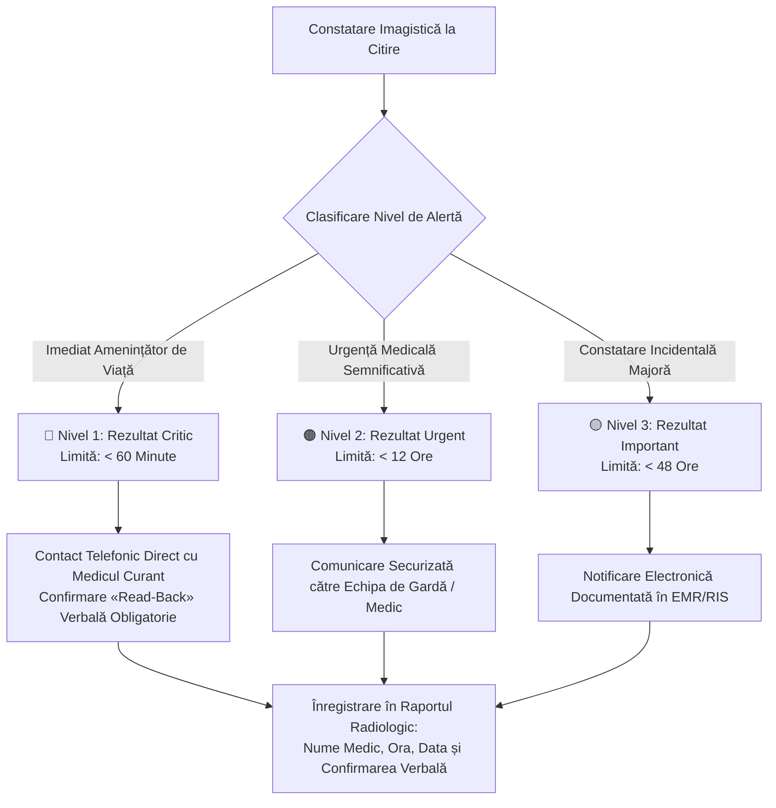

# Protocoale Clinice, Standarde Tehnice & Ghid de Proceduri MIA Radiology

Ghid instituțional sinoptic al protocoalelor clinice, politicilor procedurale și ghidurilor tehnice aplicate în cadrul rețelei de imagistică **Medical Imaging Associates (MIA Radiology)** (Idaho & regiunile afiliate), acoperind spectrul complet de examinări: Tomografie Computerizată (CT), Rezonanță Magnetică (IRM), Fluoroscopie & Radiologie Intervențională (RF), Ultrasonografie (US), Senologie & Mamografie (MG), Radiologie Convențională (RX) și Politica Instituțională de Comunicare a Rezultatelor Critice.

  

    🏥 PROTOCOALE INSTITUȚIONALE MIA RADIOLOGY (IDAHO / SUA)
  

  

    Manualul online oficial <em>MIA Modality Wiki</em> standardizează protocoalele de urgență (inclusiv protocolul triplu AVC acut &laquo;Brain Attack&raquo;), supravegherea endoprotezelor aortice (EVAR/TEVAR), portofoliul de 28 proceduri de fluoroscopie și intervențională, fișele standardizate de măsurători ecografice (US Worksheets) cu protocol dedicat DVT, controlul calității în senologie (MQSA / EQUIP) și clasificarea pe niveluri de alertă a rezultatelor critice (Policy 06-2026).
  

  <a href="https://miaradmodalitywiki.powerappsportals.com/" target="_blank" rel="noopener" style="font-weight: 600; color: #a7f3d0; text-decoration: none;">
    Accesează portalul oficial online MIA Modality Wiki ➔
  </a>

---

## 1. Sinteza Modalităților Imagistice MIA Radiology

| Domeniu Imagistic | Resurse Principale MIA | Particularități Tehnice & Clinice | Documente & Ghiduri Asociate |
|:------------------|:-----------------------|:----------------------------------|:-----------------------------|
| **Tomografie Computerizată (CT)** | [CT Wiki](https://miaradmodalitywiki.powerappsportals.com/CT) (Body, Chest, MSK, Neuro, Peds, Angio, Trauma) | Protocol AVC Acut (*Brain Attack* cu flux AI VizAI), EVAR/TEVAR multifazic, CT Enterografie, Uro-CT, Mielografie CT C/T/L | Modulare doze pediatrice pe 4 grupe de greutate, protocol reducere artefacte metalice |
| **Fluoroscopie & Intervențională (RF)** | [RF Modality Wiki](https://miaradmodalitywiki.powerappsportals.com/RF) (28 proceduri clinice) | Tranzit esofagian & MBS, Irigoscopie dublu contrast, Histerosalpingografie (HSG), Infiltrații steroidiene epidurale/radiculare, Artrografie | Tăvițe sterile standardizate, catetere, debite și proiecții dinamice |
| **Rezonanță Magnetică (IRM)** | [MRI Wiki](https://miaradmodalitywiki.powerappsportals.com/MRI) (Abdomen, Breast, MSK, Policies) | MRCP, Entero-IRM (Crohn), Ficat cu contrast hepatobiliar (Eovist/Primovist), IRM Prostată multiparametric (PI-RADS), RMN rectal înaltă rezoluție | Politică contrast gadoliniat și difuzie lombară |
| **Ultrasonografie & Ecografie (US)** | [US Wiki](https://miaradmodalitywiki.powerappsportals.com/US-Main/) | Foi de lucru standardizate (Worksheets): screening DVT (membre superioare și inferioare), Doppler carotidian, tiroidă, abdomen, aparat urinar | Criterii riguroase de compresibilitate și flux spectral |
| **Senologie & Mamografie (MG)** | [MG Wiki](https://miaradmodalitywiki.powerappsportals.com/MG) | Mamografie screening & diagnostic (2D/3D Tomosinteză), Reperaj preoperator cu fir ghid / harpon (Wire Localization) | Manual de control al calității MQSA și programul EQUIP |
| **Radiologie Convențională (RX)** | [X-Ray Manual](https://miaradmodalitywiki.powerappsportals.com/X-RAY) | Manualul complet de poziționare și radioprotecție `XR Protocols 01-2025` | Incidențe standard și suplimentare, colimare |
| **Comunicare Rezultate Critice** | [Critical Results Policy](https://miaradmodalitywiki.powerappsportals.com/Radiology_Results_and_Critical_Communications) | Ghidul de clasificare a urgențelor `Radiology Results and Critical Communications 06-2026` | 3 Niveluri de alertă: Critic (<60 min), Urgent (<12h), Important (<48h) |

---

## 2. Protocoale Cheie de Tomografie Computerizată (CT)

### 2.1. Protocolul CT AVC Acut &laquo;Brain Attack&raquo; (CT Nativ + Angio-CT Craniu & Gât)
Conceput pentru reducerea maximă a timpului &laquo;Door-to-Needle&raquo; în accidentul vascular cerebral ischemic acut:
- **Cateter & Injector:** Canulă intravenoasă 18G în plica cotului; 100 ml substanță de contrast iodată non-ionică injectată cu debit mare de **4.0 – 5.0 ml/s**, urmată de bolus de ser fiziologic (saline chaser) 40 ml la 4.0 ml/s.
- **Etapa 1 — CT Cerebral Nativ (Head WO):**
    - Acoperire: de la baza craniului până la vertex;
    - Reconstrucții: Axial 4 mm (Standard Brain / Cerebrum), Axial 2 mm (Kernel os/osteo), Coronal 2 mm, Sagital 2 mm;
    - Obiectiv: excluderea hemoragiei intracraniene acute (HIC), a efectului de masă și calculul scorului ASPECTS.
- **Etapa 2 — Angio-CT Vase Cervico-Cerebrale (CTA Head & Neck):**
    - Acoperire: de la arcul aortic până deasupra vertexului;
    - Sincronizare bolus: SmartPrep / Bolus tracking plasat pe crosa aortei sau artera carotidă comună;
    - Reconstrucții transmise către PACS:
        - Axial 1 mm nativ de la arc la vertex;
        - Coronal MIP 10 mm și 2 mm (arc aortic până la baza craniului);
        - Sagital MIP 2 mm;
    - Integrare AI (VizAI): o serie axială subțire (0.6 – 1.0 mm) este rutată automat către platforma de analiză automată VizAI pentru detecția ocluziilor de vase mari (LVO - Large Vessel Occlusion: ACI, segment M1/M2 ACM, trunchi bazilar) și alertarea echipei de trombectomie mecanică.

### 2.2. Supravegherea Endoprotezelor Aortice (EVAR / TEVAR)
Evaluarea post-operatorie a stent-grafturilor aortice impune o strategie trifazică strictă pentru detectarea endoleak-urilor:
1. **Faza Nativă (Fără Contrast):** Vizualizează integritatea scheletului metalic al endoprotezei, migrarea stentului, densitatea hematomului rezidual din sacul anevrismal și calcificările parietale.
2. **Faza Arterială Angiografică (CTA):** Declanșată automat prin bolus-tracking în aorta proximală deasupra grefonului (debit 4.0 ml/s, 100 ml contrast). Evidențiază lumenul funcțional, permeabilitatea ramurilor viscerale/iliace și endoleak-urile cu flux rapid (**Tip I** - la nivelul zonelor de etanșare proximală/distală; **Tip III** - defecte de conexiune structurală sau ruptură de material textil).
3. **Faza Venoasă / Tardivă (120 – 180 secunde):** Esențială și obligatorie! Permite acumularea și decelarea endoleak-urilor cu flux lent (**Tip II** - reumplere retrogradă a sacului prin arterele lombare patente sau artera mezenterică inferioară).

### 2.3. CT Enterografie cu Distensie Enterică Neutră
- **Pregătire Pacient:** NPO 4 ore înainte de scanare; fără pregătire laxativă agresivă a colonului;
- **Protocol Contrast Oral Neutru:** Ingestie fracționată de agent de contrast enteric hipodens / izo-osmolar (apă cu manitol / sorbitol sau Volumen) în volum total de **1000 – 1500 ml** distribuit egal la 45, 30, 15 și 5 minute înainte de așezarea pe masa tomografului, asigurând distensia omogenă a anselor jejunale și ileale;
- **Protocol Injector IV:** Cateter 18G, 80 – 100 ml contrast iodat la 4.0 ml/s;
- **Temporizare Achiziție:** Fază enterică / capilară mucosală la **60 secunde întârziere fixă**;
- **Reconstrucții:** Axial 2.5 mm și MPR coronal / sagital 3x3 mm în fereastră de părți moi. Permite vizualizarea hiperemiei mucoasei, a edemului submucos, a stenozelor cicatriciale versus inflamatorii active, a fistulelor entero-enterice/entero-cutanate și a semnului pieptenului (comb sign) în boala Crohn.

### 2.4. CT Ficat și Pancreas Multifazic
- **Multiphase Liver:** Protocol în 4 etape (Nativ, Fază arterială tardivă la 35 secunde, Fază portal-venoasă la 70 secunde, Fază tardivă la 3-5 minute) optimizat pentru caracterizarea carcinomului hepatocelular (HCC - wash-in arterial rapid urmat de wash-out tardiv și pseudocapsulă) conform criteriilor LI-RADS.
- **Multiphase Pancreas:** Contrast 120 ml la 4.0 ml/s; fază parenchimatoasă pancreatică dedicată la 40-45 secunde (contrast optim între adenocarcinomul hipovascular și parenchimul pancreatic adiacent intens captant) combinată cu fază venoasă portală la 70 secunde pentru stadializarea invaziei axului vascular spleno-mezenterico-portal.

---

## 3. Portofoliul de Fluoroscopie și Radiologie Intervențională (RF - 28 Proceduri)

Secțiunea RF din cadrul MIA Radiology cuprinde ghiduri clinice complete, necesar de materiale sterile (tăvițe chirurgicale, ace, catetere, substanțe de contrast) și timpi procedurali pentru 28 intervenții fluoroscopice:

### 3.1. Explorări Dinamice ale Tubului Digestiv
- **Tranzit Esofagian Baritat & MBS (Modified Barium Swallow):** Evaluarea motilității, a peristalticii secundare, a refluxului gastro-esofagian, diverticulilor Zenker/epifrenici și riscului de aspirație traheo-bronșică în colaborare cu logopedul (SLP), folosind suspensii baritate de densități gradate (pastă, lichid subțire, lichid dens).
- **Tranzit Eso-Gastro-Duodenal (TEGD / Upper GI):** Evaluarea herniilor hiatale prin alunecare sau paraesofagiene, ulcerelor peptice, volvulusului gastric și pasajului transpiloric.
- **Tranzit Intestin Subțire (Small Bowel Follow Through / OE):** Monitorizarea progresiei suspensiei baritate la intervale de 15, 30, 60 minute până la opacifierea completă a cecului și a valvei ileo-cecale.
- **Irigoscopie / Clismă Baritată Dublu Contrast (Barium Enema):** Pregătire colonică riguroasă, insuflare controlată de aer/CO2 după evacuarea parțială a bariului pentru vizualizarea polipilor, diverticulilor și leziunilor proliferative colonice.

### 3.2. Proceduri Ginecologice și Urologice
- **Histerosalpingografie (HSG):**
    - Indicație primară: Infertilitate primară/secundară, evaluarea permeabilității trompelor uterine și malformațiilor congenitale uterine (uter septat, bicorn, unicorn).
    - Materiale: Tăviță sterilă HSG, specul vaginal, pensă Pozzi/tenaculum, cateter histerografic cu balonaș (Hystro Catheter), contrast iodat non-ionic hidrosolubil (Optiray 350 / Omnipaque 300).
    - Tehnică: Scout film pelvin pre-procedural; injectare lentă fracționată sub control radioscopic pulsat; imagini seriate (umplere cavitate uterină, opacifiere trompe uterine și pasaj liber peritoneal liber bilateral).
- **Urografie Intravenoasă (IVP):** Scout nativ, imagini la 1, 5, 10 și 15 minute post-contrast, incidențe oblice și clișeu post-micțional pentru evaluarea reziduului vezical.
- **Cistouretrografie Micțională (VCUG):** Sondaj vezical retrograd, umplere vezicală pasivă până la capacitatea fiziologică, evidențierea refluxului vezico-ureteral (RVU gradele I-V) și imagini dinamice în timpul micțiunii pentru diagnosticul valvelor de uretră posterioară.
- **Uretrografie Retrogradă (RUG):** Evaluarea traumatismelor pelvine cu suspiciune de ruptură uretrală sau stricturilor uretrale la sexul masculin.
- **Nefrostogramă & Înlocuire Tub de Nefrostomie:** Controlul poziției cateterului nefrostomic, calibrarea căilor urinare superioare și retragerea/înlocuirea sigură pe fir ghid.

### 3.3. Infiltrații Articulare, Coloană & Neuro-Intervenții
- **Artrografie Fluoroscopică de Umăr, Șold și Genunchi:** Abord anterior sau lateral sub vizualizare directă a articulației gleno-humerale, coxo-femurale sau femuro-tibiale; injectare de 1-2 ml contrast iodat pentru confirmarea poziției intraarticulare a acului, urmată de injectarea amestecului terapeutic (corticosteroid retard + anestezic local) sau gadoliniu diluat pentru artro-IRM.
- **Infiltrație Epidurală de Steroizi (ESI):** Abord interlaminar sau transforaminal ghidat fluoroscopic, opacifierea spațiului epidural cu contrast iodat pentru excluderea puncției vasculare/intratecale înainte de injectarea corticosteroidului.
- **Blocaj de Rădăcină Nervoasă (Selective Nerve Root Block):** Orientare oblică sub unghiul &laquo;Scotty Dog&raquo;, canularea foramenului intervertebral și neurografie selectivă.
- **Mielografie Cervicală & Lombară:** Puncție subarahnoidiană la nivel C1-C2 (cervical) sau L3-L4 (lombar), recoltare LCR pentru laborator și injectare intratecală de contrast non-ionic special (Omnipaque 240 / 300 mg I/ml) urmată imediat de transfer la scanerul CT pentru mielografie computerizată.
- **Vertebroplastie Percutanată:** Canulare transpediculară sub ghidaj biplan sau monoplan fluoroscopic continuu a corpului vertebral fracturat osteoporotic/tumoral și cimentare lentă cu polimetilmetacrilat (PMMA) monitorizată pentru prevenirea scurgerilor extravertebrale.
- **Blood Patch Epidural:** Tratamentul cefaleei persistente post-puncție durală prin injectarea de sânge autolog în spațiul epidural la nivelul breșei durale.

---

## 4. Foi de Lucru Sonografice & Protocolul DVT (US Worksheets)

Sistemul MIA Radiology combate variabilitatea inter-operatorie prin implementarea unor fișe standardizate de lucru (Worksheets) completate obligatoriu de sonografist/medic:

### 4.1. Protocolul Doppler Venos pentru Tromboză Venoasă Profundă (DVT)
- **Doppler Venos Membre Inferioare (LE DVT):**
    - Protocol complet bilateral sau unilateral;
    - Evaluare obligatorie în mod B (compresibilitate pas cu pas la fiecare 2 cm în plan transvers) și Doppler Color/Spectral (plan longitudinal):
        - Vena Femurală Comună (VFC);
        - Joncțiunea Safeno-Femurală (JSF) și crosa venei safene mari;
        - Vena Femurală Superficială (VFS) — segmente proximal, mediu și distal (canalul adductorilor);
        - Vena Profundă Femurală (VPF);
        - Vena Poplitee (V. Pop);
        - Trunchiul tibio-peronier, Venele Tibiale Posterioare (VTP) și Venele Peroniere;
        - Venele Musculare Gemelare (Gastrocnemiene) și Soleare.
    - Criterii de diagnostic DVT: absența compresibilității luminale (criteriul cardinal direct), distensia calibrului venos, prezența materialului ecogen endoluminal, absența semnalului Doppler Color sau flux de ocolire, lipsa augmentării la compresiunea maselor musculare gambiere distale și pierderea fazicității respiratorii.
- **Doppler Venos Membre Superioare (UE DVT):**
    - Indicat în suspiciunea de tromboză indusă de catetere venoase centrale, linii PICC sau sindrom de apertură toracică (Paget-Schroetter);
    - Evaluare detaliată a: Vena Jugulară Internă (VJI), Vena Subclavie (V. Subcl - segmente supraclavicular și infraclavicular), Vena Axilară, Venele Brahiale, Vena Cefalică și Vena Bazilică.

### 4.2. Matricea Fișelor de Lucru Sonografice (Worksheets)
- **US Breast Worksheet:** Notarea numărului, dimensiunilor tridimensionale, orientării (paralele vs. non-paralele), marginilor, ecogenității, atenuării posterioare și vascularizației fiecărui nodul conform categoriilor BI-RADS.
- **US Abdominal & Aorta Worksheet:** Măsurători de calibru AP și transversal pe aorta abdominală (suprarenal, juxtarenal, infrarenal și bifurcația iliacă) pentru screeningul anevrismelor de aortă abdominală (AAA).
- **US Renal & Renal Artery Doppler:** Indici de rezistivitate parenchimatoși (RI), viteza maximă sistolică (PSV) pe arterele renale principale (criteriu de stenoză: PSV > 180-200 cm/s și raport renal-aortic RAR > 3.5), timpul de accelerare (AT) intrarenal.
- **US Carotid Doppler:** Măsurători riguroase PSV și EDV pe ACC, ACI proximal/mediu/distal și ACE, calculul raportului ACI/ACC și direcția fluxului pe arterele vertebrale pentru diagnosticul sindromului de furt subclavicular.

---

## 5. Politica de Comunicare a Rezultatelor Critice și Urgente (Policy 06-2026)

Conform politicii instituționale oficiale `Radiology Results and Critical Communications 06-2026`, toate constatările imagistice neașteptate sau care amenință viața pacientului sunt clasificate în 3 categorii de alertă cu proceduri stricte de escaladare:

### 5.1. Nivel 1 — Rezultat Critic (Cod Roșu: Maxim 60 de Minute)
Rezultate imagistice care impun intervenție medicală sau chirurgicală de urgență pentru a preveni decesul sau morbiditatea severă:
- **Torace & Cardiovascular:** Pneumotorax în tensiune sau pneumotorax acut de dimensiuni mari; Embolie pulmonară masivă sau submasivă cu semne de suprasolicitare a ventriculului drept; Disecție aortică acută (Tip A sau B complicată), hematom intramural sau ruptură iminentă/declarată de anevrism aortic; Hemoragie alveolară difuză masivă; revărsat pericardic masiv cu tamponadă cardiacă.
- **Neurologie:** Hemoragie intracraniană acută (HIC parenchimatoasă, hemoragie subarahnoidiană acută, hematom subdural sau epidural compresiv); Edem cerebral masiv cu hernie cerebrală (subfalciană, uncală, transtentorială sau amigdaliană); Ocluzie acută de vas mare cerebral (LVO) candidat pentru reperfuzie; Tromboză de sinus venos dural cu infarct venos hemoragic; Fractură instabilă de coloană cervicală/toraco-lombară cu fragment intracanalicular și compresie medulară.
- **Abdomen & Pelvis:** Pneumoperitoneu acut netraumatic (perforație de organ cavitar); Hemoperitoneu acut masiv / sângerare arterială activă (extravazare activă de contrast / &laquo;blush&raquo;); Ischemie mezenterică acută (pneumatoză intestinală, gaz în vena portă); Torsiune de testicul sau torsiune de ovar; Sarcină ectopică cu lichid liber pelvin.
- **Procedură de Raportare:** Radiologul contactează **direct prin apel telefonic** medicul prescriptor, medicul din CPU/UPU sau coordonatorul de gardă; este obligatorie procedura de **&laquo;read-back&raquo;** (clinicianul repetă constatările-cheie auzite); în raportul radiologic final se consemnează explicit: *„Rezultat critic comunicat telefonic dr. [Nume], la data de [Data], ora [Ora], confirmat prin read-back”*.

### 5.2. Nivel 2 — Rezultat Urgent (Cod Portocaliu: Maxim 12 Ore)
Constatări care necesită atenție medicală promptă în decursul aceleiași zile:
- Apendicită acută neperforată, Diverticulită acută colonică;
- Colecistită acută litiazică sau alitiazică;
- Tromboză Venoasă Profundă (DVT) la membre sau tromboză venoasă viscerală;
- Obstrucție intestinală mecanică fără semne de strangulare;
- Fracturi osoase acute necomplicate / luxații articulare;
- Abcese profunde sau flegmoane care necesită antibioterapie intravenoasă sau drenaj.

### 5.3. Nivel 3 — Rezultat Important / Neașteptat (Cod Galben: Maxim 48 Ore)
Constatări imagistice neanticipate, asimptomatice, cu potențial malign sau impact prognostic pe termen mediu:
- Nodul pulmonar solitar nou apărut sau crescut în dimensiuni la pacient cu risc oncologic;
- Masă renală sau suprarenaliană solidă cu caracteristici suspecte;
- Leziune osoasă osteolitică suspectă pentru determinare secundară;
- Anevrism aortic asimptomatic nou decelat (calibru 4.0 – 5.0 cm);
- Limfadenopatii profunde cu caracter tumoral.

---

## 6. Senologie & Controlul Calității (MQSA & Programul EQUIP)

Manualul de asigurare a calității în senologie al MIA Radiology respectă reglementările federale americane MQSA (*Mammography Quality Standards Act*) și cerințele programului FDA EQUIP (*Enhancing Quality in Ultrasound & Image Post-Processing*):

1. **Verificarea Zilnică a Monitoarelor de Diagnostic (SMPTE Check):**
    - Fiecare stație PACS de senologie este testată zilnic prin afișarea tiparului standard de testare SMPTE (*Society of Motion Picture and Television Engineers*);
    - Evaluarea patch-urilor de contrast 5% și 95% (trebuie să fie net distincte față de fondul 0% și respectiv 100%);
    - Verificarea uniformității de luminanță pe întreaga suprafață a ecranului și absența distorsiunilor geometrice la rețelele de linii fine.
2. **Auditul Calității Imaginii Mamografice (EQUIP Review):**
    - Evaluarea poziționării în incidențele Cranio-Caudală (CC) și Mediolateral-Oblică (MLO):
        - Includerea mușchiului pectoral pe MLO până la nivelul liniei retromamare posterioare (PNL - *Posterior Nipple Line*);
        - Diferența de lungime a PNL între incidența CC și MLO să nu depășească 1 cm;
        - Vizualizarea unghiului inframamar și a țesutului retroglandular adipos;
        - Simetria compresiei tisulare fără suprapuneri cutanate (pliuri cutanate eliminate).
3. **Formularul de Reperaj Preoperator cu Fir Ghid (Breast Wire Localization):**
    - Documentarea poziționării harponului sub ghidaj ecografic sau stereotaxic/tomosinteză;
    - Calculul distanței de la vârful firului până la leziunea țintă (ideal 0 – 5 mm);
    - Radiografia piesei operatorii de rezecție sectorială (Specimen Radiograph) pentru confirmarea certă a exciziei leziunii și verificarea integrității clipului de biopsie.

---

## 7. Linkuri Directe Către Secțiunile MIA Radiology

- [MIA Modality Protocols Portal](https://miaradmodalitywiki.powerappsportals.com/){ target="_blank" rel="noopener" }
- [CT Protocols & Neuro Stroke Section](https://miaradmodalitywiki.powerappsportals.com/CT){ target="_blank" rel="noopener" }
- [Fluoroscopy & Interventional Protocols (RF)](https://miaradmodalitywiki.powerappsportals.com/RF){ target="_blank" rel="noopener" }
- [Ultrasound Worksheets & DVT Protocols](https://miaradmodalitywiki.powerappsportals.com/US-Main/){ target="_blank" rel="noopener" }
- [MRI Modality Manual](https://miaradmodalitywiki.powerappsportals.com/MRI){ target="_blank" rel="noopener" }
- [Mammography & MQSA Manual](https://miaradmodalitywiki.powerappsportals.com/MG){ target="_blank" rel="noopener" }
- [X-Ray Protocols Manual](https://miaradmodalitywiki.powerappsportals.com/X-RAY){ target="_blank" rel="noopener" }
- [Critical Communications Policy](https://miaradmodalitywiki.powerappsportals.com/Radiology_Results_and_Critical_Communications){ target="_blank" rel="noopener" }
