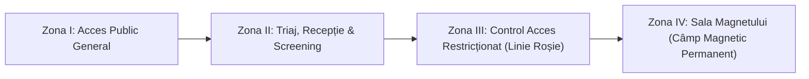

# Politici Clinice, Standarde de Securitate & Administrare Substanțe de Contrast (OHSU)

Ghid instituțional sinoptic al politicilor clinice și procedurilor de siguranță aplicate în cadrul **Department of Diagnostic Radiology — Oregon Health & Science University (OHSU)**. Acest document integrează politicile oficiale de administrare a substanțelor de contrast iodate și paramagnetice, securitatea în mediul de rezonanță magnetică (Zonele I–IV) și sedarea procedurală moderată.

  
🏥 POLITICI & STANDARDE CLINICE OHSU

  

    Politici instituționale gestionate prin <strong>MCN Policy Manager</strong> al OHSU, destinate radiologilor, tehnicienilor de radiologie și asistenților medicali pentru garantarea siguranței pacientului și standardizarea calității examinărilor imagistice.
  

  <a href="https://www.ohsu.edu/school-of-medicine/diagnostic-radiology/diagnostic-radiology-policies" target="_blank" rel="noopener" style="font-weight: 600; color: #0f766e; text-decoration: none;">
    Consultă portalul oficial OHSU Diagnostic Radiology Policies ➔
  </a>

---

## 1. Administrarea Substanțelor de Contrast Iodate (CT & Fluoroscopie)

### 1.1. Criterii de Testare a Creatininei & Calcul eGFR Pre-Contrast
Conform politicii OHSU, determinarea nivelului creatininei serice și a **ratei estimate de filtrare glomerulară (eGFR)** este obligatorie înaintea injectării i.v. a substanțelor de contrast iodate la pacienții cu factori de risc:
- **Vârstă:** Pacienți cu vârsta peste 60 de ani.
- **Istoric renal:** Antecedente de insuficiență renală acută/cronică, rinichi unic chirurgical sau congenital, transplant renal sau rezecție renală.
- **Boli sistemice:** Diabet zaharat tratat medicamentos, hipertensiune arterială cronică necesitând tratament medical.
- **Valabilitate analiză:** Valoarea creatininei/eGFR este considerată valabilă dacă a fost efectuată în ultimele **30 de zile** pentru pacienți ambulatori stabili, respectiv **24–48 ore** pentru pacienți internați sau cu patologie acută instabilă.

### 1.2. Managementul Pacienților sub Tratament cu Metformin
- **eGFR ≥ 30 mL/min/1.73m² și fără injurie renală acută:** Tratamentul cu Metformin **nu necesită întrerupere** înainte sau după injectarea de contrast.
- **eGFR < 30 mL/min/1.73m² sau pacienți instabili / proceduri cu risc mare:** Metforminul se întrerupe în momentul procedurii și se reia după **48 de ore**, doar după verificarea stabilității funcției renale (re-evaluare eGFR).

### 1.3. Protocol de Premedicație pentru Reacții Alergice la Iod
Destinat pacienților cu istoric documentat de reacție alergică anterioară moderată sau severă la contrast iodat:
- **Protocol Electiv Standard (12–13 ore):**
  1. *Prednison:* 50 mg oral la **13 ore**, **7 ore** și **1 oră** înainte de administrarea contrastului.
  2. *Difenhidramină:* 50 mg oral (sau i.v.) cu **1 oră** înainte de administrarea contrastului.
- **Protocol de Urgență (4–6 ore):**
  1. *Hidrocortizon:* 200 mg i.v. la fiecare 4 ore până la scanare (minim 2 doze).
  2. *Difenhidramină:* 50 mg i.v. cu 1 oră înainte de procedură.

### 1.4. Managementul Reacțiilor Acute la Contrast
| Severitate | Simptome Clinice | Conduită Terapeutică Imediată |
|:-----------|:-----------------|:------------------------------|
| **Ușoară** | Greață, vărsături izolate, strănut, eritem cutanat localizat, gust metalic | Observație clinică, liniștirea pacientului, monitorizare parametri vitali |
| **Moderată** | Urticarie difuză, prurit sever, bronhospasm ușor, edem facial fără stridor | Antihistaminic (Difenhidramină 25–50 mg i.v./oral), bronhodilatator inhalator (Salbutamol 2–3 pufuri), oxigenoterapie pe mască |
| **Severă** | Șoc anafilactic, stridor laringian, hipotensiune severă, stop cardiorespirator | Alertare echipă urgență / Cod Albastru, **Epinefrină (Adrenalină) 1:1000 i.m. 0.3 mg** (repetabil la 5–15 min), fluide i.v. rapide (Ringer/NaCl 0.9%), oxigenoterapie cu debit mare, intubație la nevoie |

### 1.5. Conduită în Extravazarea Substanței de Contrast
- Oprirea imediată a injectării;
- Aspirarea cantității reziduale de contrast prin canulă înainte de retragerea acesteia;
- Aplicarea de comprese reci pentru reducerea edemului local;
- Elevarea membrului afectat deasupra nivelului inimii;
- **Consult chirurgical plastic / vascular urgent** dacă: volum extravazat > 100–150 mL, apariție de parestezii, modificări de perfuzie capilară distală sau suspiciune de sindrom de compartiment.

---

## 2. Administrarea Substanțelor de Contrast pe Bază de Gadoliniu (IRM)

### 2.1. Clasificarea Agenților și Riscul de Fibroză Sistemică Nefrogenă (NSF)
- OHSU utilizează predominant **agenți de contrast macrociclici (Grupul II)** cu stabilitate termodinamică și cinetică foarte înaltă (ex. *Gadobutrol — Gadovist*, *Gadoterat de meglumină — Dotarem*, *Gadoteridol — ProHance*).
- La pacienți cu insuficiență renală severă (eGFR < 30 mL/min/1.73m²) sau dializă, agenții din Grupul II prezintă un risc extrem de scăzut de NSF; administrarea se face exclusiv dacă beneficiul clinic diagnostic este cert.

### 2.2. Sarcina și Alăptarea
- **Sarcină:** Administrarea de Gadoliniu este de regulă **contraindicată** din cauza riscului teoretic de acumulare a ionilor liberi de gadoliniu în lichidul amniotic. Se recomandă protocoale native (vezi [RM Apendicită Nativă](file:///C:/Users/ionel/Downloads/radiology-protocols/docs/irm/abdomen-pelvis/irm-apendicita-gravide-pediatrie-ohsu.md)).
- **Alăptare:** Sub 0.04% din doza maternă se excretă în laptele matern, iar din aceasta sub 1% este absorbită de tractul gastrointestinal al sugarului. Întreruperea alăptării nu este obligatorie, dar la dorința mamei, laptele poate fi muls și aruncat timp de 24 de ore.

---

## 3. Politici Instituționale de Securitate RM (Zonele I–IV)

1. **Zona I:** Spații publice accesibile tuturor pacienților și aparținătorilor (săli de așteptare, holuri exterioare).
2. **Zona II:** Zonă intermediară de primire unde se efectuează screeningul chestionarului de securitate RM sub supravegherea personalului instruit.
3. **Zona III:** Zonă cu acces strict controlat (uși securizate cu cartelă). Doar pacienții schimbați în halat spitalicesc și personalul autorizat pot pătrunde. Toate echipamentele trebuie să fie certificate "MR Conditional" sau "MR Safe".
4. **Zona IV:** Sala magnetului. Câmpul magnetic este **ACTIV PERMANENT** (24/7/365). Risc critic de proiectil mortal pentru orice obiect feromagnetic.
5. **Prioritizarea și Triajul:** Procedură standardizată de clasificare a urgențelor RM în funcție de patologie (urgențe vitale, urgențe oncologice, examinări de rutină).

---

## 4. Sedarea Procedurală Moderată în Radiologie Diagnostică

Pentru pacienții pediatrici sau adulți claustrofobi/necooperanți:
- Evaluare pre-sedare completă (istoric anestezic, clasă ASA, cale aeriană Mallampati, timp NPO de minim 6 ore pentru solide și 2 ore pentru lichide clare).
- Monitorizare continuă pe toată durata scanării și a recuperării: pulsoximetrie compatibilă RM, capnografie (EtCO2), tensiune arterială automată și traseu ECG.
- Prezența obligatorie a personalului instruit în suport vital avansat (ACLS / PALS) și a trusei de reversie farmacologică (Naloxonă, Flumazenil).

---

### Referințe Oficiale OHSU
- **OHSU Diagnostic Radiology Policies Portal:** [https://www.ohsu.edu/school-of-medicine/diagnostic-radiology/diagnostic-radiology-policies](https://www.ohsu.edu/school-of-medicine/diagnostic-radiology/diagnostic-radiology-policies){ target="_blank" rel="noopener" }
- **OHSU MCN Policy Manager:** [https://ohsu.ellucid.com/home](https://ohsu.ellucid.com/home){ target="_blank" rel="noopener" }
- **Ghidul Național IRIS (Ordinul MS 1342/2012):** [https://radiologie-pediatrica.ro/iris/](https://radiologie-pediatrica.ro/iris/){ target="_blank" rel="noopener" }
