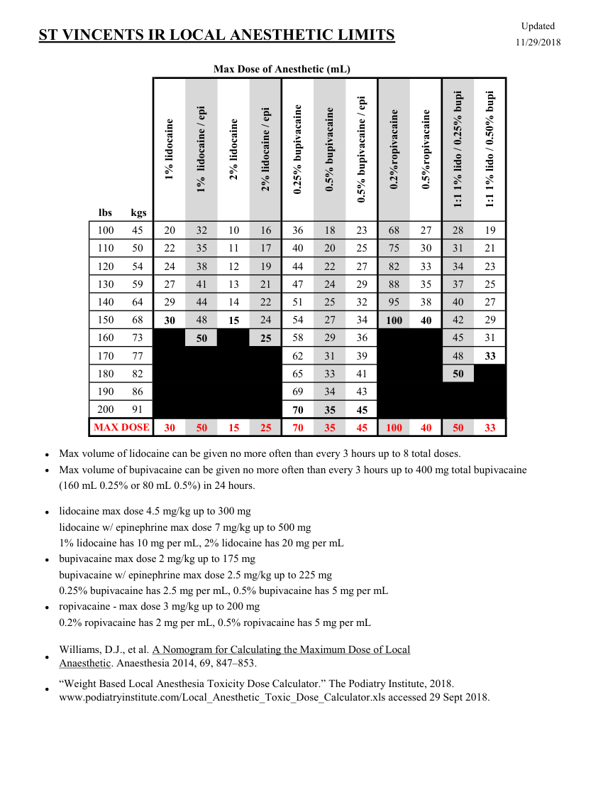

# Intervențional — Limite pentru anestezice locale (MCB)

## Documentul original MCB — Limite pentru anestezice locale

**Ghid procedural · 1 pagini · consultat la 2026-09-27.**

[Descarcă PDF-ul integral](../../assets/mcb-modalities/ir-limite-pentru-anestezice-locale-mcb/document.pdf) · [Sursa MCB](https://ref.mcbradiology.com/IR/Miscellaneous/Local%20Anesthetics.pdf) · [Catalogul MCB pentru această modalitate](../mcb/index.md)

Instrucțiunile, valorile și ilustrațiile din documentul original sunt păstrate în **engleză**. Titlul și navigarea sunt în română.

### Pagina 1

{ loading=lazy }

## Textul documentului original

??? abstract "Pagina 1 — text în engleză"

    
Updated
    11/29/2018
    ST VINCENTS IR LOCAL ANESTHETIC LIMITS
    Max Dose of Anesthetic (mL)
    1% lidocaine
    2% lidocaine
    0.2%ropivacaine
    0.5%ropivacaine
    2% lidocaine / epi
    0.5% bupivacaine
    1%  lidocaine / epi
    0.25% bupivacaine
    0.5% bupivacaine / epi
    1:1 1% lido / 0.25% bupi
    1:1 1% lido / 0.50% bupi
    lbs
     kgs
    100
    45
    20
    32
    10
    16
    36
    18
    23
    68
    27
    28
    19
    110
    50
    22
    35
    11
    17
    40
    20
    25
    75
    30
    31
    21
    120
    54
    24
    38
    12
    19
    44
    22
    27
    82
    33
    34
    23
    130
    59
    27
    41
    13
    21
    47
    24
    29
    88
    35
    37
    25
    140
    64
    29
    44
    14
    22
    51
    25
    32
    95
    38
    40
    27
    150
    68
    30
    48
    15
    24
    54
    27
    34
    100
    40
    42
    29
    160
    73
    33
    50
    23
    25
    58
    29
    36
    45
    31
    170
    77
    35
    54
    27
    62
    31
    39
    48
    33
    180
    82
    37
    57
    29
    65
    33
    41
    50
    190
    86
    39
    60
    30
    69
    34
    43
    200
    91
    41
    64
    32
    70
    35
    45
    MAX DOSE
    30
    50
    15
    25
    70
    35
    45
    100
    40
    50
    33
    Max volume of bupivacaine can be given no more often than every 3 hours up to 400 mg total bupivacaine
    Max volume of lidocaine can be given no more often than every 3 hours up to 8 total doses.
    (160 mL 0.25% or 80 mL 0.5%) in 24 hours.
    lidocaine max dose 4.5 mg/kg up to 300 mg
    ∙
    ∙
    ∙
    lidocaine w/ epinephrine max dose 7 mg/kg up to 500 mg
    bupivacaine max dose 2 mg/kg up to 175 mg
    1% lidocaine has 10 mg per mL, 2% lidocaine has 20 mg per mL
    ∙
    bupivacaine w/ epinephrine max dose 2.5 mg/kg up to 225 mg
    ∙
    0.2% ropivacaine has 2 mg per mL, 0.5% ropivacaine has 5 mg per mL
    ropivacaine - max dose 3 mg/kg up to 200 mg
    0.25% bupivacaine has 2.5 mg per mL, 0.5% bupivacaine has 5 mg per mL
    Williams, D.J., et al. A Nomogram for Calculating the Maximum Dose of Local
    Anaesthetic. Anaesthesia 2014, 69, 847–853.
    “Weight Based Local Anesthesia Toxicity Dose Calculator.” The Podiatry Institute, 2018. 
    www.podiatryinstitute.com/Local_Anesthetic_Toxic_Dose_Calculator.xls accessed 29 Sept 2018.
    ∙
    ∙
    

