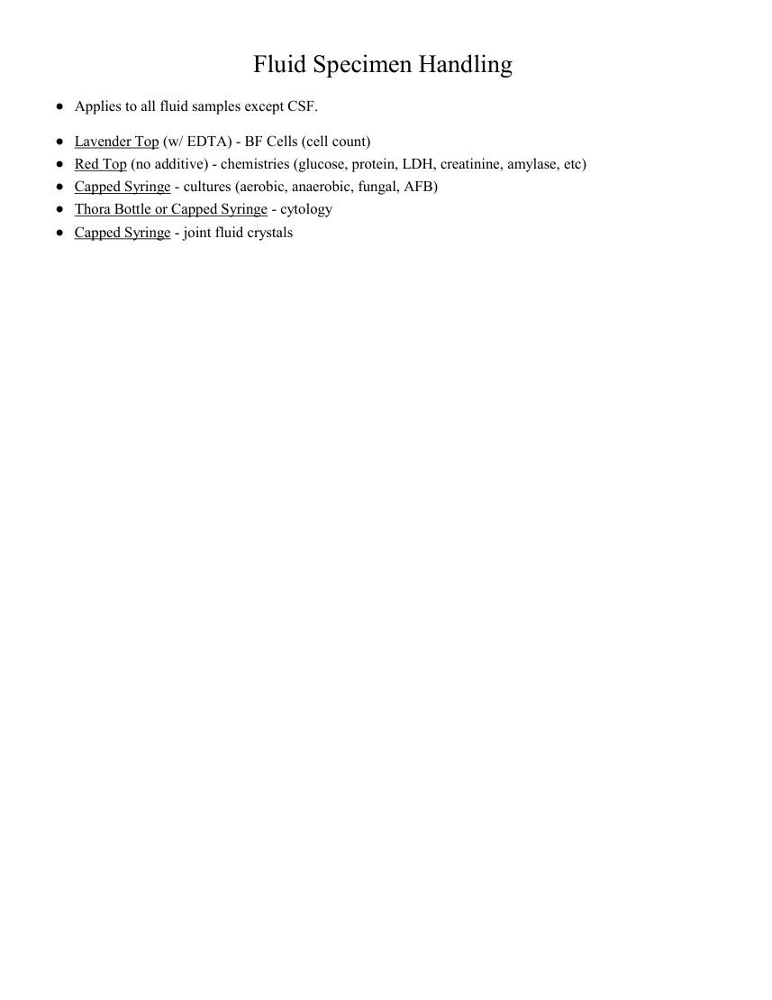

# Intervențional — Manipularea probelor de lichid (MCB)

## Documentul original MCB — Manipularea probelor de lichid

**Ghid procedural · 1 pagini · consultat la 2026-09-27.**

[Descarcă PDF-ul integral](../../assets/mcb-modalities/ir-manipularea-probelor-de-lichid-mcb/document.pdf) · [Sursa MCB](https://ref.mcbradiology.com/IR/Miscellaneous/Fluid%20Specimen%20Handling.pdf) · [Catalogul MCB pentru această modalitate](../mcb/index.md)

Instrucțiunile, valorile și ilustrațiile din documentul original sunt păstrate în **engleză**. Titlul și navigarea sunt în română.

### Pagina 1

{ loading=lazy }

## Textul documentului original

??? abstract "Pagina 1 — text în engleză"

    
Fluid Specimen Handling
    Applies to all fluid samples except CSF.
    ·
    ·
    Lavender Top (w/ EDTA) - BF Cells (cell count)
    ·
    Red Top (no additive) - chemistries (glucose, protein, LDH, creatinine, amylase, etc)
    ·
    Capped Syringe - joint fluid crystals
    Capped Syringe - cultures (aerobic, anaerobic, fungal, AFB)
    ·
    Thora Bottle or Capped Syringe - cytology
    ·
    

