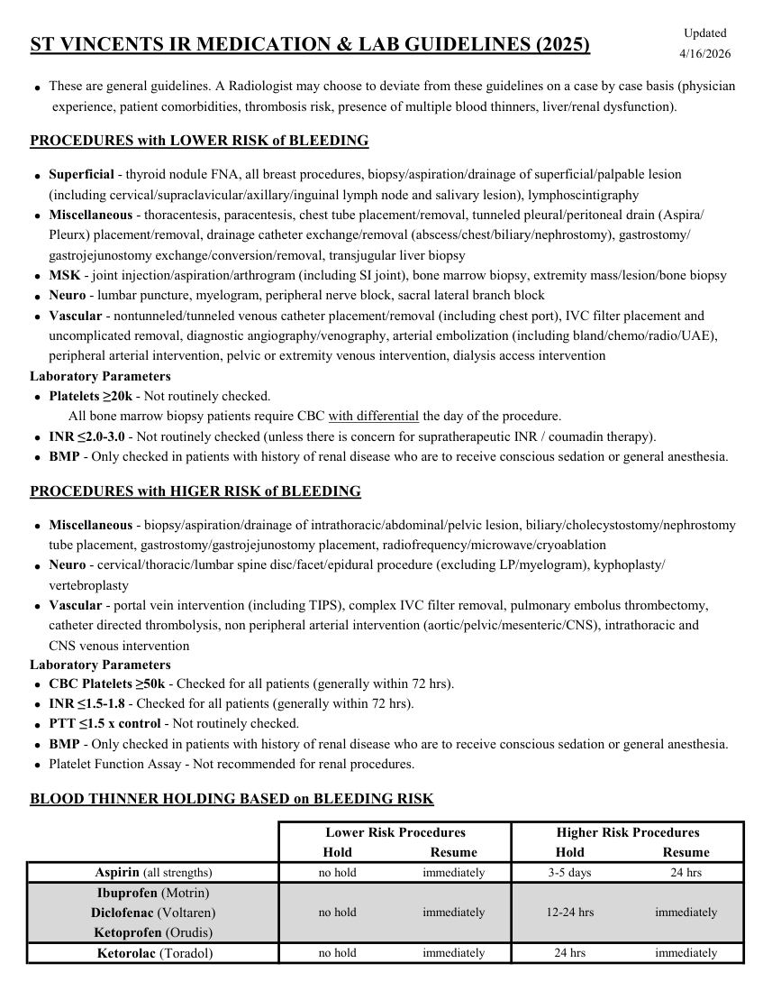
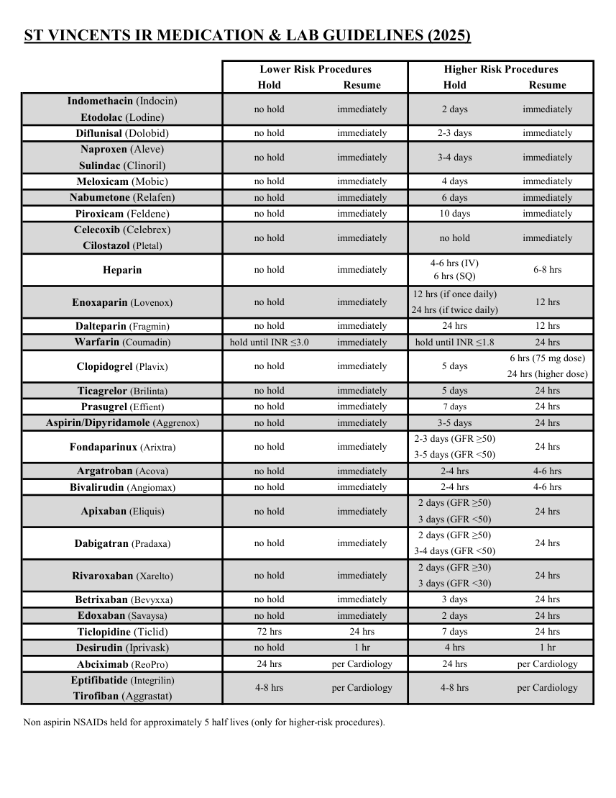
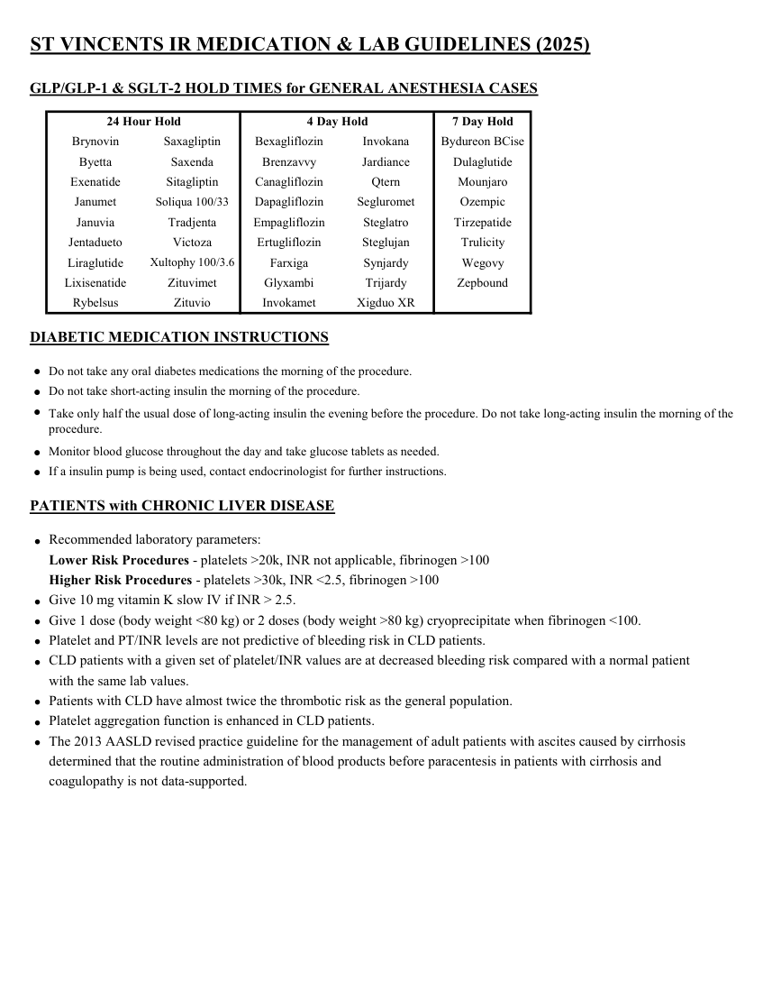

# Intervențional — Medicație și analize înaintea procedurilor (2025) (MCB)

## Documentul original MCB — Medicație și analize înaintea procedurilor (2025)

**Ghid procedural · 3 pagini · consultat la 2026-09-27.**

[Descarcă PDF-ul integral](../../assets/mcb-modalities/ir-medicatie-si-analize-inaintea-procedurilor-2025-mcb/document.pdf) · [Sursa MCB](https://ref.mcbradiology.com/IR/Miscellaneous/2025%20Med%20&%20Lab%20Guidelines.pdf) · [Catalogul MCB pentru această modalitate](../mcb/index.md)

Instrucțiunile, valorile și ilustrațiile din documentul original sunt păstrate în **engleză**. Titlul și navigarea sunt în română.

### Pagina 1

{ loading=lazy }

### Pagina 2

{ loading=lazy }

### Pagina 3

{ loading=lazy }

## Textul documentului original

??? abstract "Pagina 1 — text în engleză"

    
Updated
    4/16/2026
    ST VINCENTS IR MEDICATION &amp; LAB GUIDELINES (2025)
    
     experience, patient comorbidities, thrombosis risk, presence of multiple blood thinners, liver/renal dysfunction).
    These are general guidelines. A Radiologist may choose to deviate from these guidelines on a case by case basis (physician
    PROCEDURES with LOWER RISK of BLEEDING
    
    Superficial - thyroid nodule FNA, all breast procedures, biopsy/aspiration/drainage of superficial/palpable lesion
    (including cervical/supraclavicular/axillary/inguinal lymph node and salivary lesion), lymphoscintigraphy
    
    gastrojejunostomy exchange/conversion/removal, transjugular liver biopsy
    Pleurx) placement/removal, drainage catheter exchange/removal (abscess/chest/biliary/nephrostomy), gastrostomy/
    Miscellaneous - thoracentesis, paracentesis, chest tube placement/removal, tunneled pleural/peritoneal drain (Aspira/
    Neuro - lumbar puncture, myelogram, peripheral nerve block, sacral lateral branch block
    MSK - joint injection/aspiration/arthrogram (including SI joint), bone marrow biopsy, extremity mass/lesion/bone biopsy
    
    
    
    uncomplicated removal, diagnostic angiography/venography, arterial embolization (including bland/chemo/radio/UAE),  
    Vascular - nontunneled/tunneled venous catheter placement/removal (including chest port), IVC filter placement and
    peripheral arterial intervention, pelvic or extremity venous intervention, dialysis access intervention
    Laboratory Parameters
    Platelets ≥20k - Not routinely checked. 
    
    All bone marrow biopsy patients require CBC with differential the day of the procedure.
    BMP - Only checked in patients with history of renal disease who are to receive conscious sedation or general anesthesia.
    INR ≤2.0-3.0 - Not routinely checked (unless there is concern for supratherapeutic INR / coumadin therapy).
    
    
    PROCEDURES with HIGER RISK of BLEEDING
    
    Miscellaneous - biopsy/aspiration/drainage of intrathoracic/abdominal/pelvic lesion, biliary/cholecystostomy/nephrostomy
    tube placement, gastrostomy/gastrojejunostomy placement, radiofrequency/microwave/cryoablation
    Neuro - cervical/thoracic/lumbar spine disc/facet/epidural procedure (excluding LP/myelogram), kyphoplasty/
    
    vertebroplasty
    
    catheter directed thrombolysis, non peripheral arterial intervention (aortic/pelvic/mesenteric/CNS), intrathoracic and 
    Vascular - portal vein intervention (including TIPS), complex IVC filter removal, pulmonary embolus thrombectomy,
    CNS venous intervention
    Laboratory Parameters
    PTT ≤1.5 x control - Not routinely checked.
    INR ≤1.5-1.8 - Checked for all patients (generally within 72 hrs).
    CBC Platelets ≥50k - Checked for all patients (generally within 72 hrs).
    BMP - Only checked in patients with history of renal disease who are to receive conscious sedation or general anesthesia.
    Platelet Function Assay - Not recommended for renal procedures.
    
    
    
    
    
    BLOOD THINNER HOLDING BASED on BLEEDING RISK
    Lower Risk Procedures
    Higher Risk Procedures
    Hold
    Resume
    Hold
    Resume
    no hold
    immediately
    3-5 days
    24 hrs
    Aspirin (all strengths)
    Ibuprofen (Motrin)
    no hold
    immediately
    12-24 hrs
    immediately
    Diclofenac (Voltaren)
    no hold
    immediately
    24 hrs
    Ketoprofen (Orudis)
     Ketorolac (Toradol)
    immediately
    

??? abstract "Pagina 2 — text în engleză"

    
ST VINCENTS IR MEDICATION &amp; LAB GUIDELINES (2025)
    Lower Risk Procedures
    Higher Risk Procedures
    Hold
    Resume
    Hold
    Resume
    Indomethacin (Indocin)
    2 days
    immediately
    no hold
    immediately
    Etodolac (Lodine)
    2-3 days
    immediately
    no hold
    immediately
    Diflunisal (Dolobid)
    Naproxen (Aleve)
    immediately
    3-4 days
    immediately
    no hold
    Sulindac (Clinoril)
    immediately
    4 days
    immediately
    no hold
    Meloxicam (Mobic)
    immediately
    no hold
    immediately
    6 days
    Nabumetone (Relafen)
    10 days
    immediately
    no hold
    immediately
    Piroxicam (Feldene)
    Celecoxib (Celebrex)
    no hold
    immediately
    no hold
    immediately
    Cilostazol (Pletal)
    no hold
    6-8 hrs
    4-6 hrs (IV)                                                   
    Heparin
    6 hrs (SQ)
    immediately
    12 hrs (if once daily)
    12 hrs
    Enoxaparin (Lovenox)
    24 hrs (if twice daily)
    no hold
    immediately
    no hold
    immediately
    24 hrs
    12 hrs
    Dalteparin (Fragmin)
    hold until INR ≤3.0
    immediately
    hold until INR ≤1.8
    24 hrs
    Warfarin (Coumadin)
    6 hrs (75 mg dose)
    Clopidogrel (Plavix)
    24 hrs (higher dose)
    no hold
    immediately
    5 days
    no hold
    immediately
    5 days
    24 hrs
    Ticagrelor (Brilinta) 
    no hold
    immediately
    7 days
    24 hrs
    Prasugrel (Effient)
    no hold
    immediately
    3-5 days
    24 hrs
    Aspirin/Dipyridamole (Aggrenox)
    2-3 days (GFR ≥50)
    no hold
    immediately
    Fondaparinux (Arixtra)
    24 hrs
    3-5 days (GFR &lt;50)
    no hold
    immediately
    2-4 hrs
    4-6 hrs
    Argatroban (Acova)
    no hold
    immediately
    2-4 hrs
    4-6 hrs
    Bivalirudin (Angiomax)
    2 days (GFR ≥50)
    no hold
    immediately
    24 hrs
    Apixaban (Eliquis)
    3 days (GFR &lt;50)
    2 days (GFR ≥50)
    no hold
    immediately
    Dabigatran (Pradaxa)
    24 hrs
    3-4 days (GFR &lt;50)
    2 days (GFR ≥30)
    no hold
    immediately
    Rivaroxaban (Xarelto)
    24 hrs
    3 days (GFR &lt;30)
    no hold
    immediately
    3 days
    24 hrs
     Betrixaban (Bevyxxa)
    no hold
    immediately
    2 days
    24 hrs
    72 hrs
    24 hrs
    7 days
    24 hrs
    Ticlopidine (Ticlid)
    Edoxaban (Savaysa) 
    no hold
    1 hr
    4 hrs
    1 hr
    Desirudin (Iprivask)
    24 hrs
    per Cardiology
    24 hrs
    per Cardiology
    Abciximab (ReoPro)
    Eptifibatide (Integrilin)
    4-8 hrs
    per Cardiology
    4-8 hrs
    per Cardiology
    Tirofiban (Aggrastat)
    Non aspirin NSAIDs held for approximately 5 half lives (only for higher-risk procedures).
    

??? abstract "Pagina 3 — text în engleză"

    
ST VINCENTS IR MEDICATION &amp; LAB GUIDELINES (2025)
    GLP/GLP-1 &amp; SGLT-2 HOLD TIMES for GENERAL ANESTHESIA CASES
    24 Hour Hold
    4 Day Hold
    7 Day Hold
    Brynovin
    Saxagliptin
    Bexagliflozin
    Invokana
    Bydureon BCise
    Byetta
    Saxenda
    Brenzavvy
    Jardiance
    Dulaglutide
    Exenatide
    Sitagliptin
    Canagliflozin
    Qtern
    Mounjaro
    Janumet
    Soliqua 100/33
    Dapagliflozin
    Segluromet
    Ozempic
    Januvia
    Tradjenta
    Empagliflozin
    Steglatro
    Tirzepatide
    Jentadueto
    Victoza
    Ertugliflozin
    Steglujan
    Trulicity
    Liraglutide
    Xultophy 100/3.6
    Farxiga
    Synjardy
    Wegovy
    Lixisenatide
    Zituvimet
    Glyxambi
    Trijardy
    Zepbound
    Rybelsus
    Zituvio
    Invokamet
    Xigduo XR
    DIABETIC MEDICATION INSTRUCTIONS
    Do not take any oral diabetes medications the morning of the procedure.
    ●
    Do not take short-acting insulin the morning of the procedure.
    ●
    ●
    Take only half the usual dose of long-acting insulin the evening before the procedure. Do not take long-acting insulin the morning of the 
    procedure.
    Monitor blood glucose throughout the day and take glucose tablets as needed.
    ●
    If a insulin pump is being used, contact endocrinologist for further instructions.
    ●
    PATIENTS with CHRONIC LIVER DISEASE
    
    Higher Risk Procedures - platelets &gt;30k, INR &lt;2.5, fibrinogen &gt;100
    Lower Risk Procedures - platelets &gt;20k, INR not applicable, fibrinogen &gt;100
    Recommended laboratory parameters:
    Give 10 mg vitamin K slow IV if INR &gt; 2.5.
    Give 1 dose (body weight &lt;80 kg) or 2 doses (body weight &gt;80 kg) cryoprecipitate when fibrinogen &lt;100.
    Platelet and PT/INR levels are not predictive of bleeding risk in CLD patients.
    
    
    
    
    Platelet aggregation function is enhanced in CLD patients. 
    Patients with CLD have almost twice the thrombotic risk as the general population. 
    with the same lab values.
    CLD patients with a given set of platelet/INR values are at decreased bleeding risk compared with a normal patient
    
    
    
    coagulopathy is not data-supported.
    determined that the routine administration of blood products before paracentesis in patients with cirrhosis and
    The 2013 AASLD revised practice guideline for the management of adult patients with ascites caused by cirrhosis
    

